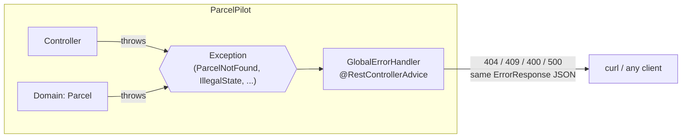

# Step 06: Error handling & HTTP error contracts

> In this step: give every ParcelPilot failure **one predictable JSON shape**. You'll learn how Java exceptions signal problems, and move all error → HTTP status mapping into a single `@RestControllerAdvice` class, so clients can program against your errors instead of guessing. ~60–90 minutes.

## The problem right now

ParcelPilot fails in three different "languages", and clients can't program against any of them:

- A validation failure (step 05) returns `400` with a field→message map, produced by a local `@ExceptionHandler` **inside the controller**.
- A missing parcel returns `404` with an **empty body** (`ResponseEntity.notFound().build()`).
- An illegal status change throws `IllegalStateException` in the domain; the step-04 lab caught it **ad hoc** in the `PATCH` method and returned a `409` with yet another shape. Any exception nobody caught becomes a `500` whose body **leaks a stack trace** with internal class names and line numbers.

Three failures, three shapes (or none). A client that wants to show "why did this fail?" has to write different parsing code for every endpoint. This step centralizes everything: **one error shape, one place that maps exceptions to statuses.**

## Key words

| Word | Beginner meaning |
|---|---|
| **Exception** | A Java object that signals "something went wrong here", thrown up the call chain until someone handles it. |
| **`throw`** | The keyword that raises an exception: `throw new IllegalStateException("...")`. |
| **`try`/`catch`** | The construct that handles an exception instead of letting it crash the current operation. |
| **Checked exception** | An exception the compiler forces you to declare or catch (e.g. `IOException`). |
| **Unchecked exception** | An exception the compiler doesn't force you to handle (`RuntimeException` and subclasses). Spring uses these almost everywhere. |
| **Stack trace** | The list of method calls that led to an exception: a map straight to the bug. |
| **`@RestControllerAdvice`** | A Spring annotation for a class that handles exceptions for **all** controllers and returns JSON. |
| **`@ExceptionHandler`** | Marks a method as the handler for one exception type. |
| **Error contract** | The agreed shape of every error response, so clients can rely on it. |
| **Error code** | A short machine-readable string like `PARCEL_NOT_FOUND` that clients match on instead of parsing prose. |

## What is centralized error handling?

An exception is Java's way of saying "this operation cannot continue" — the domain throws it at the exact spot where a rule breaks, and it travels up the call chain until something handles it. (New to exceptions? Read [Exceptions in Java, from scratch](exceptions-in-java.md) first — `throw`/`try`/`catch`, the hierarchy, and how to read a stack trace.) Until now, ParcelPilot handled these signals wherever they happened to surface: a `catch` here, an `if (parcel == null)` there, a local handler in the controller. Centralized error handling flips that around: controllers and the domain **only throw**, and one dedicated class — a `@RestControllerAdvice` — catches every exception, picks the right HTTP status, and builds the response body. Because a single class builds every error body, every error automatically has the **same shape**.



Our contract is one Java `record`, used for **every** error:

```java
package com.parcelpilot;

import java.util.Map;

/** The one shape every ParcelPilot error uses. */
public record ErrorResponse(String code, String message, Map<String, String> details, String path) {}
```

And one handler method looks like this — that's the whole trick:

```java
@RestControllerAdvice
public class GlobalErrorHandler {

    @ExceptionHandler(ParcelNotFoundException.class)   // when THIS is thrown anywhere...
    @ResponseStatus(HttpStatus.NOT_FOUND)              // ...answer with THIS status...
    public ErrorResponse parcelNotFound(ParcelNotFoundException ex, HttpServletRequest request) {
        return new ErrorResponse("PARCEL_NOT_FOUND", ex.getMessage(), Map.of(), request.getRequestURI());
    }                                                  // ...and THIS body shape.
}
```

Which exception should map to which status? The full decision table (400 vs 404 vs 409 vs 500) lives in the [error handling reference](../../references/error-handling-and-http-statuses.md), and the status codes themselves are summarized in [Spring and HTTP](../../references/spring-and-http.md).

## Why do it? Pros and cons

**What it buys you:** clients see one predictable error shape everywhere, controllers shrink (no more `try`/`catch` noise), and unexpected errors return a **generic** `500` instead of leaking a stack trace.

| Pros | Cons / risks |
|---|---|
| Predictable API: every error has the same JSON shape | One more layer of Spring "magic" to understand |
| Client code handles errors once, not per endpoint | A catch-all `Exception` handler can **hide real bugs** if you never look at what it caught |
| No stack traces or internal class names leak to clients | Easy to over-catch: handling exceptions you should have let crash loudly |
| Controllers only do the happy path — much shorter | Mapping tables drift if you add exceptions but forget handlers |
| One place to change when the error contract evolves | Generic 500 bodies tell *you* nothing — you need logs (step 07) |

## When to use it (and when not)

**Use it** in any HTTP API with more than one endpoint — which is essentially every real backend. The moment two endpoints can fail, you want their failures to look the same.

**When not, and what never to do:**

- Don't **catch-and-ignore**: `catch (Exception e) {}` turns one clear failure into a mystery later. If you can't recover meaningfully, don't catch — let the advice map it. (This is [best practice §6](../../references/java-best-practices.md#6-fail-loudly-and-specifically-with-exceptions).)
- Never map everything to **`200 OK` with an error flag in the body** (`{"success": false, ...}`). Status codes are the part of HTTP that every client, cache, monitor, and retry library already understands. A `200`-that-is-really-an-error breaks all of them: caches store the failure, monitoring sees a healthy API while users see errors, and clients must parse every body to learn what the status line should have said.
- Don't add per-exception handlers for cases the framework already gets right; start from the four failures ParcelPilot actually has.

## Real-world example

A payment API (Stripe is the classic example) returns every error as one JSON shape with a machine-readable code like `card_declined` or `rate_limit_exceeded`, plus a human message. Thousands of shops integrate against it: their code switches on the **code** field, shows the **message** to a human, and uses the **status** to decide whether to retry. None of that would be possible if each endpoint invented its own error format.

## Common mistakes

- **Catching an exception just to re-throw or log-and-swallow it.** If the controller can't fix the problem, it shouldn't catch it — throwing is the mechanism that gets it to the advice.
- **Returning `ex.getMessage()` in the 500 handler.** Unexpected exceptions can contain internals (SQL fragments, file paths, class names). The client gets a generic message; the details belong in the logs (step 07).
- **Leaving the old local `@ExceptionHandler` in the controller.** A handler in a controller wins over the advice for that controller, so your 400s would silently keep the old shape.
- **Mapping an illegal state transition to `400`.** The request body was fine; it's the parcel's *current state* that conflicts. That's `409 Conflict`.
- **One handler for `RuntimeException`.** Too broad: it would catch `ParcelNotFoundException` too (it *is* a `RuntimeException`) if declared carelessly, and it stops you from distinguishing 404 from 409 from 500. Handle the most specific types.

## Build it in ParcelPilot

Still one project: `applications/parcelpilot`, package `com.parcelpilot`, storage still the in-memory map. This step adds three small files and **deletes** code from the controller. Prefer to build it in smaller proven increments? Do the [controller advice lab](controller-advice-lab.md) alongside this checklist.

### 1. Create the error contract: `ErrorResponse.java`

One record, used by every handler. `details` is for field-level information (validation); for other errors it's an empty map, so the shape never changes:

```java
package com.parcelpilot;

import java.util.Map;

public record ErrorResponse(String code, String message, Map<String, String> details, String path) {}
```

### 2. Create `ParcelNotFoundException.java`

Unchecked (extends `RuntimeException`), so it travels to the advice without every method signature declaring it. The message says exactly what was missing:

```java
package com.parcelpilot;

public class ParcelNotFoundException extends RuntimeException {
    public ParcelNotFoundException(String id) {
        super("Parcel '" + id + "' not found");
    }
}
```

### 3. Throw instead of building responses in the controller

In `ParcelController`, replace the manual `404` with a throw. The method gets simpler — it can even return the DTO directly instead of a `ResponseEntity`:

```java
// BEFORE
@GetMapping("/{id}")
public ResponseEntity<ParcelResponse> getOne(@PathVariable String id) {
    Parcel parcel = store.get(id);
    if (parcel == null) {
        return ResponseEntity.notFound().build();   // 404 with an EMPTY body
    }
    return ResponseEntity.ok(toResponse(parcel));
}

// AFTER
@GetMapping("/{id}")
public ParcelResponse getOne(@PathVariable String id) {
    Parcel parcel = store.get(id);
    if (parcel == null) {
        throw new ParcelNotFoundException(id);      // the advice turns this into 404 + JSON
    }
    return toResponse(parcel);
}
```

### 4. Delete the ad-hoc `409` from `PATCH`

The step-04 lab caught `IllegalStateException` inside the method. Remove the `try`/`catch` and just let the domain throw — same lookup rule as above for a missing parcel:

```java
// BEFORE (shape from the step-04 lab)
@PatchMapping("/{id}/status")
public ResponseEntity<?> changeStatus(@PathVariable String id,
                                      @Valid @RequestBody ChangeStatusRequest req) {
    Parcel parcel = store.get(id);
    if (parcel == null) {
        return ResponseEntity.notFound().build();
    }
    try {
        parcel.changeStatus(req.status());
    } catch (IllegalStateException e) {
        return ResponseEntity.status(409).body(Map.of("error", e.getMessage()));
    }
    return ResponseEntity.ok(toResponse(parcel));
}

// AFTER
@PatchMapping("/{id}/status")
public ParcelResponse changeStatus(@PathVariable String id,
                                   @Valid @RequestBody ChangeStatusRequest req) {
    Parcel parcel = store.get(id);
    if (parcel == null) {
        throw new ParcelNotFoundException(id);
    }
    parcel.changeStatus(req.status());              // may throw IllegalStateException -> 409
    return toResponse(parcel);
}
```

### 5. Delete the local validation handler from the controller

Remove the whole `@ExceptionHandler(MethodArgumentNotValidException.class)` method that step 05 added inside `ParcelController` (and its now-unused imports). It moves to the advice in the next sub-step — **re-homed**, and re-shaped to use `ErrorResponse`.

### 6. Create `GlobalErrorHandler.java` (the heart of this step)

One class, five handlers, ordered from most specific to catch-all:

```java
package com.parcelpilot;

import jakarta.servlet.http.HttpServletRequest;
import org.springframework.http.HttpStatus;
import org.springframework.web.bind.MethodArgumentNotValidException;
import org.springframework.web.bind.annotation.ExceptionHandler;
import org.springframework.web.bind.annotation.ResponseStatus;
import org.springframework.web.bind.annotation.RestControllerAdvice;

import java.util.LinkedHashMap;
import java.util.Map;

@RestControllerAdvice   // applies to ALL controllers; return values become JSON
public class GlobalErrorHandler {

    // Missing parcel -> 404
    @ExceptionHandler(ParcelNotFoundException.class)
    @ResponseStatus(HttpStatus.NOT_FOUND)
    public ErrorResponse parcelNotFound(ParcelNotFoundException ex, HttpServletRequest request) {
        return new ErrorResponse("PARCEL_NOT_FOUND", ex.getMessage(), Map.of(), request.getRequestURI());
    }

    // Illegal state transition (domain rule) -> 409
    @ExceptionHandler(IllegalStateException.class)
    @ResponseStatus(HttpStatus.CONFLICT)
    public ErrorResponse illegalTransition(IllegalStateException ex, HttpServletRequest request) {
        return new ErrorResponse("INVALID_TRANSITION", ex.getMessage(), Map.of(), request.getRequestURI());
    }

    // Bad argument the domain rejected (e.g. constructor validation) -> 400
    @ExceptionHandler(IllegalArgumentException.class)
    @ResponseStatus(HttpStatus.BAD_REQUEST)
    public ErrorResponse badArgument(IllegalArgumentException ex, HttpServletRequest request) {
        return new ErrorResponse("VALIDATION_FAILED", ex.getMessage(), Map.of(), request.getRequestURI());
    }

    // Bean Validation failures (step 05) -> 400, field errors in `details`
    @ExceptionHandler(MethodArgumentNotValidException.class)
    @ResponseStatus(HttpStatus.BAD_REQUEST)
    public ErrorResponse validationFailed(MethodArgumentNotValidException ex, HttpServletRequest request) {
        Map<String, String> details = new LinkedHashMap<>();
        ex.getBindingResult().getFieldErrors()
                .forEach(error -> details.put(error.getField(), error.getDefaultMessage()));
        return new ErrorResponse("VALIDATION_FAILED", "Request validation failed", details, request.getRequestURI());
    }

    // Anything else -> 500 with a GENERIC message.
    // Never send ex.getMessage() or a stack trace to the client: it can leak internals.
    // In step 07 this handler logs the full stack trace -- that's where it belongs.
    @ExceptionHandler(Exception.class)
    @ResponseStatus(HttpStatus.INTERNAL_SERVER_ERROR)
    public ErrorResponse unexpected(Exception ex, HttpServletRequest request) {
        return new ErrorResponse("INTERNAL", "An unexpected error occurred", Map.of(), request.getRequestURI());
    }
}
```

Spring always picks the **most specific** matching handler, so `ParcelNotFoundException` hits its own handler even though the `Exception` catch-all also matches.

## Test it

```bash
cd applications/parcelpilot
mvn spring-boot:run
```

In a second terminal:

```bash
# 1. Missing parcel -> 404 with a JSON body (no more empty body)
curl -i http://localhost:8080/parcels/does-not-exist
```

Expected (formatted):

```json
{
  "code": "PARCEL_NOT_FOUND",
  "message": "Parcel 'does-not-exist' not found",
  "details": {},
  "path": "/parcels/does-not-exist"
}
```

```bash
# 2. Illegal transition: create a parcel, then jump CREATED -> DELIVERED -> 409
curl -s -X POST http://localhost:8080/parcels \
  -H 'Content-Type: application/json' \
  -d '{"id":"P-1","recipient":"Ava"}'

curl -i -X PATCH http://localhost:8080/parcels/P-1/status \
  -H 'Content-Type: application/json' \
  -d '{"status":"DELIVERED"}'
```

Expected — **same shape** as the 404 (your `message` wording comes from your domain code):

```json
{
  "code": "INVALID_TRANSITION",
  "message": "Cannot change status from CREATED to DELIVERED",
  "details": {},
  "path": "/parcels/P-1/status"
}
```

```bash
# 3. Validation failure (step 05 rules) -> 400, same shape, field errors in details
curl -i -X POST http://localhost:8080/parcels \
  -H 'Content-Type: application/json' \
  -d '{"id":"","recipient":""}'
```

Expected:

```json
{
  "code": "VALIDATION_FAILED",
  "message": "Request validation failed",
  "details": { "id": "must not be blank", "recipient": "must not be blank" },
  "path": "/parcels"
}
```

Three different failures, one shape. That's the contract.

## Acceptance criteria

- [ ] `GET /parcels/{missing-id}` returns `404` with an `ErrorResponse` JSON body (not an empty body).
- [ ] An illegal status change returns `409` with the **same** JSON shape.
- [ ] A validation failure returns `400` with field errors inside `details`, same shape.
- [ ] The controller contains **no** `try`/`catch`, no `ResponseEntity.notFound()`, and no local `@ExceptionHandler` anymore.
- [ ] The catch-all `500` handler returns a generic message — you can explain why it must never include `ex.getMessage()` or a stack trace.
- [ ] You can explain checked vs unchecked exceptions and why `ParcelNotFoundException` extends `RuntimeException` (see [Exceptions in Java](exceptions-in-java.md)).
- [ ] You can say why "always return `200` with an error flag in the body" is an anti-pattern.

## Say it like a developer

- "The domain **throws** an `IllegalStateException` on an illegal transition, and the **advice** maps it to `409 Conflict`."
- "`ParcelNotFoundException` is **unchecked**, so it propagates to the `@RestControllerAdvice` without cluttering every signature."
- "All our errors share one **error contract**: `code`, `message`, `details`, `path`."
- "Clients switch on the machine-readable **error code**, like `PARCEL_NOT_FOUND` — they never parse the human message."
- "The catch-all handler returns a generic `500`; the stack trace goes to the **logs**, never to the client."
- "I re-homed the validation handler from the controller into the global advice, so `400`s use the same shape as everything else."

## Quiz: check yourself

Answer out loud before opening each toggle.

1. What is the difference between a **checked** and an **unchecked** exception, and which kind does Spring mostly use?

<details><summary>Show answer</summary>

A checked exception must be declared in the method signature or caught — the compiler enforces it. An unchecked exception (`RuntimeException` and its subclasses) needs no declaration and propagates freely. Spring uses mostly unchecked exceptions, so errors can travel from the domain to a central handler without every method in between declaring them.

</details>

2. What does `@RestControllerAdvice` do, in one sentence?

<details><summary>Show answer</summary>

It marks a class whose `@ExceptionHandler` methods handle exceptions thrown by **all** controllers, with return values serialized as JSON — one central place that maps exceptions to HTTP statuses and bodies.

</details>

3. A client sends a well-formed request to change parcel `P-1` from `CREATED` straight to `DELIVERED`. Why is the right status `409` and not `400`?

<details><summary>Show answer</summary>

`400` means the request itself is malformed or invalid. Here the request is fine — it's the parcel's **current state** that conflicts with the requested change. `409 Conflict` says exactly that: valid request, but it conflicts with the resource's state right now.

</details>

4. Why must the catch-all `500` handler return a generic message instead of `ex.getMessage()`?

<details><summary>Show answer</summary>

An unexpected exception's message can leak internals — class names, file paths, query fragments — which helps attackers and confuses clients. The client only needs "something went wrong on our side"; the full detail belongs in the server's logs (step 07).

</details>

5. Why is returning `200 OK` with `{"success": false}` in the body an anti-pattern?

<details><summary>Show answer</summary>

The status code is the part of HTTP that every client, cache, monitor, and retry library already understands. A `200`-that-is-really-an-error makes caches store failures, makes monitoring report a healthy API while requests fail, and forces every client to parse every body to discover what the status line should have said.

</details>

## Reflect

Trigger the catch-all: temporarily throw `new RuntimeException("boom")` from an endpoint and call it. The client correctly sees a generic `500` — but now look at *your* terminal. Can you tell **what** went wrong and for **which request**? Only if you happen to be watching the console, and even then there's no request context. When the generic handler hides details from the client (correctly!), *you* are blind unless the details land somewhere you can search.

## Next

[Step 07](../07-logging-and-observability-basics/README.md): logging — put the stack trace, the request, and the decision trail where they belong, so a `500` at 3 a.m. is diagnosable.
