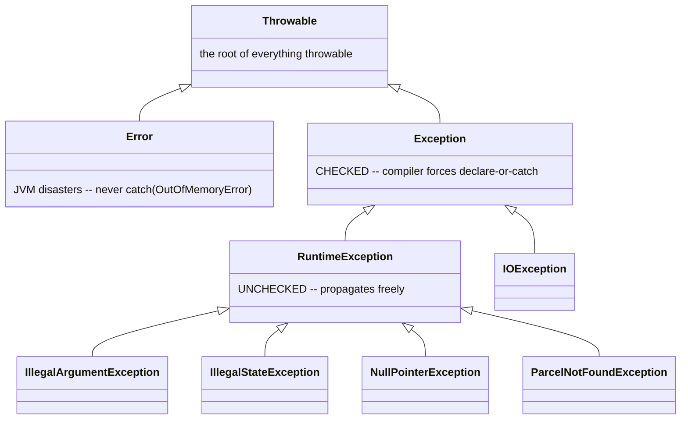

# Exceptions in Java, from scratch

## Problem

Code fails: a parcel ID doesn't exist, a status change breaks the rules, a file isn't there. Without a dedicated mechanism, methods would have to smuggle failure into their return values (`null`, `-1`, `"ERROR"`), and every caller would have to remember to check — and most forget. Java's answer is **exceptions**: a failure becomes an object that is *thrown* at the exact spot where the problem is detected and travels up the call chain until someone *catches* it. Ignoring it is impossible — an uncaught exception stops the operation loudly instead of corrupting data quietly.

You've seen exceptions in passing since step 02 (`IllegalStateException` for an illegal parcel transition). This page makes them a first-class skill: throwing, catching, the hierarchy, checked vs unchecked, reading a stack trace, and writing your own exception class.

## Throw, try, catch, finally

**`throw`** raises an exception. Execution of the current method stops immediately at that line:

```java
public void markDelivered() {
    if (status != Status.PICKED_UP) {
        throw new IllegalStateException(
            "Cannot deliver parcel " + id + ": expected status PICKED_UP, got " + status);
    }
    status = Status.DELIVERED;
}
```

**`try`/`catch`** handles an exception. The `try` block is the risky code; a `catch` block runs only if a matching exception was thrown inside it:

```java
try {
    parcel.markDelivered();
    System.out.println("Delivered!");                  // skipped if the throw happens
} catch (IllegalStateException e) {
    System.out.println("Blocked: " + e.getMessage());  // runs instead
}
```

**`finally`** runs *always* — whether the `try` succeeded, a `catch` ran, or the exception flew past uncaught. It's for cleanup (closing files, releasing resources):

```java
try {
    riskyWork();
} catch (IllegalStateException e) {
    System.out.println("Handled: " + e.getMessage());
} finally {
    System.out.println("Runs no matter what");
}
```

One rule to carry into step 06: **only catch what you can meaningfully handle.** If the code at this level can't fix the problem, don't catch — let the exception travel to a level that can (in ParcelPilot: the `@RestControllerAdvice`). This is [Java best practice §6](../../references/java-best-practices.md#6-fail-loudly-and-specifically-with-exceptions).

## The exception hierarchy

Every throwable thing in Java is an object in one family tree:



- **`Throwable`**: the root. You never use it directly.
- **`Error`**: the JVM itself is in trouble (`OutOfMemoryError`, `StackOverflowError`). Don't catch these — nothing your code does can fix them.
- **`Exception`** (and subclasses *except* `RuntimeException`): **checked** — the compiler forces every method that can raise one to either catch it or declare it with `throws`.
- **`RuntimeException`** and subclasses: **unchecked** — no declaration needed; they propagate silently through signatures until caught.

## Checked vs unchecked: the decision table

| | Checked (`IOException`, `SQLException`) | Unchecked (`RuntimeException` family) |
|---|---|---|
| Compiler forces handling? | Yes: `throws` in the signature or `try`/`catch` | No |
| Typical meaning | Expected external failure: file missing, network down | Programming error or broken business rule |
| Caller can usually recover? | Sometimes (retry, fallback file) | Rarely at the call site — better handled centrally |
| Effect on signatures | Every method on the path must declare it | None — travels invisibly |
| ParcelPilot examples | (none yet — arrives with files/DB) | `IllegalStateException`, `IllegalArgumentException`, `ParcelNotFoundException` |

**Why modern frameworks prefer unchecked:** a checked exception thrown five layers deep forces `throws` onto all five signatures (or, worse, tempts people into empty `catch` blocks just to silence the compiler). Spring wants an exception thrown in your domain to reach one central handler untouched, so its own exceptions — and the ones you write for it — are unchecked. Checked exceptions still earn their keep at the *edges* of a program, where failure is expected and locally recoverable (opening a file that may not exist). Honest trade-off:

| Checked exceptions: pros | Checked exceptions: cons |
|---|---|
| The compiler guarantees nobody forgets the failure case | Signatures accumulate `throws` clutter through every layer |
| Failure modes are visible in the API signature | Invites the worst habit: empty `catch` blocks to shut the compiler up |
| Good fit for expected, recoverable failures | Poor fit for "let a central handler deal with it" designs like Spring |

## How to read a stack trace, line by line

When an exception goes uncaught, Java prints a **stack trace**. Beginners scroll past it; developers read it top-down. Here's a real one from ParcelPilot, annotated:

```text
java.lang.IllegalStateException: Cannot deliver parcel P-1: expected status PICKED_UP, got CREATED
	at com.parcelpilot.Parcel.markDelivered(Parcel.java:42)
	at com.parcelpilot.ParcelController.changeStatus(ParcelController.java:58)
	at java.base/jdk.internal.reflect.DirectMethodHandleAccessor.invoke(DirectMethodHandleAccessor.java:103)
	at org.springframework.web.method.support.InvocableHandlerMethod.doInvoke(InvocableHandlerMethod.java:255)
	... 47 more frames ...
```

Read it like this:

1. **First line = what and why.** The exception class (`IllegalStateException`) and its message. If the message is good, half your debugging is done already.
2. **Second line = where.** The topmost `at` line is the exact spot the `throw` happened: class `Parcel`, method `markDelivered`, file `Parcel.java`, **line 42**. Open that file at that line.
3. **Next lines = how we got there.** Each line is one caller: `ParcelController.changeStatus` (line 58) called the method that threw. Read downward = walking back in time through the call chain.
4. **Skim the framework frames.** Lines from `java.base`, `org.springframework`, `jdk.internal` are plumbing. Your eyes want the lines starting with **your package** (`com.parcelpilot`).
5. **Watch for `Caused by:`.** When one exception wraps another, the *deepest* `Caused by:` block is the original problem. Start there.

## Writing your own exception class

A custom exception is a tiny class — usually just a name and a message. The name carries meaning (`ParcelNotFoundException` tells you the story before you read anything else), and it gives central handlers something *specific* to match on:

```java
package com.parcelpilot;

public class ParcelNotFoundException extends RuntimeException {
    public ParcelNotFoundException(String id) {
        super("Parcel '" + id + "' not found");
    }
}
```

Design choices, and why:

- **Extends `RuntimeException`** → unchecked, so it flies from the controller to the `@RestControllerAdvice` without touching any signature.
- **Constructor takes the data, builds the message** → every throw site writes `throw new ParcelNotFoundException(id)` and the message is consistent everywhere.
- **Specific name** → the advice can map exactly this class to `404`, without disturbing how other exceptions are handled.

When to create your own vs reuse a built-in: reuse `IllegalArgumentException` (bad input) and `IllegalStateException` (operation illegal in the current state) for generic rule breaks; create your own when a central handler needs to treat that failure **differently** from everything else — exactly the case for "parcel not found" → `404`.

## Exception messages that help

The message is read twice: by a developer staring at a stack trace, and (for expected errors) by a client reading the error body. Both want the same thing — **expected X, got Y, for which thing**:

```java
// Bad: true, but useless
throw new IllegalStateException("Invalid transition");

// Good: what was expected, what was found, which parcel
throw new IllegalStateException(
    "Cannot deliver parcel " + id + ": expected status PICKED_UP, got " + status);
```

Include the identifiers and values you already have in scope — they cost nothing at throw time and are unrecoverable later.

## Prove it in the terminal

You don't need Spring for any of this. Put this in `Scratch.java` and watch a stack trace happen, then get caught:

```java
public class Scratch {
    static void deliver(String status) {
        if (!status.equals("PICKED_UP")) {
            throw new IllegalStateException("expected status PICKED_UP, got " + status);
        }
        System.out.println("delivered");
    }

    public static void main(String[] args) {
        try {
            deliver("CREATED");
        } catch (IllegalStateException e) {
            System.out.println("caught: " + e.getMessage());
        } finally {
            System.out.println("finally always runs");
        }
        deliver("CREATED");   // uncaught this time -> full stack trace
    }
}
```

```bash
java Scratch.java
```

Expected output — first the handled path, then the raw stack trace (your line numbers will match your file):

```text
caught: expected status PICKED_UP, got CREATED
finally always runs
Exception in thread "main" java.lang.IllegalStateException: expected status PICKED_UP, got CREATED
	at Scratch.deliver(Scratch.java:4)
	at Scratch.main(Scratch.java:18)
```

Practice the reading order on it: first line = what/why, top `at` line = the throw (line 4), next line = the caller (line 18).

## Pros and cons of exceptions themselves

| Pros | Cons |
|---|---|
| Failure cannot be silently ignored, unlike a `null` or `-1` return | Control flow "jumps", which surprises beginners |
| Error detail (type + message + stack trace) travels with the failure | Slightly costly to construct (they capture the stack) — don't use them for normal flow |
| Separates the happy path from failure handling | Easy to misuse: catch-and-ignore hides bugs |
| Central handling becomes possible (step 06's whole point) | Overly generic catches (`catch (Exception e)`) blur distinct failures |

Rule of thumb: exceptions signal **exceptional** situations — a broken rule, a missing thing, a failed dependency. Don't throw one to implement an ordinary "if" (e.g. checking whether a list is empty).

## Next

- Back to [Step 06](README.md): route these exceptions through one `@RestControllerAdvice`.
- Hands-on: the [controller advice lab](controller-advice-lab.md) proves each exception→status mapping with `curl`.
- Deep dive: [Error handling and HTTP statuses](../../references/error-handling-and-http-statuses.md) — the full exception→status decision table.
