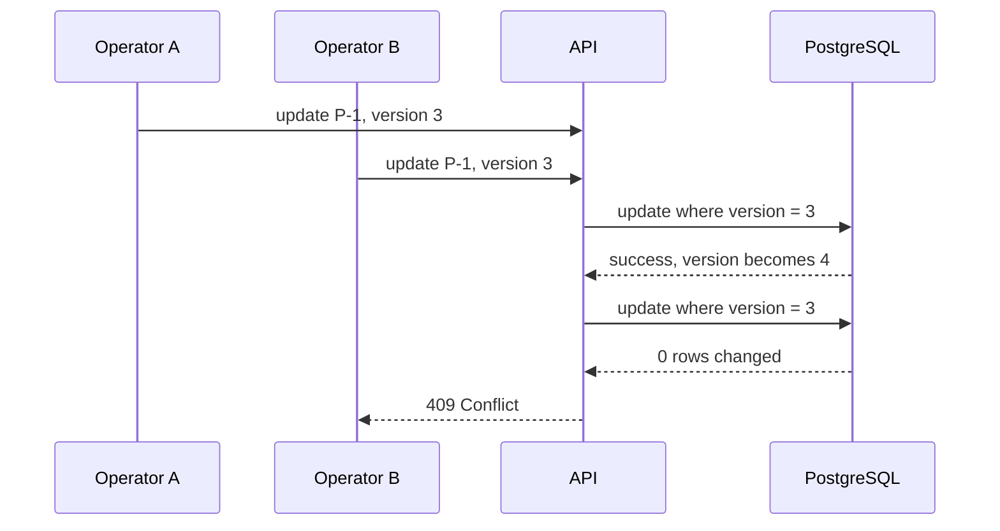

# Database lab: PostgreSQL, migrations, and concurrent updates

## Problem

The in-memory map disappears on restart. Even after persistence, two requests can overwrite each other unless the API detects a concurrent change.

## Solution

Run PostgreSQL in Docker, persist parcels through a repository, and add a schema migration. Add an optimistic-lock version field before adding a cache.



## Local database command

```bash
docker run --name parcelpilot-db --rm \
  -e POSTGRES_DB=parcelpilot \
  -e POSTGRES_USER=parcelpilot \
  -e POSTGRES_PASSWORD=local-dev-only \
  -p 5432:5432 \
  -v parcelpilot-postgres:/var/lib/postgresql/data \
  postgres:16-alpine
```

The password is only an intentionally visible local-development value. Do not commit real secrets.

## Proof

Create a parcel, restart the API, and read it back. Then send two updates based on the same version and confirm one succeeds while the other returns `409`.

## Next

Read [Databases, caching, and locking](../../references/databases-caching-and-locking.md). Redis caching comes later, after the database behavior is clear.
