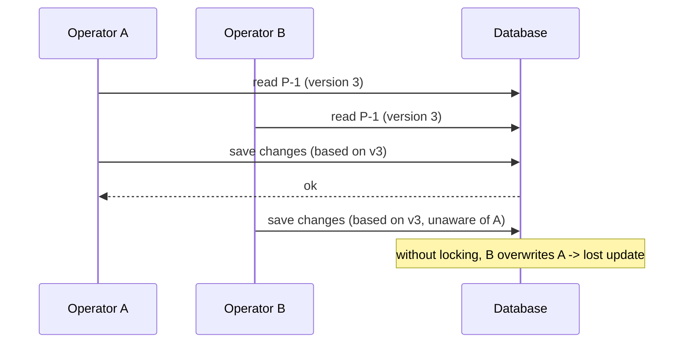
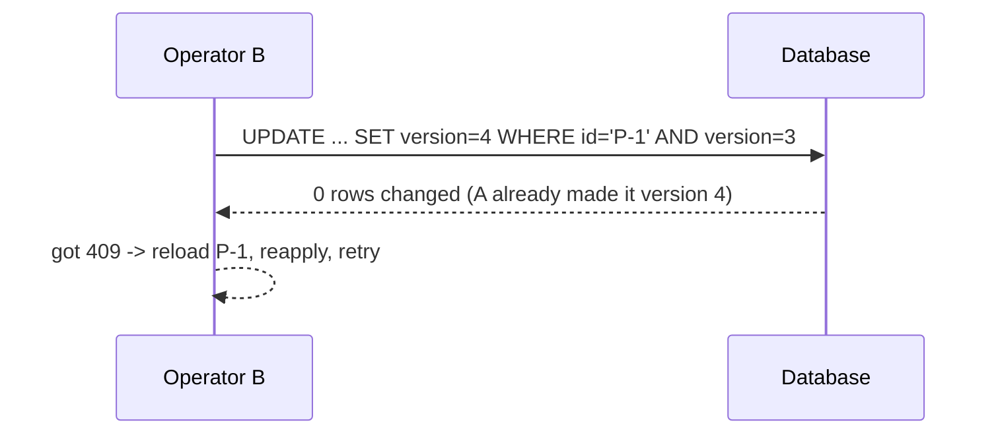

# Locking explained (optimistic vs pessimistic)

When more than one request changes the same data at the same time, you can get **lost updates**. Locking prevents that.

## The problem (real world)

Two operators open parcel `P-1` at the same moment (both see version 3). Operator A sets it to `PICKED_UP`; Operator B, still looking at the old copy, sets a note and saves. Without protection, B's save overwrites A's change — A's update is silently **lost**.



## Two solutions

### Optimistic locking (our default)

Assume conflicts are **rare**. Add a `version` number to each row. On update, the database only writes if the version still matches; then it bumps the version. If someone else already changed the row, your update matches zero rows → the app returns `409 Conflict`, and the caller reloads and retries.



In JPA this is **automatic** once you add `@Version`:

```java
@Entity
public class ParcelEntity {
    @Id private String id;
    @Version private long version;   // JPA checks + increments this on every update
    // ...
}
```

If a conflict happens, JPA throws `OptimisticLockException`; map that to HTTP `409` in your controller.

### Pessimistic locking

Assume conflicts are **likely**. Lock the row in the database while you work, so others must wait. Stronger, but reduces concurrency and can cause waits/deadlocks.

```java
// conceptual: lock the row for the duration of the transaction
@Lock(LockModeType.PESSIMISTIC_WRITE)
Optional<ParcelEntity> findById(String id);
```

## Optimistic vs pessimistic — when to use which

| | Optimistic | Pessimistic |
|---|---|---|
| Assumes | conflicts are rare | conflicts are common |
| How | version check on write | lock the row while working |
| Cost | must handle `409`/retry | others wait; risk of deadlock |
| Concurrency | high | lower |
| Good for | typical REST updates (ParcelPilot) | short critical sections, hot rows (e.g. seat/stock counters) |

**We use optimistic locking** because parcel updates rarely collide, and it keeps the API fast and simple — you just handle the occasional `409`.

## Locking vs transactions (don't confuse them)

- A **transaction** groups changes so they all succeed or all fail (atomicity).
- **Locking** decides what happens when two transactions touch the same row.

You'll use both: a transaction wraps a change; the `@Version` lock protects against concurrent writers.

## Real-world analogy

Optimistic = editing a shared doc and getting "someone else changed this, please refresh" when you save. Pessimistic = checking out a library book so nobody else can take it until you return it.

## Proof (do this in the step)

Create `P-1`, then send two updates both based on version 3. One succeeds; the other must return `409`.

## Back to the step

Return to [Step 06](README.md).
