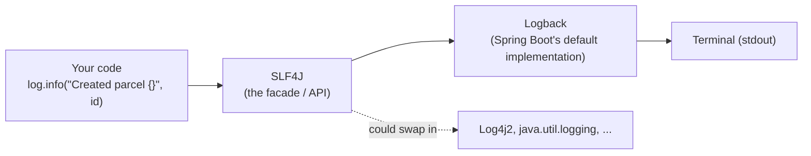

# Step 07: Logging you can actually read

> In this step: make ParcelPilot tell you what it's doing. You'll learn SLF4J and Logback, log levels, parameterized messages, and what must never appear in a log, then add real logging to the controller and the error handler. ~60–75 minutes.

## The problem right now

In step 06 you built a `GlobalErrorHandler` so that when something unexpected explodes, the client gets a clean JSON `500` instead of a stack trace. Good for the client, terrible for **you**: the response says "unexpected error", and that's *all anyone knows*. What failed? On which request? With which parcel ID? Right now the answer is: nobody can tell.

Maybe you've debugged with `System.out.println("here 1")`. That works for two minutes and then betrays you:

- You delete the prints when you're done, so the next bug starts from zero.
- There's no timestamp, no severity, no way to say "show me only the errors".
- You can't turn them off in one place, or follow **one request** through the app.

A real backend keeps a permanent, structured record of what it did. That record is called a **log**, and this step gives ParcelPilot one you can actually read.

## Key words

| Word | Beginner meaning |
|---|---|
| **Log** | A time-ordered record of events your app writes while running. |
| **Log line / log event** | One entry: timestamp + level + which class + a message. |
| **Log level** | The severity label of a line: `TRACE`, `DEBUG`, `INFO`, `WARN`, `ERROR`. |
| **Logger** | The object you call to write log lines, usually one per class. |
| **SLF4J** | The logging *API* your code talks to (Simple Logging Facade for Java). |
| **Logback** | The logging *implementation* that actually formats and writes the lines. Spring Boot's default. |
| **Facade** | A thin front interface hiding which implementation is behind it. |
| **Parameterized logging** | Writing `log.info("Created parcel {}", id)` with `{}` placeholders instead of string concatenation. |
| **Stack trace** | The list of method calls that led to an exception, printed line by line. |
| **MDC** | Mapped Diagnostic Context: a per-request "sticky note" that gets attached to every log line, e.g. a request ID. |
| **Correlation / request ID** | A unique ID given to one request so you can find all its log lines. |

## What is logging with SLF4J and Logback?

**Logging** is your app narrating its own life to standard output: *"18:22:31, INFO, ParcelController: Created parcel P-2."* Unlike `println`, every line carries a timestamp, a severity **level**, and the class that wrote it, and you can dial the detail up or down **without touching code**.

In Java you don't talk to a logging library directly. You talk to **SLF4J**, a *facade*: a small, stable API (`log.info(...)`, `log.error(...)`) that forwards to whichever real implementation is on the classpath. Spring Boot ships **Logback** as that implementation. The win: your code never changes even if the implementation underneath does.



The minimal ParcelPilot version — no new dependencies, `spring-boot-starter-web` already includes everything:

```java
package com.parcelpilot;

import org.slf4j.Logger;
import org.slf4j.LoggerFactory;

public class Example {
    // one logger per class, named after the class
    private static final Logger log = LoggerFactory.getLogger(Example.class);

    void createParcel(String id, String recipient) {
        log.info("Created parcel {} for recipient {}", id, recipient);
    }
}
```

Run it and Logback prints:

```text
2026-07-14T18:22:31.512+02:00  INFO 41235 --- [nio-8080-exec-1] com.parcelpilot.Example : Created parcel P-2 for recipient Ava
```

### The five levels, and when to use each

Every log line has exactly one level. Levels are ordered, and you set a *threshold* per package: at `INFO`, everything `INFO` and above is shown, `DEBUG`/`TRACE` are dropped.

| Level | Use it when… | ParcelPilot example |
|---|---|---|
| `TRACE` | You need step-by-step internals. Almost never in app code. | "Entering toResponse() with P-2" |
| `DEBUG` | Useful while developing; noise in normal operation. | "Status filter matched 3 of 12 parcels" |
| `INFO` | Something businessy happened that you'd want in the record. | "Created parcel P-2", "Parcel P-2 → PICKED_UP" |
| `WARN` | Something is off but the app handled it and kept going. | "Unknown status filter 'CREATD', returning empty list" |
| `ERROR` | Something failed that shouldn't have. A human should look. | The catch-all in `GlobalErrorHandler` fired |

Rule of thumb: **INFO tells the story of the business, DEBUG tells the story of the code.** The full decision table with more examples is in [SLF4J and log levels](slf4j-and-log-levels.md).

### Parameterized logging: `{}` beats `+`

Always write messages with `{}` placeholders:

```java
log.info("Created parcel {} for recipient {}", id, recipient);   // good
log.info("Created parcel " + id + " for recipient " + recipient); // avoid
```

Two reasons:

1. **Cost.** With `+`, Java builds the full string *even when the level is disabled* and the line is thrown away. With `{}`, SLF4J only assembles the string if the line will actually be written. This matters most for `DEBUG` lines that are usually off.
2. **Safety and readability.** It's printf-style: the template stays constant and scannable, the values slot in. No `+ " " +` typos, and log tools can group lines by their template.

### What must NEVER be in a log

Logs get copied, shipped, searched, and kept for months. Treat every log line as something a stranger might read later.

| Never log | Why |
|---|---|
| Passwords (even wrong ones) | A log leak becomes an account leak. |
| Tokens, JWTs, API keys, session IDs | Anyone reading the log can impersonate the user. |
| Full personal data (addresses, emails, phone numbers) | Privacy laws and basic decency. Log the parcel **ID**, not the recipient's home address. |
| Full request bodies "just in case" | They contain all of the above sooner or later. |

For ParcelPilot: `recipient` is a name — borderline, fine for a learning project. When ParcelPilot grows real addresses, you'd log `parcelId` only. More in [the logging reference](../../references/logging.md).

### Correlation IDs (a first look)

When two `curl`s hit the app at the same time, their log lines interleave. A **request ID** — one unique ID per request, stamped on every line that request produces — lets you filter the log down to one request's story. You'll build a small version as this step's stretch goal, and the full multi-service version in [step 14](../14-compose-and-observe/README.md).

## Why do it? Pros and cons

**What it brings us:** when the next 500 happens, the terminal tells you *what* failed, *where*, and *for which request* — without redeploying with print statements.

| Pros | Cons |
|---|---|
| Debuggability: the stack trace of every unexpected error is on record | Volume: logs cost disk/attention; chatty logs bury the important lines |
| An audit trail: "parcel P-2 was created at 18:22, moved to PICKED_UP at 18:40" | Risk: one careless line can leak a password or token into storage |
| Levels let you dial detail up (DEBUG) or down (WARN) per package, no code change | Unparameterized logging (`+`) silently costs CPU and invites bugs |
| Logging to stdout is exactly what Docker expects — this pays off in [step 09](../09-docker/README.md) and [step 14](../14-compose-and-observe/README.md) | A log is not a metric: it can't cheaply answer "how many per second?" |

## When to use it (and when not)

**Use INFO** at business moments: parcel created, status changed, request rejected with a 4xx you care about. **Use ERROR** exactly where the last-resort handler catches the unexpected. **Use DEBUG** for the details you'd want mid-investigation but not every day.

**Where to log matters as much as what.** Log at the **boundary** (the controller / error handler, where requests enter and leave) and at **decision points** (a status transition rejected). Do *not* log the same event in every layer — if the controller logs "creating parcel" and the domain logs "creating parcel" and a future repository logs it too, one request becomes three identical lines and the log turns to noise.

**When not:**

- **No INFO inside tight loops.** A line per parcel inside `list()` over 10,000 parcels is 10,000 lines per request. Log the summary ("returned 10000 parcels"), or use DEBUG.
- **Logs are not metrics.** "How many parcels per minute? What's the p95 latency?" — counting log lines is the wrong tool; that's what metrics are for, and they arrive in [step 14](../14-compose-and-observe/README.md).
- **Don't log secrets to make debugging easier.** See the never-log table above; there is no exception for "just locally".

## Real-world example

A bank's payment service processes a transfer that fails at 03:12 on a Sunday. Nobody was watching a terminal. On Monday, an engineer greps the logs for the transfer ID, finds one `ERROR` line with a full stack trace pointing to a currency-conversion call that timed out, and the `INFO` lines around it showing exactly which steps completed before the failure. The bug is fixed by lunch — because the app wrote its story down while nobody was looking.

## Common mistakes

- **Passing the exception inside the message:** `log.error("Failed: " + e)` or `log.error("Failed {}", e)` prints only `e.toString()` — **no stack trace**. Pass the exception as the *last argument with no placeholder*: `log.error("Failed on {} {}", method, path, e)`.
- **String concatenation in log messages** — builds strings even for disabled levels, and loses the constant-template benefit. Use `{}`.
- **Log-and-rethrow:** catching an exception, logging it, then throwing it again — the caller (or the `GlobalErrorHandler`) logs it *too*, and every error appears twice. Log an exception at exactly **one** place: where it's finally handled.
- **INFO noise:** logging every getter, every layer, every loop iteration. When everything is INFO, nothing is.
- **Creating the logger with the wrong class:** copy-pasting `LoggerFactory.getLogger(ParcelController.class)` into `GlobalErrorHandler` makes lines *claim* to come from the controller. The logger's class argument should always be the class it lives in.

## Build it in ParcelPilot

Still one project: `applications/parcelpilot`. No `pom.xml` changes — SLF4J and Logback are already in `spring-boot-starter-web`.

### 1. Give the controller a logger

At the top of `ParcelController`, add the two imports and one field:

```java
import org.slf4j.Logger;
import org.slf4j.LoggerFactory;

@RestController
@RequestMapping("/parcels")
public class ParcelController {

    private static final Logger log = LoggerFactory.getLogger(ParcelController.class);

    // ... existing fields and methods
}
```

`private static final` because one logger per class is enough, it never changes, and it doesn't belong to any single instance.

### 2. Log the business moments

Add one line to each endpoint — INFO for writes (state changes), DEBUG for reads:

```java
@PostMapping
public ResponseEntity<ParcelResponse> create(@Valid @RequestBody CreateParcelRequest req) {
    Parcel parcel = new Parcel(req.id(), req.recipient());
    store.put(parcel.id(), parcel);
    log.info("Created parcel {} for recipient {}", parcel.id(), parcel.recipient());
    return ResponseEntity.status(201).body(toResponse(parcel));
}
```

```java
@GetMapping("/{id}")
public ResponseEntity<ParcelResponse> getOne(@PathVariable String id) {
    log.debug("Reading parcel {}", id);
    // ... existing lookup and return
}
```

```java
@PatchMapping("/{id}/status")
public ResponseEntity<ParcelResponse> updateStatus(@PathVariable String id,
                                                   @Valid @RequestBody UpdateStatusRequest req) {
    // ... existing lookup and transition
    log.info("Parcel {} status changed to {}", id, req.status());
    return ResponseEntity.ok(toResponse(parcel));
}
```

(Your method bodies from steps 05–06 may differ slightly — the point is one `log.info` per successful write and one `log.debug` per read. Don't add more.)

### 3. Log the disaster in `GlobalErrorHandler`

This is the heart of the step. Your catch-all from step 06 returns a clean `ErrorResponse` — now make it also record what actually happened:

```java
import jakarta.servlet.http.HttpServletRequest;
import org.slf4j.Logger;
import org.slf4j.LoggerFactory;

@RestControllerAdvice
public class GlobalErrorHandler {

    private static final Logger log = LoggerFactory.getLogger(GlobalErrorHandler.class);

    // ... your existing 400/404/409 handlers stay as they are

    @ExceptionHandler(Exception.class)
    public ResponseEntity<ErrorResponse> handleUnexpected(Exception e, HttpServletRequest request) {
        log.error("Unhandled error on {} {}", request.getMethod(), request.getRequestURI(), e);
        ErrorResponse body = new ErrorResponse(
                "INTERNAL",
                "An unexpected error occurred",
                Map.of(),
                request.getRequestURI());
        return ResponseEntity.status(500).body(body);
    }
}
```

**Look closely at the `log.error` line — this is a classic gotcha.** There are two `{}` placeholders but *three* arguments. That's deliberate: when the **last** argument is a `Throwable` and has no placeholder, SLF4J treats it as *the exception* and prints its **full stack trace** under the message. If you wrote `log.error("Unhandled error: {}", e)` instead, `e` would fill the placeholder as a plain string — one line, **no stack trace**, and you'd be blind again. Exception last, no `{}` for it.

Note the split: the **client** still gets the generic "Something went wrong" (never leak internals in responses) while the **log** gets everything.

### 4. (Stretch) A request ID on every line

Optional but satisfying. A tiny filter runs before every request: it reads the `X-Request-Id` header (or generates one), stores it in Logback's **MDC** so every log line in that request carries it, and echoes it back in the response.

```java
package com.parcelpilot;

import jakarta.servlet.FilterChain;
import jakarta.servlet.ServletException;
import jakarta.servlet.http.HttpServletRequest;
import jakarta.servlet.http.HttpServletResponse;
import org.slf4j.MDC;
import org.springframework.stereotype.Component;
import org.springframework.web.filter.OncePerRequestFilter;

import java.io.IOException;
import java.util.UUID;

@Component
public class RequestIdFilter extends OncePerRequestFilter {

    @Override
    protected void doFilterInternal(HttpServletRequest request,
                                    HttpServletResponse response,
                                    FilterChain chain) throws ServletException, IOException {
        String requestId = request.getHeader("X-Request-Id");
        if (requestId == null || requestId.isBlank()) {
            requestId = UUID.randomUUID().toString().substring(0, 8);
        }
        MDC.put("requestId", requestId);            // attach to every log line in this request
        response.setHeader("X-Request-Id", requestId);
        try {
            chain.doFilter(request, response);
        } finally {
            MDC.remove("requestId");                // threads are reused; always clean up
        }
    }
}
```

Then make the log pattern print it, in `src/main/resources/application.properties`:

```properties
logging.pattern.console=%d{HH:mm:ss.SSS} %-5level [%X{requestId}] %logger{36} : %msg%n
```

`%X{requestId}` reads the MDC. Every line now looks like `18:22:31.512 INFO  [b4f2a91c] com.parcelpilot.ParcelController : Created parcel P-2 ...`. Prove it works with two concurrent requests in the [logging lab](logging-lab.md).

## Test it

```bash
cd applications/parcelpilot
mvn spring-boot:run
```

In a second terminal, create a parcel:

```bash
curl -i -X POST http://localhost:8080/parcels \
  -H 'Content-Type: application/json' \
  -d '{"id":"P-7","recipient":"Ava"}'
```

The first terminal (the app) should show your INFO line:

```text
2026-07-14T18:22:31.512+02:00  INFO 41235 --- [nio-8080-exec-1] com.parcelpilot.ParcelController         : Created parcel P-7 for recipient Ava
```

Now trigger the catch-all on purpose. Add a **temporary** trap at the top of `getOne` (delete it after this test):

```java
if ("boom".equals(id)) {
    throw new RuntimeException("simulated storage failure");
}
```

Restart and hit it:

```bash
curl -i http://localhost:8080/parcels/boom
```

The **client** sees the clean step-06 response, no internals leaked:

```text
HTTP/1.1 500
Content-Type: application/json

{"code":"INTERNAL","message":"An unexpected error occurred","details":{},"path":"/parcels/boom"}
```

The **app terminal** sees everything — one ERROR line and the full stack trace beneath it:

```text
2026-07-14T18:24:05.113+02:00 ERROR 41235 --- [nio-8080-exec-2] com.parcelpilot.GlobalErrorHandler       : Unhandled error on GET /parcels/boom

java.lang.RuntimeException: simulated storage failure
	at com.parcelpilot.ParcelController.getOne(ParcelController.java:47)
	at java.base/jdk.internal.reflect.DirectMethodHandleAccessor.invoke(DirectMethodHandleAccessor.java:103)
	...
```

If you see the ERROR line but **no stack trace**, you've hit the gotcha: the exception is inside the message (or has a `{}`), instead of being the bare last argument.

**Delete the temporary `boom` trap** before moving on, then do the [logging lab](logging-lab.md) for the concatenation-vs-placeholder and DEBUG exercises.

## Acceptance criteria

- [ ] `POST /parcels` prints one `INFO` line with the parcel ID (visible in the app terminal).
- [ ] `PATCH /parcels/{id}/status` prints one `INFO` line with the ID and new status.
- [ ] An unexpected exception produces: a clean JSON `500` for the client **and** one `ERROR` line **with a full stack trace** in the terminal.
- [ ] You can point at `log.error("Unhandled error on {} {}", method, path, e)` and explain why `e` has no `{}`.
- [ ] You can explain SLF4J vs Logback in one sentence (facade vs implementation).
- [ ] You can name the five levels in order and give a ParcelPilot example for INFO, WARN, and ERROR.
- [ ] You can name two things that must never appear in a log.
- [ ] (Stretch) two requests with different `X-Request-Id` headers produce log lines with different IDs.

## Say it like a developer

- "Our code logs through **SLF4J**; **Logback** is the implementation Spring Boot wires in underneath."
- "I log at **INFO** for business events like parcel creation, and at **ERROR** with the full **stack trace** in the catch-all handler."
- "Use **parameterized logging** — `log.info("Created parcel {}", id)` — so the string is only built if the level is enabled."
- "The exception goes as the **last argument without a placeholder**, otherwise you lose the stack trace."
- "We log at the boundary and at decision points, not in every layer, to avoid duplicate noise."
- "We never log tokens or passwords; the client gets a generic 500 while the details stay in our log."

## Quiz: check yourself

Answer out loud before opening each toggle.

1. What is the difference between **SLF4J** and **Logback**?

<details><summary>Show answer</summary>

SLF4J is the **facade** — the stable API your code calls (`log.info(...)`). Logback is the **implementation** behind it that actually formats and writes the lines. Your code only depends on SLF4J, so the implementation could be swapped (e.g. for Log4j2) without changing a line of your code.

</details>

2. Why is `log.info("Created parcel {}", id)` better than `log.info("Created parcel " + id)`?

<details><summary>Show answer</summary>

With `+`, the full string is built even when the level is disabled and the line is discarded — wasted work. With `{}`, SLF4J only assembles the string if the line will actually be written. The template also stays constant, which is easier to read and lets tools group lines.

</details>

3. You write `log.error("Failed: {}", e)`. What do you get, and what should you write instead?

<details><summary>Show answer</summary>

You get one line containing `e.toString()` — **no stack trace**, because `e` was consumed by the placeholder as a plain value. Pass the exception as the last argument with **no** placeholder: `log.error("Failed on {} {}", method, path, e)` — then SLF4J prints the message *and* the full stack trace.

</details>

4. A request comes in with an unknown status filter; the app returns an empty list and keeps working. A request hits a bug and the catch-all handler fires. Which level fits each, and why?

<details><summary>Show answer</summary>

The unknown filter is a **WARN**: something is off, but the app handled it and kept going. The catch-all firing is an **ERROR**: something failed that shouldn't have, and a human should investigate.

</details>

5. Name three things that must never be written to a log, and say what a request ID is for.

<details><summary>Show answer</summary>

Never log passwords, tokens/JWTs/API keys, or full personal data (like a recipient's home address) — logs get stored, shipped, and read widely, so a log leak becomes a credential or privacy leak. A request ID is a unique ID stamped on every log line one request produces, so you can filter interleaved logs down to a single request's story.

</details>

## Reflect

You proved the logging works by running the app and eyeballing the terminal — a human reading text. That doesn't scale: tomorrow you'll change the status rules and *manually* re-curl every endpoint to check nothing broke, and the day after you'll forget one. What you want is a program that exercises ParcelPilot and checks the answers **automatically**, every time, in seconds.

## Next

[Step 08](../08-testing/README.md): automated tests, so a machine verifies ParcelPilot's behavior instead of your eyes.
