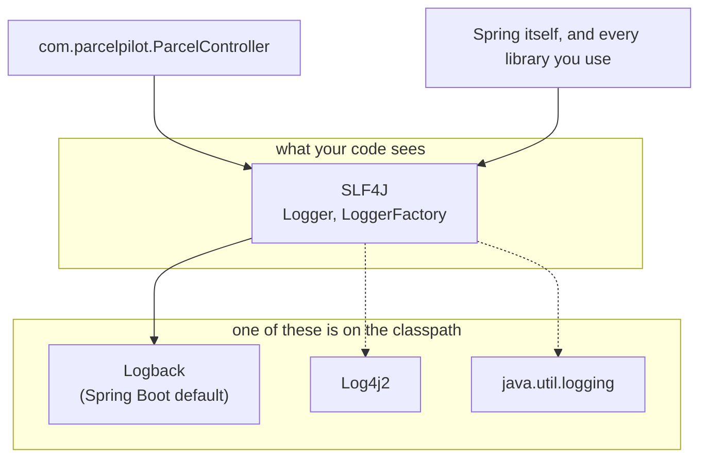
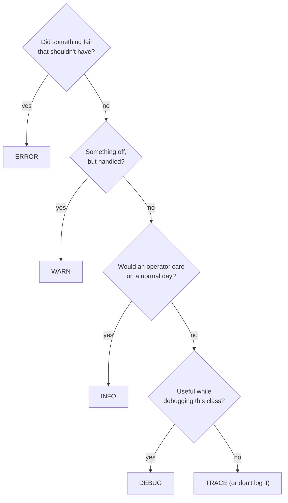

# SLF4J and log levels, in depth

Companion to [Step 07](README.md). The README shows *what to add*; this page explains *how the pieces work*: the facade pattern, the anatomy of a log line, each level with ParcelPilot examples, and how to control levels from configuration.

## The problem

You want to write `log.info(...)` in ParcelPilot and get readable, filterable output — without your code being welded to one particular logging library, and without editing Java every time you want more or less detail.

## The solution: a facade plus a swappable implementation

Java has had *many* logging libraries over the years: `java.util.logging` (built in), Log4j, Log4j2, Logback. If your code called one of them directly, switching later would mean rewriting every logging line — and worse, the libraries *you* depend on may each have picked a different one.

**SLF4J** (Simple Logging Facade for Java) fixes this with the **facade pattern**: everyone codes against one small, stable API, and exactly one real implementation is plugged in at runtime.



Spring Boot's `spring-boot-starter-web` pulls in SLF4J + **Logback** already configured, which is why step 07 needs zero new dependencies. You will likely never swap Logback out — the point is that you *could*, and that every library in your app funnels through the same pipe, so all output lands in one place with one format.

**Pros of the facade:** one API to learn; libraries and your code share one output; the implementation is a deployment decision, not a code decision.
**Cons:** one more layer of indirection to understand, and classpath conflicts (two implementations present at once) produce confusing warnings at startup.

## Anatomy of a log line

Run ParcelPilot and create a parcel; Logback prints something like this. Every field earns its place:

```text
2026-07-14T18:22:31.512+02:00  INFO 41235 --- [nio-8080-exec-1] com.parcelpilot.ParcelController         : Created parcel P-7 for recipient Ava
└──────────┬─────────────────┘ └─┬─┘ └─┬─┘     └──────┬───────┘ └───────────────┬──────────────┘   └──────────────┬────────────────────┘
       timestamp               level  PID          thread                logger (class name)                 your message
```

| Part | What it tells you |
|---|---|
| **Timestamp** | *When* — down to milliseconds, with timezone. Lets you line events up in order. |
| **Level** | *How serious* — and the handle for filtering ("show me WARN and above"). |
| **PID** | Which process wrote it (useful when several apps share one machine). |
| **Thread** | Which worker thread handled the request. Two concurrent requests run on different threads (e.g. `exec-1` and `exec-2`), which is how you spot interleaving. |
| **Logger** | *Where in the code* — the class name, because we name loggers after their class. |
| **Message** | *What happened* — your parameterized text with the values filled in. |

`println` gives you only the last column. The other five are why logs are searchable and prints aren't.

## The five levels, with ParcelPilot examples

| Level | Meaning | ParcelPilot example | Who reads it |
|---|---|---|---|
| `TRACE` | Microscopic step-by-step detail. | "Entering toResponse() for P-7" | Almost nobody; framework internals. |
| `DEBUG` | Developer detail: values, branches, counts. | "Status filter CREATED matched 3 of 12 parcels" | You, while investigating. |
| `INFO` | Normal business events worth recording. | "Created parcel P-7", "Parcel P-7 → PICKED_UP" | You and future operators, every day. |
| `WARN` | Handled trouble; the app kept going. | "Rejected transition DELIVERED → CREATED for P-7" | Someone scanning for early trouble. |
| `ERROR` | Unhandled or unexpected failure. | `GlobalErrorHandler` catch-all fired with a stack trace | Whoever gets paged. |

A decision path when you're unsure:



Two habits worth building now:

- **INFO tells the business story.** Reading only the INFO lines should read like a diary of what ParcelPilot did: created P-7, moved P-7 to PICKED_UP.
- **ERROR means "a human should look".** If an ERROR is routine and ignorable, it's mislabeled — demote it, or fix the cause.

## Levels are thresholds, set in configuration

Each logger has an *effective level*, and a line is written only if its level is **at or above** that threshold. Spring Boot defaults to `INFO`, which is why your `log.debug(...)` lines are invisible until you ask for them.

The threshold lives in `src/main/resources/application.properties` — configuration, not code:

```properties
# your code: show DEBUG and above
logging.level.com.parcelpilot=DEBUG

# a noisy framework package: only WARN and above
logging.level.org.apache.tomcat=WARN
```

Logger names are hierarchical, following package names: setting `com.parcelpilot` covers `com.parcelpilot.ParcelController` and everything else in the package. Restart the app after the DEBUG line and your `log.debug("Reading parcel {}", id)` from the README appears; remove it and the line vanishes — **same code, different visibility**.

### Why config beats code for levels

| Levels in configuration (properties) | Levels hard-coded (e.g. `if (verbose) println`) |
|---|---|
| Change detail without recompiling or touching Java | Every change is a code change and redeploy |
| Different settings per environment (DEBUG locally, INFO in production) | One behavior everywhere |
| Per-package precision (your code DEBUG, Tomcat WARN) | All-or-nothing flags |
| One standard place everyone knows to look | Home-grown flags nobody else knows about |

The cost: one more file influencing behavior — if logs look wrong, remember to check `application.properties`, not just the code.

## Parameterized messages and lazy evaluation

The `{}` placeholder is more than style. Compare what happens when the line is at `DEBUG` but the threshold is `INFO` (so the line is dropped):

```java
// 1) Concatenation: builds "Status filter CREATED matched 3 of 12 parcels"
//    in memory FIRST, then SLF4J checks the level and throws it away.
log.debug("Status filter " + status + " matched " + count + " of " + total + " parcels");

// 2) Parameterized: SLF4J checks the level FIRST. Threshold says no →
//    the string is never assembled. Near-zero cost.
log.debug("Status filter {} matched {} of {} parcels", status, count, total);
```

This is **lazy evaluation**: postpone the work until you know it's needed. For one line it's negligible; for DEBUG lines inside request handling, executed on every request but usually disabled, it adds up. One caveat: if an *argument itself* is expensive to compute (say, serializing a big object), laziness doesn't save you — the argument is evaluated before SLF4J is even called. Guard those rare cases with `if (log.isDebugEnabled()) { ... }`.

And the exception rule from the README bears repeating, because it bites everyone once: a `Throwable` passed as the **last argument without a placeholder** gets its full stack trace printed. Give it a `{}` and you get one flat line instead.

```java
log.error("Unhandled error on {} {}", method, path, e);  // message + full stack trace
log.error("Unhandled error: {}", e);                     // one line, stack trace LOST
```

## Logger naming: one per class, named after it

The convention, used everywhere including Spring itself:

```java
private static final Logger log = LoggerFactory.getLogger(ParcelController.class);
```

- **One per class** — so the logger column tells you where a line came from.
- **Named after the class** (pass the class itself, not a string) — refactor-safe, and the name tracks the package hierarchy so `logging.level.com.parcelpilot=DEBUG` covers it.
- **`private static final`** — one shared, immutable instance; loggers are thread-safe.

The classic bug: copy-pasting the field into a new class and forgetting to change `ParcelController.class` to the new class. Everything works, but the log *lies about where lines come from*. Check the class argument whenever you paste this line.

## Try it in ParcelPilot

The [logging lab](logging-lab.md) turns each section above into an exercise: comparing `+` vs `{}` output, flipping `logging.level` to DEBUG and watching Spring's own internals appear, and stamping request IDs on concurrent requests.

## Next

- Back to the step: [Step 07 README](README.md)
- Practice: [Logging lab](logging-lab.md)
- Deeper reference (structured logs, MDC, retention, anti-patterns): [../../references/logging.md](../../references/logging.md)
