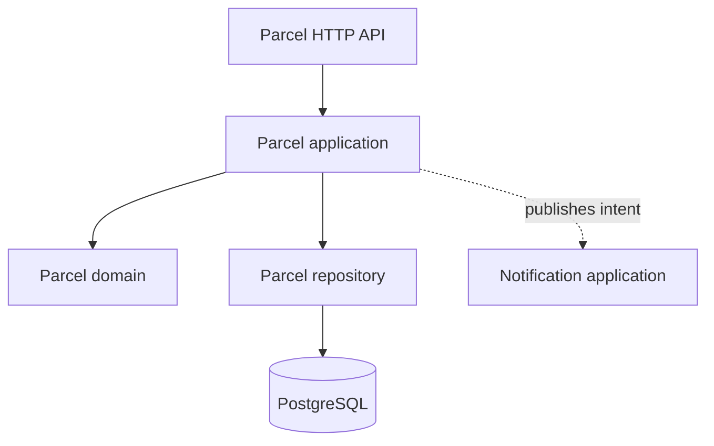

# Step 07: The modular monolith

> In this step: organize the code into clean feature modules while keeping ONE deployable app. ~75 minutes.

## The problem right now

ParcelPilot now does HTTP, parcel rules, storage, and (soon) notifications, often tangled together in a few classes. That makes changes risky and tests awkward. But splitting into networked services now would add huge complexity **before** you have a proven reason. The middle path is a **modular monolith**.

## Key words

| Word | Beginner meaning |
|---|---|
| **Monolith** | One application, built and deployed as a single unit. |
| **Modular monolith** | A monolith with clear internal modules (boundaries), still one deployable. |
| **Module** | A self-contained slice of the app for one feature (e.g. `parcel`, `notification`). |
| **Domain** | The core business rules and objects (e.g. parcel lifecycle). |
| **Use case / application layer** | The steps that carry out an operation (e.g. "mark delivered"). |
| **Adapter** | Code that translates between the outside world (HTTP, DB) and your domain. |
| **Coupling** | How tightly parts depend on each other (less is usually better). |
| **Cohesion** | How focused a module is on one job (more is better). |
| **Boundary** | A clear line separating one responsibility from another. |

## What is a modular monolith (and why not microservices yet)?

Think of one building with well-labeled rooms. You still live in one house (one deploy, no network between rooms), but each room has a clear purpose, so you can later move a room into its own building if needed.

Organize **by feature**, not by generic layers (this is Stage 5 in [Code organization](../../references/code-organization.md), and it applies the [package-by-feature best practice](../../references/java-best-practices.md#12-organize-by-feature-not-by-layer)):

```text
parcel/
  Parcel.java              # domain: rules + state
  ParcelApplication.java   # use cases
  ParcelHttpApi.java       # adapter: HTTP in/out
  ParcelRepository.java    # adapter: persistence
notification/
  NotificationApplication.java
```



## Why do it? Pros and cons

**What it brings us:** each feature is understandable and testable on its own, and future extraction (step 09) becomes a copy-paste-sized job instead of a rewrite.

**Pros of the monolith:** one deploy, fast local calls (no network), easy debugging, and simple data consistency.
**Cons:** everything scales and deploys together, a heavy feature can't be scaled alone, and the codebase can grow large.

**Real-world example:** most successful products start as a well-structured monolith and only extract services where a real bottleneck or team boundary appears.

## Build it in ParcelPilot

Keep it one app in `applications/parcelpilot`.

1. Group code into `parcel/` and `notification/` packages by feature.
2. Inside `parcel/`, separate: domain (`Parcel`), application (use cases), HTTP adapter, repository.
3. Make the notification side a **separate module the parcel module talks to through a small interface**, not by reaching into its internals.
4. Keep the same endpoints and database. This is reorganization, not new features.

The key move is a small interface (a "port") that the parcel module depends on, while the notification module provides the implementation. This is what makes step 09's extraction easy later:

```java
// parcel module depends on this interface only, not on notification internals
package com.parcelpilot.parcel;

public interface Notifier {
    void parcelDelivered(String parcelId);
}
```

```java
// notification module provides the implementation
package com.parcelpilot.notification;

import com.parcelpilot.parcel.Notifier;
import org.springframework.stereotype.Component;

@Component
public class LoggingNotifier implements Notifier {
    @Override
    public void parcelDelivered(String parcelId) {
        System.out.println("notification: parcel " + parcelId + " delivered");
    }
}
```

The parcel use case receives a `Notifier` by constructor (dependency injection = composition), so it never knows *how* notifications are sent:

```java
package com.parcelpilot.parcel;

import org.springframework.stereotype.Service;

@Service
public class ParcelApplication {
    private final ParcelRepository repository;
    private final Notifier notifier;

    public ParcelApplication(ParcelRepository repository, Notifier notifier) {
        this.repository = repository;
        this.notifier = notifier;
    }

    public void markDelivered(String parcelId) {
        ParcelEntity parcel = repository.findById(parcelId).orElseThrow();
        // ... apply domain rule to move to DELIVERED, then save ...
        notifier.parcelDelivered(parcelId);   // still inline for now (step 08 fixes this)
    }
}
```

## Test it

```bash
cd applications/parcelpilot
mvn test    # includes a use-case test WITHOUT starting the web server
# then run and re-check the endpoints still behave the same
mvn spring-boot:run
curl -i http://localhost:8080/parcels/P-1
```

## Acceptance criteria

- [ ] Code is organized by feature (`parcel`, `notification`), each with clear responsibilities.
- [ ] There is a test for a **use case** that runs without starting the web server (proving HTTP is just an adapter).
- [ ] All existing `curl` requests behave exactly as before.
- [ ] The parcel module talks to notifications through an interface, not internal details.
- [ ] You can explain "modular monolith" and why it comes before microservices.

## Say it like a developer

- "It's a **modular monolith**: one deployable app, but organized into clear feature **modules**."
- "I organized code **by feature** (`parcel`, `notification`), not by generic layers."
- "The parcel module talks to notifications only through a small **interface** (a **port**): low **coupling**."
- "Each module has high **cohesion**: everything in it is about one job."
- "The `Notifier` implementation is **injected**, so the parcel use case never knows *how* notifications are sent."

## Quiz: check yourself

Answer out loud before opening each toggle.

1. What is a **modular monolith**, and why choose it before microservices?

<details><summary>Show answer</summary>

One app, deployed as a single unit, but split into clear internal modules with boundaries. It gives you clean structure without the network complexity of microservices, and it makes a *real* future split easy once a genuine boundary appears.

</details>

2. Why organize **by feature** (`parcel`, `notification`) instead of by layer (`controllers`, `services`, `repositories`)?

<details><summary>Show answer</summary>

Feature packages keep everything about one capability together (high cohesion) and make a feature easy to understand, test, or later extract. Layer folders scatter one feature across many places.

</details>

3. What are **coupling** and **cohesion**, and which do you want more/less of?

<details><summary>Show answer</summary>

Coupling is how tightly parts depend on each other: you want **less**. Cohesion is how focused a module is on one job: you want **more**.

</details>

4. Why does the parcel module depend on a `Notifier` **interface** rather than the concrete `LoggingNotifier`?

<details><summary>Show answer</summary>

So the parcel module doesn't depend on notification internals. You can swap the implementation (log, email, queue) without touching parcel code, and later extract notifications into its own service with minimal changes.

</details>

5. This step adds **no new features**. So what's the point?

<details><summary>Show answer</summary>

It reorganizes existing code into clean boundaries. That structure is what makes every later step (queues, splitting services) a small change instead of a rewrite. The endpoints and behavior stay identical.

</details>

## Reflect (stretch)

Right now, marking a parcel delivered probably calls notification code **inline**, so the HTTP response waits for it. If notifications get slow or fail, parcel updates suffer. That shared-timing problem is what the queue in step 08 removes.

## Next

[Step 08](../08-queues/README.md): move notification work off the request path with a queue.
