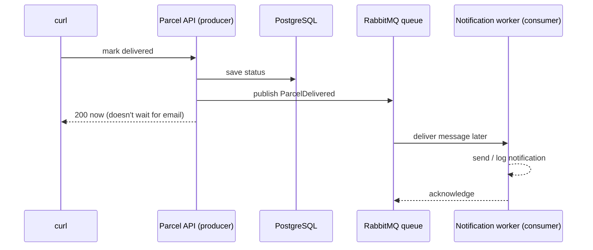

# Step 08 — Queues: do slow work later

> In this step: send notifications through a queue so the API responds fast. ~90 minutes. Start with the [What is a queue?](what-is-a-queue.md) lab.

## The problem right now

When an operator marks a parcel delivered, your monolith saves the parcel **and** sends the notification in the same request. If the email/SMS provider is slow or down, a perfectly good parcel update becomes slow or fails — for a reason that has nothing to do with parcels.

```text
now:  operator -> API -> save parcel -> send email (slow!) -> response
```

## Key words

| Word | Beginner meaning |
|---|---|
| **Synchronous** | The caller waits for the work to finish before getting a response. |
| **Asynchronous (async)** | The caller gets a response now; the work happens later. |
| **Queue** | A waiting line for messages: added at the back, processed from the front. |
| **Message** | A small piece of data describing something that happened or should happen. |
| **Producer** | The code that puts a message on the queue. |
| **Consumer / worker** | The code that takes messages off and processes them. |
| **Broker** | The server that stores and routes messages (RabbitMQ here). |
| **Acknowledge (ack)** | The consumer telling the broker "done, you can drop this message". |
| **Idempotent** | Doing the same thing twice has the same result as doing it once. |
| **Event** | A message describing a fact that already happened (past tense), e.g. `ParcelDelivered`. |

## What is a queue? (the one-minute version)

A queue is a **waiting line for work**. Instead of doing slow work during the request, you drop a note ("parcel P-1 delivered") into the line and answer the caller immediately. A separate **worker** picks up notes and does the slow work whenever it can.

```text
with a queue:  operator -> API -> save parcel + drop message -> response NOW
                                                   |
                                          worker picks it up later -> send email
```



## When SHOULD you use a queue? When not?

**Use a queue when** the work can happen after the response, might be slow, benefits from retries, or should scale separately:
- sending emails / SMS / push notifications
- generating PDFs, reports, or thumbnails
- calling slow third-party webhooks
- writing audit logs, analytics events

**Do NOT use a queue when** the caller needs the answer *right now*:
- "does this parcel exist?" (a read)
- "is this password correct?" (login)
- "is this item in stock?" before confirming an order

Read the full [What is a queue?](what-is-a-queue.md) lab before building — it explains producers, consumers, acks, and duplicates with pictures.

## Why RabbitMQ first? (and the alternatives)

| Broker | What it is | Pros | Cons |
|---|---|---|---|
| **RabbitMQ** (use now) | Classic message/task queue | easy to see queues + acks; simple locally in Docker; great for learning | not built for huge replayable event streams |
| **Kafka** | Durable event log with replay | massive throughput; many consumers; replay history | heavier to run and understand |
| **AWS SQS** | Managed cloud queue | no broker to operate; scales automatically | AWS-only; polling model; not a replay log |

Choose by requirements (throughput, replay, ordering, ops budget), not popularity. We learn on RabbitMQ because you can *watch* it work.

## Build it in ParcelPilot

Still the one monolith in `applications/parcelpilot`.

1. Run RabbitMQ in Docker (`rabbitmq:3-management`, which includes a web UI on port 15672).
2. Add Spring AMQP (`spring-boot-starter-amqp`) to `pom.xml`.
3. Define an event `ParcelDelivered(eventId, parcelId, occurredAt)`.
4. When a parcel is marked delivered: save state, then **publish** the event (producer).
5. Add a **consumer** that receives the event and logs `"notification sent for <parcelId>"`.
6. Make the consumer **idempotent**: remember handled `eventId`s so a redelivered message doesn't notify twice.

Do the [event-driven lab](event-driven-lab.md) for the command/observer/adapter framing.

## Test it

```bash
# 1. start RabbitMQ, then the app
# 2. PAUSE the consumer (comment it out or stop that part)
# 3. mark a parcel delivered -> response is still fast:
curl -i -X PATCH http://localhost:8080/parcels/P-1/status \
  -H 'Content-Type: application/json' -d '{"status":"DELIVERED"}'
# 4. start the consumer -> watch it process the waiting message
```

## Acceptance criteria

- [ ] Marking a parcel delivered returns quickly even when the consumer is paused/stopped.
- [ ] A `ParcelDelivered` message is visible in RabbitMQ (check the management UI at `http://localhost:15672`).
- [ ] When the consumer starts, it processes the queued message and logs the notification.
- [ ] Re-delivering the same event does **not** produce a second notification (idempotent).
- [ ] You can explain in one sentence what a queue is and give one good and one bad use case.

## Say it like a developer

- "Notifications are now **asynchronous**: the API responds first and the work happens later."
- "The API is the **producer** — it **publishes** a `ParcelDelivered` **event** to the **queue**."
- "A separate **consumer** (worker) picks messages off the queue and does the slow work."
- "The **broker** (RabbitMQ) stores and routes the messages."
- "The consumer **acknowledges** a message when it's done so the broker can drop it."
- "The consumer is **idempotent** — handling the same event twice has the same effect as once."

## Quiz — check yourself

Answer out loud before opening each toggle.

1. In one sentence, what is a **queue**?

<details><summary>Show answer</summary>

A waiting line for messages/work: producers add messages at the back, and consumers process them from the front — letting slow work happen after the response.

</details>

2. What's the difference between **synchronous** and **asynchronous** work?

<details><summary>Show answer</summary>

Synchronous: the caller waits for the work to finish before getting a response. Asynchronous: the caller gets a response now, and the work happens later (e.g. via a queue).

</details>

3. Give one **good** and one **bad** use case for a queue.

<details><summary>Show answer</summary>

Good: sending an email/SMS after delivery (can happen later, may be slow, benefits from retries). Bad: "does this parcel exist?" or "is this password correct?" — the caller needs the answer *right now*.

</details>

4. Why must the consumer be **idempotent**?

<details><summary>Show answer</summary>

Because a message can be delivered more than once (redelivery after a crash or missed ack). If handling it twice sent two notifications, that's a bug. Idempotency (e.g. remembering handled `eventId`s) makes duplicates harmless.

</details>

5. Why did this course learn on RabbitMQ instead of Kafka or SQS first?

<details><summary>Show answer</summary>

RabbitMQ is a classic message/task queue that's easy to run locally in Docker and lets you *watch* queues and acks in a UI — great for learning. Kafka (replayable event log) and SQS (managed cloud queue) fit different needs and add complexity.

</details>

6. What is the **dual-write** problem hinted at in this step?

<details><summary>Show answer</summary>

Saving to the database and publishing to the queue are two separate actions. If the process is interrupted between them, they can disagree (saved but not published, or vice versa). It's solved later with the transactional outbox pattern.

</details>

## Reflect (stretch)

Two subtle risks: messages can be delivered **twice** (handle with idempotency), and saving to the DB *and* publishing are two actions that could be interrupted between them (the "dual-write" problem — solved later by the transactional outbox). Also notice: notification is now clearly a **separate responsibility** that runs on its own schedule. That is the real reason it can become its own service.

## Next

[Step 09](../09-split-services/README.md): extract notifications into a standalone microservice.
