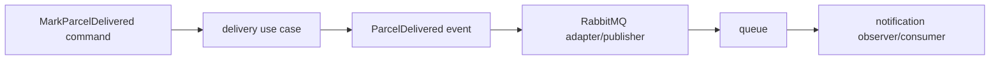

# Event-driven lab: observer, command, adapter, and idempotency

## Problem

The delivery HTTP request should not wait for a notification provider. The code also needs a way to react to an event without the parcel feature depending on every reaction.

## Solution

Treat “parcel delivered” as an immutable event. The delivery use case is a command; event listeners act as observers; the RabbitMQ publisher is an adapter around broker-specific code.



## Example event

```java
public record ParcelDelivered(
    UUID eventId, String parcelId, Instant occurredAt) {}
```

An event describes a fact in the past. Name it in past tense. A command asks for work; name it as an action.

## Consumer rule

Store or otherwise recognize the `eventId` before the external side effect. If the broker redelivers the same event, acknowledge it without sending another notification.

## Trade-off

Events reduce direct coupling, but make state eventually consistent: the parcel can show `DELIVERED` briefly before the notification record exists. Log event IDs in producer and consumer so one flow remains traceable.
