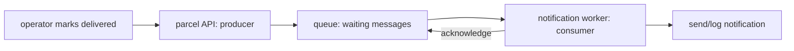

# What is a queue, really?

## The real-world analogy

At a post office, a customer puts a parcel on the sorting belt, then leaves. Sorting continues after the customer is gone. The belt is a queue: it holds work until a worker is ready.

In ParcelPilot:

- the **producer** is the code that publishes `ParcelDelivered`;
- the **message** says which parcel was delivered;
- RabbitMQ is the **broker** that holds and routes the message;
- the **consumer** is the notification worker; and
- an **acknowledgement** tells the broker the worker completed the job.



## What problem does it solve?

Without a queue, the API waits:

```text
operator → API → database → email provider → response
```

If the email provider takes ten seconds or fails, the operator waits or sees an error even though the parcel update worked.

With a queue:

```text
operator → API → database + queue → response now
                               ↓
                         notification later
```

The caller gets a response after the important parcel state is saved. The worker can retry notification delivery later.

## When should I use one?

Use a queue when all are broadly true:

1. the work can happen later;
2. the caller does not need the final result in the same HTTP response;
3. the work benefits from retries, buffering, or independent scaling; and
4. you accept that different parts of the system may be briefly out of sync.

Examples: email, SMS, thumbnail creation, billing exports, audit events, scheduled imports, and slow third-party webhooks.

Do not use one for ordinary reads or validations the request must know immediately: login password validation, checking stock before accepting an order, or reading a parcel by ID.

## Why RabbitMQ first?

RabbitMQ visibly exposes queues, messages, consumers, acknowledgements, and retries. It is a good learning broker and runs locally in Docker.

- **RabbitMQ**: task queues and routing; start here.
- **Kafka**: durable event log with replay and partitions; useful for high-throughput streams and several independent consumers.
- **AWS SQS**: managed cloud queue; good when running on AWS and avoiding broker operations matters.

They are not interchangeable products. The problem and operational constraints decide.

## Important limitation

A queue does not make code automatically reliable. A consumer may receive a message twice, so notification processing must be idempotent. And saving a database update plus publishing a message is two actions that can be interrupted; the later transactional-outbox lesson addresses that gap.
