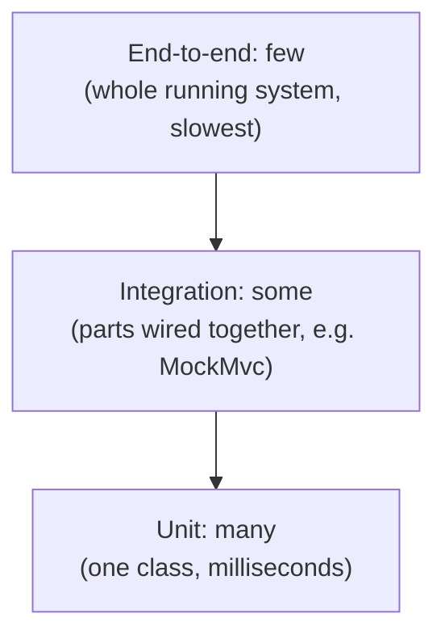

# Step 08: Testing beyond `mvn test`

> In this step: stop proving your API works by re-running six `curl` commands by hand. You'll learn the test pyramid, write HTTP-level tests with MockMvc that check the exact status codes and JSON your API promises, and learn when (not) to load the whole app in a test. ~90–120 minutes.

## The problem right now

Since step 03 you have automated tests, but only for the **domain rules**: `ParcelTrackerTest` checks that a parcel can't be delivered before pickup. Nothing checks the HTTP layer you built in steps 04–07:

- Does `GET /parcels/missing` really return `404` **with** the `ErrorResponse` JSON from step 06?
- Does an invalid `POST` body really return `400` **with** the field details from step 05?
- Does an illegal status change really return `409`?

Today, the only way to know is: start the app, run six `curl` commands, and read the output by eye. Every time you change anything. Miss one, and a regression ships silently. You already learned in step 03 that checking by eye doesn't scale, and the same lesson now applies **one level up**: the HTTP behavior needs automated tests too.

## Key words

| Word | Beginner meaning |
|---|---|
| **Test pyramid** | A guideline: many fast unit tests, some integration tests, few end-to-end tests. |
| **Unit test** | Tests one class alone, no Spring, no network. Milliseconds fast. |
| **Integration test** | Tests several parts wired together, e.g. HTTP request → controller → error handler → JSON. |
| **End-to-end (E2E) test** | Tests the fully running system from the outside, like a real client would. |
| **Regression** | A feature that used to work and silently broke after a change. |
| **Given-When-Then** | A way to structure a test: set up (given), act (when), check (then). |
| **MockMvc** | A Spring tool that performs fake-but-realistic HTTP requests against your controller without starting a real server. |
| **Test slice** | Loading only *part* of the Spring app in a test (e.g. just the web layer), so tests stay fast. |
| **`@WebMvcTest`** | The annotation for the web slice: controllers, error handlers, validation, JSON — nothing else. |
| **`@SpringBootTest`** | Loads the *entire* application in a test. Powerful, thorough, and slow. |
| **`jsonPath`** | A way to point at a value inside a JSON response, e.g. `$.code`. |
| **Testcontainers** | A library that starts a real database in a throwaway Docker container for your tests (used after step 10). |

## What is the test pyramid?

The test pyramid is a guideline for **how many tests of each kind** to write. Unit tests are cheap and fast, so you write many. End-to-end tests are expensive and slow, so you write few, and only for the most important flows. Integration tests sit in between. The shape matters: if most of your tests are slow E2E tests, every change takes minutes to verify and you stop running them, which defeats the point.



For ParcelPilot at this step: the **unit** layer is `ParcelTrackerTest` from steps 02–03 (pure Java, fake `Clock`, no Spring). The **integration** layer is what you build today: MockMvc tests that fire an HTTP request and assert on the status code and JSON, with the controller, the validation from step 05, and the `GlobalErrorHandler` from step 06 all wired together. The **E2E** layer stays tiny: your `curl` commands against the running app, kept for occasional manual smoke checks, not repeated for every case.

Here is the smallest possible taste — one fake HTTP request, one assertion, no server started:

```java
mockMvc.perform(get("/parcels/does-not-exist"))
        .andExpect(status().isNotFound())
        .andExpect(jsonPath("$.code").value("PARCEL_NOT_FOUND"));
```

That is your `curl -i http://localhost:8080/parcels/does-not-exist` check, made automatic and repeatable in about 50 milliseconds.

> The three kinds of tests, a full comparison table, and the "ice cream cone" anti-pattern are in the companion page [Unit vs integration vs E2E](unit-vs-integration-vs-e2e.md). Read it after this section.

## JUnit recap, and how to structure a test

You already know the mechanics from [step 03](../03-maven/README.md): a method with `@Test` runs automatically under `mvn test`, and **assertions** (`assertEquals`, `assertThrows`) decide pass or fail. Two habits turn those mechanics into tests people can actually read:

**1. Given-When-Then.** Every good test has three parts: *given* a starting situation, *when* one action happens, *then* specific things must be true. You don't need comments for it, but the order should be visible:

```java
@Test
void deliver_afterPickup_setsStatusToDelivered() {
    // given
    ParcelTracker tracker = new ParcelTracker(new FixedClock());
    Parcel parcel = new Parcel("P-1", "Ava");
    tracker.pickUp(parcel);

    // when
    tracker.deliver(parcel);

    // then
    assertEquals(Status.DELIVERED, parcel.status());
}
```

**2. Names that state the rule.** A test name should say *what is being done*, *under what condition*, and *what must happen*: `createParcel_withBlankRecipient_returns400`. When that test fails in six months, the name alone tells you which promise broke. If you prefer full sentences, `@DisplayName("POST /parcels with a blank recipient returns 400")` does the same job.

## MockMvc and `@WebMvcTest`: testing HTTP without a server

**The problem:** to test that your API returns `404` with the right JSON, something has to actually route a request through Spring — the URL mapping, the JSON conversion, the validation, the `@RestControllerAdvice`. A plain unit test of the controller class (`new ParcelController(); controller.getOne("x")`) skips all of that, so it can't catch a wrong status code or a broken JSON shape.

**How MockMvc solves it:** MockMvc performs a *simulated* HTTP request inside the test process. No port, no real network, but the full Spring web machinery runs: routing, `@Valid`, Jackson, your `GlobalErrorHandler`. You get real HTTP behavior at unit-test speed.

**What a "slice" loads (and doesn't):** `@WebMvcTest(ParcelController.class)` starts a *slice* of the application — only the web layer:

- **Loaded:** the named controller, every `@RestControllerAdvice` (your `GlobalErrorHandler`), validation, JSON converters, MockMvc itself.
- **Not loaded:** `@Service` and `@Repository` beans, database configuration, anything unrelated to HTTP.

That's why slice tests start in a second or two instead of loading the whole app. In ParcelPilot today this works out especially simply: the controller still holds its `ConcurrentHashMap` itself, so there is nothing else to provide. From step 10 on, when a repository exists, a `@WebMvcTest` will need a `@MockBean` for it — see the [testing reference](../../references/testing.md).

**And `@SpringBootTest`?** It loads the *entire* application context — every bean, every configuration. Use it sparingly: it's the right tool when you genuinely need everything wired together (a handful of whole-app smoke tests), but it is many times slower per class, and if most tests use it, `mvn test` crawls. Rule of thumb: slice by default, `@SpringBootTest` only when the slice can't express what you're testing.

> **Looking ahead — Testcontainers.** One kind of integration test can't be written yet: one that talks to a real PostgreSQL, because ParcelPilot has no database until [step 10](../10-persistence/README.md). The [Testcontainers lab](testcontainers-lab.md) in this folder covers exactly that — read it now so you know it exists, but **complete it after step 10**, when ParcelPilot has PostgreSQL and a `ParcelRepository`. Step 10 contains a "return to testing" callout so you won't forget.

## Why do it? Pros and cons

**What it brings us:** every HTTP promise ParcelPilot makes (`201`, `400` with field details, `404`, `409`) is now checked automatically on every `mvn test`, instead of by eye.

**Pros:**

- **Regression safety:** change the error handler, run `mvn test`, and know in seconds whether any status code or JSON shape broke.
- **Tests as documentation:** `createParcel_withBlankRecipient_returns400` states the API contract more precisely than any comment.
- **Refactor confidence:** in [step 11](../11-monolith/README.md) you'll reorganize ParcelPilot's insides into clean modules. These tests are what lets you do that boldly: if they stay green, the API behavior didn't change.

**Cons:**

- **Slow tests, if abused:** put `@SpringBootTest` on everything and `mvn test` goes from seconds to minutes, and people stop running it.
- **Over-mocking hides bugs:** replace every collaborator with a mock and your test passes while the real wiring is broken. (Concrete example in [Unit vs integration vs E2E](unit-vs-integration-vs-e2e.md).)
- Tests are code too: they need maintenance when the API intentionally changes.

## When to use it (and when not)

**Use an HTTP-level (MockMvc) test when** the thing you're protecting is HTTP behavior: a status code, a JSON shape, validation kicking in, an error handler translating an exception. That is a *contract with clients* and deserves a test.

**Use a plain unit test when** the thing you're protecting is pure logic, like the state-transition rules. `ParcelTrackerTest` needs no Spring; adding Spring would only make it slower.

**Don't test the framework.** No test should verify that Spring can parse JSON or that `@GetMapping` routes a GET. Test *your* rules and *your* contract, not Spring's.

**Don't duplicate every curl as an E2E test.** Once MockMvc covers the contract, a full-app E2E check of the same case adds minutes of runtime and almost no new information. Keep E2E for a couple of critical whole-system flows.

## Real-world example

A bank's "transfer money" API has hundreds of unit tests on the money-arithmetic rules (fast, run on every save), a few dozen integration tests asserting that a transfer to a closed account returns exactly `422` with a machine-readable error code (client apps depend on that shape), and a *handful* of end-to-end tests that run one real transfer through the deployed system before each release. When a developer accidentally changes the error JSON, the integration tests fail within seconds — long before a partner's app breaks in production.

## Common mistakes

- **Testing through the whole app when a slice would do.** Reaching for `@SpringBootTest` by default makes the suite slow; reach for `@WebMvcTest` first.
- **Vague test names.** `test1` or `testCreate` tells you nothing when it fails. Name the condition and the expected outcome.
- **Asserting too little.** `status().isBadRequest()` alone doesn't protect the JSON shape clients parse. Assert the body with `jsonPath` too.
- **Letting tests share state.** ParcelPilot's controller keeps its `ConcurrentHashMap` for the whole test class, so a parcel created in one test is visible in the next. Use a unique parcel id per test — order-dependent tests are the classic source of flakiness.
- **Mocking everything.** If the controller, the validation, and the error handler are all mocked, you've tested your mocks, not your app.

## Build it in ParcelPilot (do this exactly)

Still one project: `applications/parcelpilot`. No new dependencies — `spring-boot-starter-test` (already in your `pom.xml` since step 04) brings JUnit 5, MockMvc, AssertJ, and Mockito.

### 1. Re-read your unit tests from steps 02–03

Open `src/test/java/com/parcelpilot/ParcelTrackerTest.java`. Notice it already follows today's ideas: a `FixedClock` makes time predictable ([step 02](../02-oop-and-composition/README.md)'s composition paying off), and `assertThrows` pins the illegal-transition rule. These stay exactly as they are — they're the base of your pyramid.

### 2. Create the MockMvc test class

Create `src/test/java/com/parcelpilot/ParcelControllerTest.java`. This single class turns your manual `curl` checklist into automated tests:

```java
package com.parcelpilot;

import org.junit.jupiter.api.Test;
import org.springframework.beans.factory.annotation.Autowired;
import org.springframework.boot.test.autoconfigure.web.servlet.WebMvcTest;
import org.springframework.http.MediaType;
import org.springframework.test.web.servlet.MockMvc;

import static org.springframework.test.web.servlet.request.MockMvcRequestBuilders.*;
import static org.springframework.test.web.servlet.result.MockMvcResultMatchers.*;

// Loads ONLY the web slice: this controller, the GlobalErrorHandler, validation, JSON.
@WebMvcTest(ParcelController.class)
class ParcelControllerTest {

    @Autowired
    private MockMvc mockMvc;   // performs simulated HTTP requests, no real server

    // Each test uses its own parcel id: the controller's in-memory Map lives for
    // the whole class, and shared state between tests is how flakiness starts.

    @Test
    void getParcel_thatDoesNotExist_returns404WithErrorResponse() throws Exception {
        mockMvc.perform(get("/parcels/does-not-exist"))
                .andExpect(status().isNotFound())
                .andExpect(jsonPath("$.code").value("PARCEL_NOT_FOUND"))
                .andExpect(jsonPath("$.message").isNotEmpty())
                .andExpect(jsonPath("$.path").value("/parcels/does-not-exist"));
    }

    @Test
    void createParcel_withBlankRecipient_returns400WithFieldDetails() throws Exception {
        mockMvc.perform(post("/parcels")
                        .contentType(MediaType.APPLICATION_JSON)
                        .content("""
                                {"id":"P-400","recipient":""}
                                """))
                .andExpect(status().isBadRequest())
                .andExpect(jsonPath("$.code").value("VALIDATION_FAILED"))
                .andExpect(jsonPath("$.details.recipient").isNotEmpty());
    }

    @Test
    void createParcel_withValidBody_returns201AndTheParcel() throws Exception {
        mockMvc.perform(post("/parcels")
                        .contentType(MediaType.APPLICATION_JSON)
                        .content("""
                                {"id":"P-201","recipient":"Ava"}
                                """))
                .andExpect(status().isCreated())
                .andExpect(jsonPath("$.id").value("P-201"))
                .andExpect(jsonPath("$.recipient").value("Ava"))
                .andExpect(jsonPath("$.status").value("CREATED"));
    }

    @Test
    void updateStatus_skippingPickup_returns409() throws Exception {
        // given: a freshly created parcel (status CREATED)
        mockMvc.perform(post("/parcels")
                        .contentType(MediaType.APPLICATION_JSON)
                        .content("""
                                {"id":"P-409","recipient":"Ben"}
                                """))
                .andExpect(status().isCreated());

        // when/then: CREATED -> DELIVERED skips PICKED_UP, the step 02 rule forbids it
        mockMvc.perform(patch("/parcels/P-409/status")
                        .contentType(MediaType.APPLICATION_JSON)
                        .content("""
                                {"status":"DELIVERED"}
                                """))
                .andExpect(status().isConflict())
                .andExpect(jsonPath("$.code").value("INVALID_TRANSITION"));
    }
}
```

If your step 06 `ErrorResponse` uses different `code` values, or `details` is a list instead of a field-to-message map, adjust the `jsonPath` expressions to match **your** shape — the point is that the test pins whatever shape you promised.

### 3. Walk each test and say what it proves

For each of the four tests, say out loud which manual `curl` command it replaces and which step's feature it protects (step 05 validation, step 06 error handling, step 02 transition rules).

### 4. Do the lab

The [MockMvc lab](mockmvc-lab.md) builds this class one test at a time, explains each import, and has a table of the most common failures (context won't load, `jsonPath` mismatches) with fixes.

## Test it

```bash
cd applications/parcelpilot
mvn test
```

Expected: the two domain tests from step 03 plus the four new HTTP tests, all green.

```text
[INFO] Tests run: 6, Failures: 0, Errors: 0, Skipped: 0
[INFO] BUILD SUCCESS
```

Now prove the safety net is real. In `GlobalErrorHandler`, temporarily change the `404` code string (e.g. `PARCEL_NOT_FOUND` → `NOT_FOUND`) and run `mvn test` again: `getParcel_thatDoesNotExist_returns404WithErrorResponse` must go **red** with a message showing expected vs actual. Revert the change, and it's green again. That red is a regression being caught in seconds instead of shipping.

## Acceptance criteria

- [ ] `mvn test` runs the step 02–03 domain tests **and** at least four MockMvc tests, all green.
- [ ] There is a test for each: `404` + `ErrorResponse` shape, `400` + field details, `201` on valid create, `409` on an illegal transition.
- [ ] Every new test asserts on the JSON **body** (via `jsonPath`), not only the status code.
- [ ] Test names (or `@DisplayName`) state the condition and the expected outcome.
- [ ] Breaking the error handler on purpose makes a test fail with a readable message.
- [ ] You can explain what `@WebMvcTest` loads, what it doesn't, and why that makes it fast.
- [ ] You can say when `@SpringBootTest` is worth its cost.
- [ ] You know the [Testcontainers lab](testcontainers-lab.md) exists and that you'll complete it after [step 10](../10-persistence/README.md).

## Say it like a developer

- "Our tests follow the **test pyramid**: many unit tests on the domain rules, a layer of **MockMvc integration tests** on the HTTP contract, and almost no end-to-end tests."
- "`@WebMvcTest` loads only the **web slice** — the controller, the advice, and validation — so the suite stays fast."
- "The test `createParcel_withBlankRecipient_returns400` is **Given-When-Then**: given a blank recipient, when I POST, then I get a 400 with field details."
- "I assert on the body with **`jsonPath`**, because the `ErrorResponse` shape is part of our contract, not just the status code."
- "I avoid `@SpringBootTest` unless I really need the whole context — it's slow."
- "That failure was a **regression**: the suite caught it before anyone ran `curl`."

## Quiz: check yourself

Answer out loud before opening each toggle.

1. In one sentence, what does the **test pyramid** recommend, and why that shape?

<details><summary>Show answer</summary>

Write many fast unit tests, some integration tests, and only a few end-to-end tests — because tests get slower and more brittle as they cover more of the system, and a suite dominated by slow tests stops being run.

</details>

2. What does `@WebMvcTest(ParcelController.class)` load, and what does it deliberately leave out?

<details><summary>Show answer</summary>

It loads the web slice: the named controller, `@RestControllerAdvice` classes like `GlobalErrorHandler`, validation, and JSON conversion. It leaves out `@Service`/`@Repository` beans and database configuration, which is why it starts fast.

</details>

3. Why isn't `status().isNotFound()` alone a good enough assertion for the 404 test?

<details><summary>Show answer</summary>

Because clients also depend on the response **body** — the `ErrorResponse` fields (`code`, `message`, `details`, `path`). If the JSON shape changes, clients break even though the status is still 404, so the test must pin the body with `jsonPath` too.

</details>

4. Why use `@SpringBootTest` sparingly?

<details><summary>Show answer</summary>

It starts the entire application context — every bean and configuration — so each test class is many times slower than a slice test. Use it only when the test genuinely needs everything wired together, otherwise the suite becomes so slow people stop running it.

</details>

5. Why can't the Testcontainers lab be completed at this step?

<details><summary>Show answer</summary>

Testcontainers starts a real PostgreSQL in Docker for repository tests, but ParcelPilot has no database or repository yet — parcels live in an in-memory map. PostgreSQL and `ParcelRepository` arrive in step 10, so the lab is read now and completed after step 10.

</details>

## Reflect (stretch)

Your `curl` checklist is now code: six checks in a few seconds, on every change, forever. Also notice what the `updateStatus_skippingPickup_returns409` test relies on — the *same* rule already proven by `ParcelTrackerTest`, just observed at a different level (a thrown `IllegalStateException` at the unit level; a `409` with an `ErrorResponse` at the HTTP level). That's the pyramid working: the rule is cheap to test exhaustively at the bottom, and the HTTP translation is pinned once near the middle.

## Next

The tests pass **on your machine** — because your machine has JDK 21, your Maven cache, your setup. The app still runs only where your JDK lives; hand it to anyone else and the first hour is "install Java, install Maven, hope the versions match". [Step 09](../09-docker/README.md) packages ParcelPilot into one portable Docker image that runs the same everywhere — and Docker is also exactly what the [Testcontainers lab](testcontainers-lab.md) will need later.
