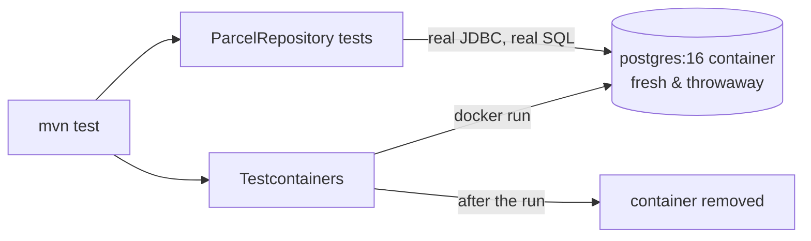

# Lab: Testcontainers, a real PostgreSQL for your tests

> ⏳ **Do this lab after [step 10](../10-persistence/README.md) (persistence).** Read it now to know it exists; return when ParcelPilot has PostgreSQL + a `ParcelRepository`. It also needs Docker, which arrives in [step 09](../09-docker/README.md).

Companion lab to [Step 08](README.md).

## The problem

After step 10, ParcelPilot's data lives in PostgreSQL, reached through a `ParcelRepository`. Now there's a whole category of bugs your MockMvc tests can't see: a wrong column type in a migration, a `findByStatus` query that doesn't do what you think, an entity mapping that fails only on a real database. To test them you need a database in the test — but *which* database?

The tempting shortcut is **H2**, an in-memory Java database that starts instantly with zero setup. The catch: H2 is not PostgreSQL. It accepts slightly different SQL, handles types differently, and misses PostgreSQL-specific behavior. So an H2-backed test can be green while the same code fails against the real database — and the reverse. A test that lies to you is worse than no test: it spends your time *and* hands you false confidence. You verified your app works on a database you will never run in production.

## The solution: Testcontainers

**Testcontainers** is a Java library that starts a **real PostgreSQL in a throwaway Docker container** for your test run, hands your app its address, and removes the container afterwards. Your repository tests run against the same database engine as production — the exact `postgres:16-alpine` image from step 10 — and every run starts from a blank slate, so no leftover rows from a previous run can pollute results.



## `@DataJpaTest` vs Testcontainers

These two answer different questions and are combined, not chosen between:

| | `@DataJpaTest` alone | `@DataJpaTest` + Testcontainers |
|---|---|---|
| What it is | The JPA **slice**: entities + repositories, no web layer | The same slice, pointed at a real PostgreSQL container |
| Database used | An embedded/in-memory one (H2) by default | Real PostgreSQL, same image as production |
| Speed | Fastest | Slower (container starts once, then fast per test) |
| Trustworthiness | SQL/type differences can lie to you | Real engine, real SQL, real migrations |
| Needs Docker | No | Yes |

So: keep `@DataJpaTest` for the slicing (start only the persistence layer, not the whole app), and let Testcontainers replace H2 with the real engine underneath it.

## Build it (after step 10)

### 1. Add the test dependencies

In `pom.xml` (versions are managed by the Spring Boot parent):

```xml
<dependency>
    <groupId>org.springframework.boot</groupId>
    <artifactId>spring-boot-testcontainers</artifactId>
    <scope>test</scope>
</dependency>
<dependency>
    <groupId>org.testcontainers</groupId>
    <artifactId>postgresql</artifactId>
    <scope>test</scope>
</dependency>
<dependency>
    <groupId>org.testcontainers</groupId>
    <artifactId>junit-jupiter</artifactId>
    <scope>test</scope>
</dependency>
```

### 2. Write the repository test

Create `src/test/java/com/parcelpilot/ParcelRepositoryTest.java`:

```java
package com.parcelpilot;

import org.junit.jupiter.api.Test;
import org.springframework.beans.factory.annotation.Autowired;
import org.springframework.boot.test.autoconfigure.jdbc.AutoConfigureTestDatabase;
import org.springframework.boot.test.autoconfigure.orm.jpa.DataJpaTest;
import org.springframework.test.context.DynamicPropertyRegistry;
import org.springframework.test.context.DynamicPropertySource;
import org.testcontainers.containers.PostgreSQLContainer;
import org.testcontainers.junit.jupiter.Container;
import org.testcontainers.junit.jupiter.Testcontainers;

import java.util.List;

import static org.junit.jupiter.api.Assertions.*;

@DataJpaTest                     // JPA slice: entities + repositories only
@Testcontainers                  // let Testcontainers manage @Container fields
@AutoConfigureTestDatabase(replace = AutoConfigureTestDatabase.Replace.NONE)
class ParcelRepositoryTest {     // Replace.NONE = do NOT swap in H2; use our container

    // One real PostgreSQL for this test class, same image as step 10.
    // 'static' = started once for the class, not per test method.
    @Container
    static PostgreSQLContainer<?> postgres = new PostgreSQLContainer<>("postgres:16-alpine");

    // The container picks a random free port at startup, so the connection
    // settings can't be hard-coded. This method feeds Spring the live values.
    @DynamicPropertySource
    static void databaseProperties(DynamicPropertyRegistry registry) {
        registry.add("spring.datasource.url", postgres::getJdbcUrl);
        registry.add("spring.datasource.username", postgres::getUsername);
        registry.add("spring.datasource.password", postgres::getPassword);
    }

    @Autowired
    private ParcelRepository repository;

    @Test
    void savedParcel_canBeFoundById() {
        // given
        ParcelEntity parcel = new ParcelEntity("P-TC-1", "Ava", Status.CREATED);

        // when
        repository.save(parcel);
        var found = repository.findById("P-TC-1");

        // then: the row really went through PostgreSQL and came back
        assertTrue(found.isPresent());
        assertEquals("Ava", found.get().recipient());
        assertEquals(Status.CREATED, found.get().status());
    }

    @Test
    void findByStatus_returnsOnlyMatchingParcels() {
        // given
        repository.save(new ParcelEntity("P-TC-2", "Ben", Status.CREATED));
        ParcelEntity delivered = new ParcelEntity("P-TC-3", "Cara", Status.CREATED);
        delivered.markPickedUp();
        delivered.markDelivered();
        repository.save(delivered);

        // when: this runs REAL SQL against REAL PostgreSQL
        List<ParcelEntity> created = repository.findByStatus(Status.CREATED);

        // then
        assertTrue(created.stream().anyMatch(p -> p.id().equals("P-TC-2")));
        assertTrue(created.stream().noneMatch(p -> p.id().equals("P-TC-3")));
    }
}
```

Adjust constructor/accessor names to match your actual `ParcelEntity` from step 10. The three annotations carry the weight:

- `@Testcontainers` + `@Container` — start the PostgreSQL container before the tests, stop and remove it after.
- `@DynamicPropertySource` — the container's port is random, so this hands Spring the real URL, username, and password at runtime.
- `Replace.NONE` — without this, `@DataJpaTest` would helpfully swap in an embedded database, which is exactly the H2 lie we're avoiding.

A bonus you get for free: your Flyway migration from step 10 runs against the container at startup — so this test also proves `V1__create_parcels.sql` works on real PostgreSQL.

## Proof

Docker must be running (step 09). Then:

```bash
cd applications/parcelpilot
mvn test
```

Expected: the first run pulls the `postgres:16-alpine` image if needed (one-time download), then:

```text
[INFO] Tests run: 8, Failures: 0, Errors: 0, Skipped: 0
[INFO] BUILD SUCCESS
```

Watch it happen: run `docker ps` *during* the test run and you'll see a `postgres:16-alpine` container with a random name and port; run it again afterwards and the container is gone. Throwaway means throwaway.

To feel the value, break the migration on purpose: rename a column in `V1__create_parcels.sql` (e.g. `recipient` → `receiver`) and re-run. The tests fail with a real PostgreSQL error — a bug H2 might have masked and production would have found for you.

## Pros and cons

**Pros:**

- **Real engine, real SQL:** the test database *is* PostgreSQL, so type handling, SQL dialect, and migrations are verified for real.
- **Fresh state every run:** no leftover data between runs; no "works on my machine because of old rows".
- **Migrations tested for free:** Flyway scripts run against the real engine on every test run.

**Cons:**

- **Needs Docker:** on any machine (or CI server) without Docker, these tests can't run.
- **Slower:** container startup adds seconds to the suite — fine for a repository test class, another reason not to put *everything* at this level of the pyramid.
- First run downloads the image (a one-time cost).

## Next

- Back to [step 10](../10-persistence/README.md), whose "return to testing" callout sent you here.
- Back to [Step 08](README.md) to see where these tests sit in the pyramid.
- [Testing reference](../../references/testing.md) for the full deep dive, including flaky-test causes.
