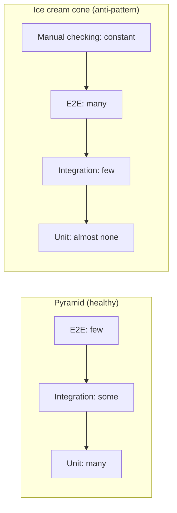

# Unit vs integration vs end-to-end tests

Companion to [Step 08](README.md). Three kinds of tests, what each one is for, and how to keep the mix healthy.

## The problem

"Write tests" is not one instruction. A test can check one class in isolation, several parts wired together, or the whole running system. Each kind answers a different question, runs at a different speed, and fails for different reasons. Teams that don't know the difference end up with either *only* slow whole-system tests (every change takes minutes to verify) or *only* isolated tests (everything passes while the wired-up app is broken).

## The solution: three kinds, plain definitions

**Unit test** — tests **one class alone**, in plain Java. No Spring, no network, no files. Dependencies that would make it slow or unpredictable (like a real clock) are replaced with simple fakes. Runs in milliseconds.

**Integration test** — tests **several parts wired together**, checking that the connections work: a request really reaches the controller, validation really fires, the error handler really produces the promised JSON. Slower than a unit test (Spring has to start something), still no full deployment.

**End-to-end (E2E) test** — tests the **whole running system from the outside**, exactly like a real client: the actual app, on a real port, with real HTTP. Slowest, most realistic, most fragile.

## Comparison table

| | Unit | Integration | End-to-end |
|---|---|---|---|
| **Speed** | Milliseconds | Seconds (a slice of Spring starts) | Many seconds to minutes (whole app runs) |
| **Scope** | One class | Several parts wired together | The full system, from outside |
| **Confidence it gives** | "This rule is correct" | "These parts connect correctly" | "The whole thing works for a real client" |
| **Flakiness risk** | Very low | Low–medium | Highest (ports, timing, startup order) |
| **When it fails, you learn** | Exactly which rule broke, instantly | Which wiring or contract broke | *Something* broke — now go find where |
| **How many to have** | Many | Some | Few |

The last row of failures is worth pausing on: a failing unit test names the broken rule; a failing E2E test only tells you the system is unhealthy *somewhere*. That's another reason to push tests as far down the pyramid as they can go — cheaper failures are also more informative failures.

## The pyramid vs the ice cream cone

The healthy shape is a **pyramid**: a wide base of unit tests, a middle layer of integration tests, a small tip of E2E tests. The classic anti-pattern is the **ice cream cone**: the shape upside down — a huge pile of slow E2E tests, few unit tests, and (in the worst version) a thick layer of manual checking on top.



Why the cone hurts: the suite takes so long that developers stop running it before commits, failures point at "somewhere in the system" instead of a specific rule, and one slow environment hiccup turns twenty tests red at once. Notice that pre-step-08 ParcelPilot was a small ice cream cone: two unit tests at the bottom and a pile of manual `curl` commands on top, with nothing in between. Step 08 fills in the middle.

## What each kind looks like for ParcelPilot

**Unit — the state rules (exists since steps 02–03).** `ParcelTrackerTest` builds a `ParcelTracker` with a `FixedClock` and asserts that delivering an un-picked-up parcel throws `IllegalStateException`. No Spring anywhere:

```java
@Test
void cannot_deliver_before_pickup() {
    ParcelTracker tracker = new ParcelTracker(new FixedClock());
    Parcel parcel = new Parcel("P-2", "Ben");

    assertThrows(IllegalStateException.class, () -> tracker.deliver(parcel));
}
```

**Integration — the HTTP contract (built in step 08).** A `@WebMvcTest` fires a simulated request and asserts the status *and* the `ErrorResponse` JSON that the step 06 error handler must produce:

```java
@Test
void getParcel_thatDoesNotExist_returns404WithErrorResponse() throws Exception {
    mockMvc.perform(get("/parcels/does-not-exist"))
            .andExpect(status().isNotFound())
            .andExpect(jsonPath("$.code").value("PARCEL_NOT_FOUND"));
}
```

The unit test above already proved the *rule*. This test proves something the unit test can't: that Spring translates the rule's exception into the right status and JSON. Different question, different kind of test. (After step 10, a third flavor appears here: repository tests against a real PostgreSQL via [Testcontainers](testcontainers-lab.md).)

**E2E — the smoke check (stays manual and tiny).** Start the app with `mvn spring-boot:run` and run one `curl` create-then-read pair. After step 09 (Docker) this becomes "run the image, curl it once". One or two flows, not a copy of every MockMvc case.

## Over-mocking: when isolation lies to you

A **mock** is a stand-in object that a test controls ("when `findById` is called, return this"). Mocks are useful for cutting away slow or unavailable dependencies. The failure mode is **over-mocking**: mocking so much that the test only verifies the mocks you wrote, not the code you shipped.

**Bad example** — the controller is tested with the web layer mocked away:

```java
// BAD: no Spring, so nothing here proves HTTP behavior
@Test
void getOne_returnsNotFound() {
    ParcelController controller = new ParcelController();

    var response = controller.getOne("does-not-exist");

    assertEquals(404, response.getStatusCode().value());
}
```

This passes even if the URL mapping is broken (`@GetMapping("/parcel/{id}")` — singular, oops), even if `GlobalErrorHandler` is misconfigured, and even if the JSON body is empty. Every part that could realistically break has been cut out of the test.

**Good example** — the same intent, through the real web slice:

```java
// GOOD: routing, the error handler, and the JSON body are all really exercised
@Test
void getParcel_thatDoesNotExist_returns404WithErrorResponse() throws Exception {
    mockMvc.perform(get("/parcels/does-not-exist"))
            .andExpect(status().isNotFound())
            .andExpect(jsonPath("$.code").value("PARCEL_NOT_FOUND"))
            .andExpect(jsonPath("$.path").value("/parcels/does-not-exist"));
}
```

Rule of thumb: mock what is *slow, external, or not yet built* — never mock the very thing the test claims to verify. (Mockito and `@MockBean`, which you'll need once ParcelPilot has a repository, are introduced in the [testing reference](../../references/testing.md).)

## Pros and cons of each kind

| Kind | Pros | Cons |
|---|---|---|
| Unit | Instant feedback, pinpoint failures, easy to cover every edge case | Can't catch wiring/config bugs; over-mocking makes them meaningless |
| Integration | Catches real wiring bugs at reasonable speed; pins contracts (status + JSON) | Slower than unit; needs care about shared state between tests |
| E2E | Highest realism, catches whole-system and environment problems | Slow, flaky, vague failures, expensive to maintain |

## Decision guide

Ask: **what am I protecting?**

- A *rule or calculation* (a status transition, a validation condition's logic) → **unit test**. Cover every edge case here; they're nearly free.
- A *contract or wiring* (this request returns this status with this JSON; the exception becomes a 409; validation fires on this field) → **integration test** (MockMvc now; Testcontainers for database wiring after step 10).
- *"Does the whole assembled system start and serve a real request?"* → **E2E**, and only for one or two critical flows.
- *Spring itself* (JSON parsing works, `@GetMapping` routes) → **no test**. Don't test the framework.

When in doubt, write the test at the **lowest** level that can actually catch the bug you're worried about.

## Next

- Back to [Step 08](README.md) to build the MockMvc tests.
- The [MockMvc lab](mockmvc-lab.md) for the incremental build-up.
- The [Testcontainers lab](testcontainers-lab.md) — read now, complete after [step 10](../10-persistence/README.md).
- The [testing reference](../../references/testing.md) for the full deep dive.
