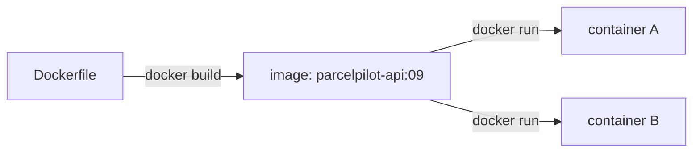
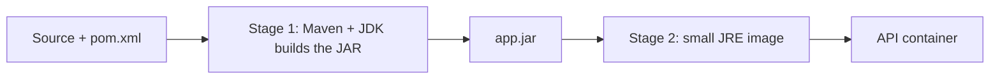

# Step 09: Docker, ship the API as one unit

> In this step: package ParcelPilot into a portable image that runs on any machine with Docker, using a full Dockerfile you'll understand line by line. ~60–90 minutes.

## The problem right now

ParcelPilot has grown up since step 04: it validates input, returns clean errors, logs to stdout, and has tests (steps 05–08). But it still only runs where the source code and the right JDK are installed. Sharing it means telling someone "install Java 21, clone the repo, run Maven…". That's fragile and error-prone. You want to hand over **one runnable thing** that behaves identically everywhere.

## Key words

| Word | Beginner meaning |
|---|---|
| **Dockerfile** | A recipe listing the steps to build an image. |
| **Image** | The frozen, ready-to-run package built from the Dockerfile. |
| **Container** | A running instance of an image (you can start many from one image). |
| **Layer** | Each Dockerfile instruction creates a cached layer, and unchanged layers are reused (faster builds). |
| **Build context** | The folder Docker may read while building (usually your project). |
| **Multi-stage build** | Build in a big image, then copy only the result into a small image. |
| **JDK vs JRE** | JDK *builds* Java, while JRE only *runs* it (smaller, enough to ship). |
| **`.dockerignore`** | Files Docker should not copy (like `.gitignore`). |
| **`EXPOSE` / `-p`** | Declares / maps the port the app listens on. |
| **Tag** | A name + version for an image, e.g. `parcelpilot-api:09`. |

## What is an image vs a container?

An **image** is like an app installer frozen on disk: it contains your compiled app plus everything it needs to run. A **container** is one running copy of that image. You can start, stop, and delete containers freely, and the image stays put.



## What is a multi-stage build, and why?

Compiling Java needs Maven + a full JDK (large). *Running* the app only needs a JRE (small). A **multi-stage** Dockerfile uses a big "build" image to produce the JAR, then copies just that JAR into a small "runtime" image. Result: a leaner, safer final image.



## Why do it? Pros and cons

**What it brings us:** identical runs anywhere with Docker, no manual Java install, easy to start/stop/replace, and the foundation for Compose and microservices later.

**Pros:** portable, reproducible, and isolates the app from your machine.
**Cons:** images use disk, there's an extra build step, and importantly, **data inside a container is lost when it's replaced**, the exact problem step 10 solves.

**Real-world example:** teams build an image once in CI and run that *same* image in test and production, so "it worked in the pipeline" means "it works in prod".

## Build it in ParcelPilot (do this exactly)

In `applications/parcelpilot`:

### 1. Create the `Dockerfile`

```dockerfile
# ---------- Stage 1: build ----------
FROM maven:3-eclipse-temurin-21 AS build
WORKDIR /app
COPY pom.xml .
# Download dependencies first (cached unless pom.xml changes) for faster rebuilds
RUN mvn -q dependency:go-offline
COPY src ./src
RUN mvn -q -DskipTests package

# ---------- Stage 2: run ----------
FROM eclipse-temurin:21-jre
WORKDIR /app
# Copy only the built JAR from the build stage
COPY --from=build /app/target/*.jar app.jar
EXPOSE 8080
ENTRYPOINT ["java", "-jar", "app.jar"]
```

**Line by line** (short version here; every instruction is explained in depth in [The Dockerfile, line by line](dockerfile-line-by-line.md)):

- `FROM ... AS build`: start from an image that already has Maven + JDK, and name this stage `build`.
- `WORKDIR /app`: work inside `/app` in the image.
- `COPY pom.xml .` then `dependency:go-offline`: download libraries in their own layer so later code changes don't re-download everything.
- `COPY src ./src` + `mvn package`: compile and build the JAR.
- Second `FROM`: a fresh, small JRE-only image for running.
- `COPY --from=build`: take just the JAR from stage 1.
- `EXPOSE 8080`: document the port.
- `ENTRYPOINT`: the command that runs when the container starts.

### 2. Create `.dockerignore`

Keeps the build fast and clean:

```text
target/
.git/
*.iml
.idea/
```

## Test it

```bash
cd applications/parcelpilot
docker build -t parcelpilot-api:09 .
docker run --rm -p 8080:8080 parcelpilot-api:09

# in another terminal
curl -i -X POST http://localhost:8080/parcels \
  -H 'Content-Type: application/json' -d '{"id":"P-1","recipient":"Ava"}'
curl -i http://localhost:8080/parcels/P-1
```

Now prove the data problem: stop the container (`Ctrl+C`), start a **fresh** one, and query `P-1` again. It's gone.

If anything misbehaves — build fails, container exits instantly, port conflicts, "works locally but not in the container" — [Troubleshooting Docker](troubleshooting-docker.md) covers the classic failures symptom by symptom.

## Acceptance criteria

- [ ] `docker build -t parcelpilot-api:09 .` succeeds.
- [ ] `docker run -p 8080:8080 ...` serves the API and `curl` gets JSON.
- [ ] After replacing the container, the previously created parcel is **gone**.
- [ ] Your Dockerfile is multi-stage (build stage + smaller runtime stage) and you have a `.dockerignore`.
- [ ] You can explain the difference between an image and a container.

## Say it like a developer

- "The **Dockerfile** is the recipe, `docker build` turns it into an **image**, and `docker run` starts a **container** from it."
- "It's a **multi-stage build**: I compile in a big Maven+JDK image, then copy just the JAR into a small **JRE** image."
- "Each instruction is a cached **layer**, so unchanged layers make rebuilds fast."
- "`EXPOSE 8080` documents the port, and `-p 8080:8080` maps it to my machine."
- "The container is **disposable**: data inside it is gone when it's replaced."

## Quiz: check yourself

Answer out loud before opening each toggle.

1. What is the difference between an **image** and a **container**?

<details><summary>Show answer</summary>

An image is the frozen, built package on disk. A container is a running instance of that image. One image can run as many containers.

</details>

2. Why use a **multi-stage** build instead of one stage?

<details><summary>Show answer</summary>

Building needs Maven and a full JDK (large), while running only needs a JRE (small). Multi-stage builds in the big image and copies just the resulting JAR into a small runtime image, which is leaner and safer.

</details>

3. Why do we `COPY pom.xml` and download dependencies **before** copying `src`?

<details><summary>Show answer</summary>

Docker caches layers. Dependencies rarely change, so putting them in their own earlier layer means editing your source code doesn't force Docker to re-download every library, so rebuilds are much faster.

</details>

4. What does `ENTRYPOINT ["java", "-jar", "app.jar"]` do?

<details><summary>Show answer</summary>

It's the command that runs when the container starts: here, launching the app by running the packaged JAR.

</details>

5. Why did the parcel disappear after you replaced the container?

<details><summary>Show answer</summary>

The parcel lived in the app's in-memory `Map` inside the container. A container is disposable, so replacing it wipes everything inside. Durable data must live outside the container (a database with a volume, covered in step 10).

</details>

## Reflect (stretch)

The disappearing parcel isn't a bug. It's the point. A container is disposable, so real data must live somewhere that outlives it. That "somewhere" is a database with a volume.

## Next

[Step 10](../10-persistence/README.md): add PostgreSQL so parcels survive restarts.
