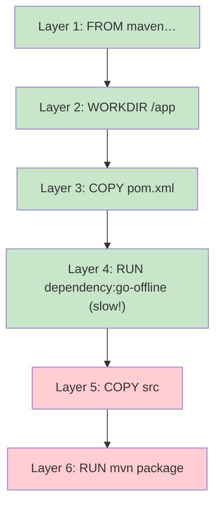

# The Dockerfile, line by line

## Problem

Step 09 hands you a Dockerfile and it works, but every line is a small decision. If you don't know *why* `pom.xml` is copied before `src`, or what `ENTRYPOINT` does that `RUN` doesn't, you can't fix a broken build or write your own Dockerfile next time. This page walks the exact ParcelPilot Dockerfile one instruction at a time, so nothing in it stays magic.

## Key words

| Word | Beginner meaning |
|---|---|
| **Instruction** | One line of the Dockerfile (`FROM`, `COPY`, `RUN`, …). |
| **Base image** | The image your image starts from, named by `FROM`. |
| **Tag** | The human-readable version label after the colon, e.g. `eclipse-temurin:21-jre`. |
| **Digest** | The exact, immutable fingerprint of an image (`@sha256:…`). |
| **Layer** | The filesystem snapshot each instruction produces, cached and reused between builds. |
| **Layer cache** | Docker's reuse of unchanged layers, so rebuilds only redo what changed. |
| **Build context** | The set of files Docker is allowed to read during the build (usually your project folder). |
| **Stage** | One `FROM`-block in a multi-stage Dockerfile, with its own filesystem. |

## The solution: read the recipe like Docker does

Here is the step-09 Dockerfile again, unchanged:

```dockerfile
# ---------- Stage 1: build ----------
FROM maven:3-eclipse-temurin-21 AS build
WORKDIR /app
COPY pom.xml .
# Download dependencies first (cached unless pom.xml changes) for faster rebuilds
RUN mvn -q dependency:go-offline
COPY src ./src
RUN mvn -q -DskipTests package

# ---------- Stage 2: run ----------
FROM eclipse-temurin:21-jre
WORKDIR /app
# Copy only the built JAR from the build stage
COPY --from=build /app/target/*.jar app.jar
EXPOSE 8080
ENTRYPOINT ["java", "-jar", "app.jar"]
```

Docker reads it top to bottom, executing each instruction on top of the previous one, snapshotting the result of each as a **layer**. Let's take the lines one by one.

### `FROM maven:3-eclipse-temurin-21 AS build`

Every Dockerfile starts with `FROM`: it names the **base image** you build on top of, so you never start from an empty machine. The name has parts:

- `maven` is the image name (an official image with Maven pre-installed).
- `3-eclipse-temurin-21` is the **tag**: Maven 3 on top of **Eclipse Temurin** 21. Temurin is the most widely used free, production-quality build of OpenJDK (the open-source Java), maintained by the Eclipse Adoptium project. When you see `eclipse-temurin`, read "a trustworthy free JDK/JRE".
- `AS build` names this **stage** `build`, so a later stage can copy files out of it.

One sentence on **digest pinning**: a tag like `21-jre` can silently point to a newer image tomorrow, so production teams often pin the exact fingerprint (`FROM eclipse-temurin@sha256:...`) to make builds perfectly reproducible; for learning, tags are fine.

### `WORKDIR /app`

Sets the current directory *inside the image* to `/app` (creating it if needed). Every later `COPY`, `RUN`, and `ENTRYPOINT` happens relative to it. It's `cd`, but for the image, and it saves you from writing absolute paths on every line.

### `COPY pom.xml .` — and why it comes before `src`

`COPY <from> <to>` copies files from your **build context** (your project folder, see below) into the image. Here: `pom.xml` into `/app`.

Why copy just `pom.xml` first instead of everything at once? **Layer caching.** Docker caches the result of each instruction. On a rebuild, an instruction's cached layer is reused *if* the instruction is unchanged **and** the files it copies are unchanged. Once one layer changes, that layer **and every layer after it** are rebuilt.

Your dependencies are decided by `pom.xml`, which changes rarely. Your code in `src/` changes constantly. By splitting the copy:

```dockerfile
COPY pom.xml .                     # changes rarely
RUN mvn -q dependency:go-offline   # slow: downloads all libraries
COPY src ./src                     # changes on every edit
RUN mvn -q -DskipTests package     # fast-ish: only compiles
```

…an ordinary code edit invalidates only the last two layers. The slow dependency download stays cached. If you copied everything with one `COPY . .` at the top, *every* code edit would re-download *every* library.



Green layers are reused from cache when you edit only `src/`; red layers are rebuilt. Change `pom.xml` and the rebuild starts at layer 3 instead.

### `RUN mvn -q dependency:go-offline` and `RUN mvn -q -DskipTests package`

`RUN` executes a command **at build time**, inside the image, and snapshots the result as a layer. The first `RUN` downloads all Maven dependencies; the second compiles the code and packages the JAR into `/app/target/`. (`-q` = quiet output, `-DskipTests` = don't run tests during the image build; you run them with `mvn test` before building.)

### `RUN` vs `CMD` vs `ENTRYPOINT`

Three instructions run commands, at different times and with different intent:

| Instruction | Runs when? | Purpose | ParcelPilot example |
|---|---|---|---|
| `RUN` | At **build** time | Bake something into the image (install, compile) | `RUN mvn package` |
| `ENTRYPOINT` | At **container start** | The fixed main command of the container | `ENTRYPOINT ["java", "-jar", "app.jar"]` |
| `CMD` | At **container start** | *Default* command or default *arguments*, easily overridden by `docker run image <something-else>` | (we don't use one) |

Rule of thumb: `RUN` builds the image, `ENTRYPOINT`/`CMD` decide what a container *does*. `ENTRYPOINT` says "this container **is** the ParcelPilot API"; a `CMD` would say "by default do this, but feel free to run something else". For an app image with one job, `ENTRYPOINT` states the intent best.

### `FROM eclipse-temurin:21-jre` — the second stage

A second `FROM` starts a **fresh stage** with a clean filesystem. Nothing from stage 1 comes along automatically. This image is JRE-only: it can *run* Java but not compile it, which makes it much smaller than the Maven+JDK image and leaves fewer tools inside for an attacker to abuse.

### `COPY --from=build /app/target/*.jar app.jar`

The bridge between stages: `--from=build` copies out of the stage named `build` instead of out of your build context. Only the finished JAR crosses over. Maven, the JDK, your source code, and the downloaded libraries all stay behind in stage 1 and are **not** part of the final image.

### `EXPOSE 8080`

Honest truth: `EXPOSE` is **documentation only**. It records "this app listens on port 8080" so humans and tools can see it (`docker inspect` shows it). It does **not** open or publish any port. The thing that actually makes the port reachable from your laptop is the `-p 8080:8080` flag on `docker run`. Delete `EXPOSE` and `-p` still works; keep `EXPOSE` and forget `-p`, and nothing is reachable.

### `ENTRYPOINT ["java", "-jar", "app.jar"]`

The command every container from this image runs at startup: launch the JAR. The JSON-array form (called *exec form*) runs `java` directly as process 1, without a shell in between, which means the process receives stop signals properly and shuts down cleanly.

## The build context and `.dockerignore`

When you run `docker build .`, the `.` names the **build context**: the folder whose contents Docker is allowed to `COPY` from. Docker first packages up that whole folder and sends it to the build. Two problems if you don't trim it:

1. **Slow builds**: a bloated `target/` or `.git/` folder gets sent along every time.
2. **Cache misses**: `COPY src ./src` re-runs when anything it copies changed — stray build artifacts can invalidate layers for no real reason.

`.dockerignore` lists what to leave out, exactly like `.gitignore`. A good one for a Maven project:

```text
target/
.git/
*.iml
.idea/
```

`target/` matters most: it holds your *local* Maven build output, which the image build recreates itself in stage 1 and would otherwise be copied in as noise.

## Proof: change one line, watch what rebuilds

Run each build twice and read which steps say `CACHED`:

```bash
cd applications/parcelpilot

# 1. baseline build — everything runs
docker build -t parcelpilot-api:09 .

# 2. rebuild with NO changes — every step is CACHED, finishes in seconds
docker build -t parcelpilot-api:09 .

# 3. touch a source file, rebuild — dependency download stays CACHED,
#    only "COPY src" and "mvn package" re-run
echo "// cache experiment" >> src/main/java/com/parcelpilot/ParcelPilotApplication.java
docker build -t parcelpilot-api:09 .

# 4. touch pom.xml, rebuild — the cache breaks earlier:
#    dependency:go-offline re-runs too (that's the slow one)
echo "<!-- cache experiment -->" >> pom.xml
docker build -t parcelpilot-api:09 .
```

(Afterwards, remove the two experiment lines you appended.) The lesson you just watched: **order your Dockerfile from least-changing to most-changing**, and rebuilds stay fast.

## Fat single-stage vs multi-stage

You could build everything in one stage and ship the whole Maven+JDK image. Compare honestly:

| | Single-stage (fat) | Multi-stage |
|---|---|---|
| Dockerfile complexity | simplest possible | two stages, `--from` to learn |
| Final image size | large (JDK + Maven + sources + deps) | small (JRE + one JAR) |
| Attack surface | compilers and build tools ship to prod | runtime only |
| Debugging inside the container | full toolbox available | leaner, fewer tools |
| Good for | learning, quick experiments | anything you ship |

Both are legitimate: single-stage is fine while you're learning what an image even is; multi-stage is the habit worth keeping. The [Docker reference](../../references/docker.md) has a fuller comparison with a concrete example of each.

## Next

- Something not working? [Troubleshooting Docker](troubleshooting-docker.md) covers the classic failures symptom by symptom.
- Back to [Step 09](README.md) to finish the acceptance criteria.
- Deeper reference: [Docker](../../references/docker.md).
