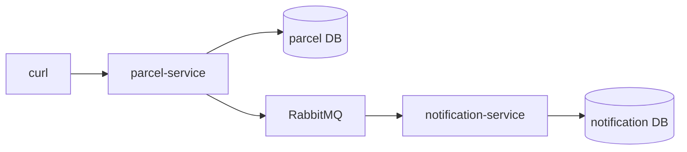

# Step 09: Extract the notification microservice

> In this step: split the monolith into two independent services that talk through the broker. ~90 minutes.

## The problem right now

Step 08 proved notification work runs on its own schedule via the queue. But it still lives **inside** the parcel app: they share a deploy, a codebase, and a database. If notifications need to scale or get redeployed, parcel tracking is dragged along. Now there is a *real* boundary worth splitting.

## Key words

| Word | Beginner meaning |
|---|---|
| **Microservice** | A small app that is built, deployed, and scaled independently. |
| **Service boundary** | The clear line of responsibility a service owns. |
| **Independent deployment** | Releasing one service without redeploying the others. |
| **Database per service** | Each service owns its own data, and others can't read it directly. |
| **Eventual consistency** | Different services become consistent shortly after, not instantly. |
| **Contract** | The agreed message/format two services use to talk. |
| **Failure isolation** | One service failing doesn't automatically break the others. |
| **Network call** | Talking over the network, which is slower and can fail, unlike a local method call. |

## What makes it a microservice (not just a folder)?

A microservice is **independently deployable** and **owns its data**. Two packages in one app that share a database are *not* microservices. Here:

- **parcel-service** owns parcel endpoints and the parcel database.
- **notification-service** owns notification handling and its own database.
- They communicate **only** through RabbitMQ. The notification service must **never** query the parcel database directly.



## Why do it? Pros and cons

**What it brings us:** notifications can be deployed, scaled, and fail on their own without touching parcel tracking.

**Pros:** independent deploy/scale, failure isolation, smaller focused codebases, and teams can own a service each.
**Cons, real and important:** network calls fail and add latency, two databases to run, eventual consistency, duplicated setup (config, logging, builds), and debugging spans multiple apps. **This is exactly why we started as a monolith.**

**Real-world example:** an e-commerce platform keeps checkout separate from email/notifications so a notification outage never blocks purchases.

## Build it in ParcelPilot

Reshape the project (see [PROJECT-STORY.md](../../PROJECT-STORY.md)). First, **save the working monolith** as a Git tag or a `checkpoints/08-event-driven-monolith` copy, then:

```text
applications/parcelpilot-services/
├── parcel-service/          # parcel endpoints + parcel DB + publishes events
├── notification-service/    # consumes events + notification DB
└── compose.yaml             # created in step 10
```

1. Move parcel code into `parcel-service` (keep its endpoints and DB).
2. Move notification code into `notification-service` with its **own** database.
3. The parcel-service **publishes** `ParcelDelivered`, and the notification-service **consumes** it.
4. Give each service its own `pom.xml` and `Dockerfile` so they build independently.
5. Keep the notification consumer **idempotent** (still important across the network).

## Test it

```bash
# start RabbitMQ, both databases, then both services (manually for now)
docker build -t parcel-service ./parcel-service
docker build -t notification-service ./notification-service
# run them, then:
curl -i -X PATCH http://localhost:8080/parcels/P-1/status \
  -H 'Content-Type: application/json' -d '{"status":"DELIVERED"}'
# watch notification-service logs consume exactly one event
```

## Acceptance criteria

- [ ] Two separately buildable images exist (`parcel-service`, `notification-service`).
- [ ] Marking a parcel delivered in parcel-service causes notification-service to process **exactly one** event.
- [ ] notification-service does **not** connect to the parcel database.
- [ ] Each service has its own database and can be built/started on its own.
- [ ] You can list two concrete costs microservices added compared to the monolith.

## Say it like a developer

- "I **extracted** notifications into its own **microservice**: independently deployable."
- "Each service owns its own data (**database per service**), and notification-service **never** reads the parcel DB."
- "They communicate only through the broker: that's the **contract** between them."
- "Because they're separate, one can fail without taking the other down: **failure isolation**."
- "The trade-off is **network calls**, **eventual consistency**, and more moving parts to run."

## Quiz: check yourself

Answer out loud before opening each toggle.

1. What makes something a **microservice** rather than just a package/folder?

<details><summary>Show answer</summary>

It's independently deployable and owns its own data. Two packages in one app sharing a database are not microservices. They deploy together and share state.

</details>

2. Why must notification-service have its **own database** and never query the parcel DB?

<details><summary>Show answer</summary>

So the services stay truly independent. Sharing a database re-couples them: a schema change or outage in one would break the other, defeating the point of splitting.

</details>

3. Name two concrete **costs** microservices add compared to the monolith.

<details><summary>Show answer</summary>

Any two of: network calls that add latency and can fail, eventual consistency instead of instant, two databases to run and back up, duplicated setup (config, logging, builds), and debugging that spans multiple apps.

</details>

4. What is **eventual consistency**?

<details><summary>Show answer</summary>

Different services become consistent shortly *after* an event, not instantly. For a moment, the parcel service may show "delivered" before the notification service has processed the event.

</details>

5. Why was starting as a **monolith** (and only splitting now) the right call?

<details><summary>Show answer</summary>

Microservices add real cost and complexity. Splitting is only worth it once a genuine boundary appears. Here, notifications proved (in step 08) that they run on their own schedule and need independent scaling and deployment.

</details>

## Reflect (stretch)

Starting two services, a broker, and two databases by hand is tedious and easy to get wrong. You need a single, documented way to bring the whole system up. That is Docker Compose.

## Next

[Step 10](../10-compose-and-observe/README.md): run everything with one command and learn to observe it.
