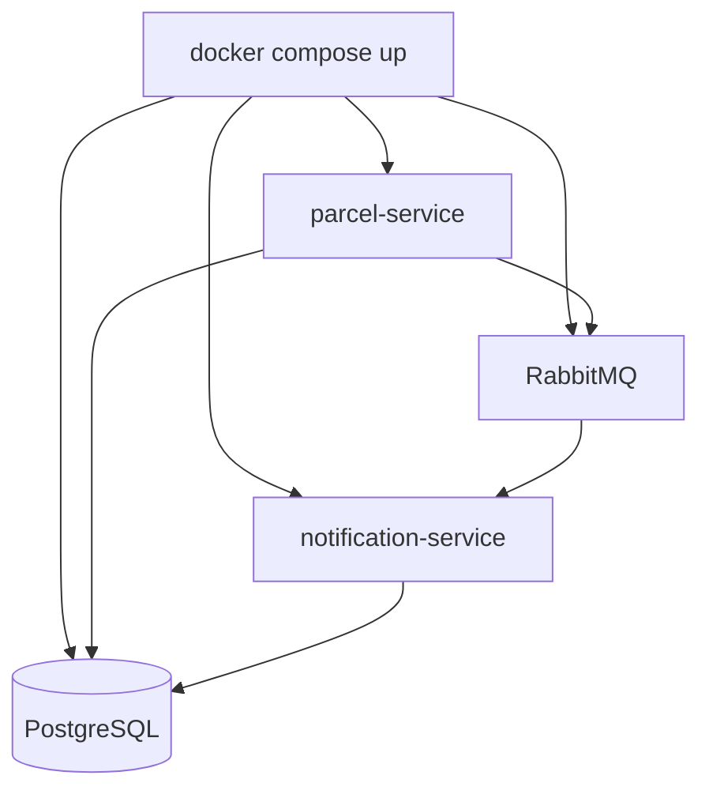

# Step 10: Docker Compose & observing the system

> In this step: start the whole system with one command, add health checks and logs, and watch it fail on purpose. ~75 minutes.

## The problem right now

Your system is now two services + RabbitMQ + databases. Starting each container by hand, in the right order, with the right ports, network, and environment variables is slow and error-prone, and it isn't written down anywhere. You need a **single, documented definition** of the local system.

## Key words

| Word | Beginner meaning |
|---|---|
| **Docker Compose** | A tool to define and run a multi-container system from one file. |
| **`compose.yaml`** | The file describing all services, networks, volumes, and settings. |
| **Service (Compose)** | One container definition inside `compose.yaml`. |
| **Network (Compose)** | A private network so services reach each other by name (e.g. `rabbitmq`). |
| **Health check** | A command Compose runs to see if a service is actually ready. |
| **`depends_on`** | Tells Compose to start (and optionally wait for) other services first. |
| **Actuator** | Spring's built-in health/metrics endpoints (`/actuator/health`). |
| **Observability** | Being able to see what a running system is doing (logs, health, metrics). |
| **stdout logging** | Writing logs to the terminal/standard output so Docker can collect them. |

## What is Docker Compose (and why observe)?

Compose is a recipe for your **whole** local system. One `docker compose up` builds and starts every service on a shared network with the right config. **Observability** is how you answer three questions about a running system: *Is it alive?* (health), *What did it do?* (logs), *Is it degrading?* (metrics).



## Why do it? Pros and cons

**What it brings us:** a reproducible, documented, one-command local system, plus the signals to debug it.

**Pros:** one command, config is version-controlled, consistent startup order via health checks, and easy to share.
**Cons:** Compose is for local/single-host use (production orchestration like Kubernetes is a separate topic), YAML mistakes can be fiddly, and you must design health checks that are honest.

**Real-world example:** developers clone a repo and run `docker compose up` to get the entire backend running locally in minutes, instead of a page of manual setup steps.

## Build it in ParcelPilot

In `applications/parcelpilot-services/`:

1. Create `compose.yaml` defining: `parcel-service`, `notification-service`, `rabbitmq`, the database(s), **named volumes**, **environment variables**, **health checks**, and `depends_on` where useful.
2. Add `spring-boot-starter-actuator` to both services and expose `/actuator/health`.
3. Configure both services to log to **stdout** (not files inside the container).
4. Use Compose service **names** for addresses (e.g. host `rabbitmq`, not `localhost`).

A starting `compose.yaml` (adapt names/ports to your services):

```yaml
services:
  db:
    image: postgres:16-alpine
    environment:
      POSTGRES_DB: parcelpilot
      POSTGRES_USER: parcelpilot
      POSTGRES_PASSWORD: local-dev-only
    volumes:
      - db-data:/var/lib/postgresql/data
    healthcheck:                       # is the DB really ready?
      test: ["CMD-SHELL", "pg_isready -U parcelpilot"]
      interval: 5s
      timeout: 3s
      retries: 5

  rabbitmq:
    image: rabbitmq:3-management
    ports:
      - "15672:15672"                  # management UI
    healthcheck:
      test: ["CMD", "rabbitmq-diagnostics", "-q", "ping"]
      interval: 5s
      timeout: 3s
      retries: 5

  parcel-service:
    build: ./parcel-service
    ports:
      - "8080:8080"
    environment:
      DB_HOST: db                      # reach other services by NAME, not localhost
      DB_USER: parcelpilot
      DB_PASSWORD: local-dev-only
      RABBIT_HOST: rabbitmq
    depends_on:
      db:
        condition: service_healthy     # wait until the DB is ready
      rabbitmq:
        condition: service_healthy

  notification-service:
    build: ./notification-service
    environment:
      RABBIT_HOST: rabbitmq
    depends_on:
      rabbitmq:
        condition: service_healthy

volumes:
  db-data:
```

## Test it

```bash
cd applications/parcelpilot-services
docker compose up --build

# check health and logs
curl -i http://localhost:8080/actuator/health
docker compose logs -f notification-service
```

Then break it on purpose:

```bash
docker compose stop rabbitmq
# mark a parcel delivered and observe what happens to the message/logs
docker compose start rabbitmq
# observe recovery
```

## Acceptance criteria

- [ ] `docker compose up --build` starts every service successfully.
- [ ] `GET /actuator/health` returns `UP` for the services.
- [ ] `docker compose logs` shows notification-service consuming events.
- [ ] With RabbitMQ stopped, you can describe what happens to a delivery event. After restart, the system recovers.
- [ ] You can explain what a health check is and why logs go to stdout.

## Say it like a developer

- "`docker compose up` starts the **whole system** (both services, RabbitMQ, and the database) with one command."
- "Services reach each other by **name** on the Compose **network** (host `rabbitmq`, not `localhost`)."
- "**Health checks** let Compose wait until a service is actually **ready** before starting dependents."
- "I log to **stdout** so Docker can collect the logs."
- "**Observability** answers three questions: is it alive (health), what did it do (logs), is it degrading (metrics)."

## Quiz: check yourself

Answer out loud before opening each toggle.

1. What does `docker compose up` give you over running `docker run` for each container?

<details><summary>Show answer</summary>

One command starts the entire multi-container system on a shared network with the right config, in the right order, and that setup is documented and version-controlled in `compose.yaml`.

</details>

2. Why does a service use the host name `rabbitmq` instead of `localhost` to reach the broker?

<details><summary>Show answer</summary>

Inside Compose, each service is its own container. `localhost` would mean "this container itself". Compose provides a private network where services are reachable by their **service name**, so `rabbitmq` resolves to the broker container.

</details>

3. What is a **health check**, and why use `depends_on: condition: service_healthy`?

<details><summary>Show answer</summary>

A health check is a command Compose runs to see if a service is truly ready (not just started). Waiting for `service_healthy` prevents the app from starting before the database/broker can accept connections.

</details>

4. Why log to **stdout** instead of to a file inside the container?

<details><summary>Show answer</summary>

Containers are disposable, so files inside them vanish. Logging to stdout lets Docker (and log collectors) capture the output with `docker compose logs`.

</details>

5. What three questions does **observability** answer?

<details><summary>Show answer</summary>

Is it alive? (health checks), What did it do? (logs), Is it degrading? (metrics).

</details>

## Reflect (stretch)

The system runs, but it isn't yet *robust* or *safe*: repeated reads hit the database every time, clashing writes and floods of requests aren't controlled, and anyone can call any endpoint. The last two steps harden it.

## What comes after this course

Once ParcelPilot is complete, natural next topics are: retries + dead-letter queues + the transactional outbox, API versioning, metrics + tracing + correlation IDs, cloud deployment, and Kafka/SQS where their properties fit. See [Production thinking](../../references/production-thinking.md).

## Next

[Step 11](../11-performance-and-safety/README.md): add caching, locking, and rate limiting.
