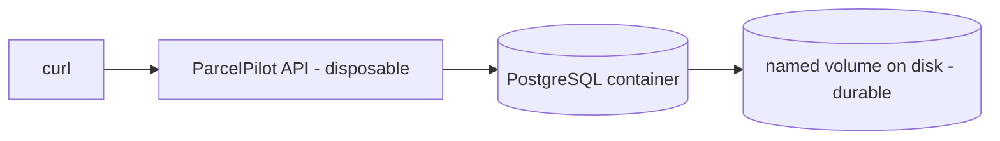
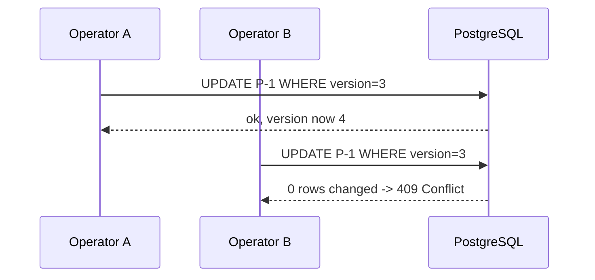

# Step 10: Persistence, keep the parcels

> In this step: store parcels in PostgreSQL (running in Docker) so they survive restarts, and protect against two people overwriting each other. ~90–120 minutes.

## The problem right now

Step 09 proved parcels vanish when the container is replaced, because they live in an in-memory `Map`. A delivery company cannot lose all parcels on every deploy. Data needs a **durable** home separate from the disposable app.

## Key words

| Word | Beginner meaning |
|---|---|
| **Database** | A separate program built to store and query data reliably. |
| **PostgreSQL** | The relational (table-based) database this course uses. |
| **Relational / SQL** | Data in tables (rows + columns), queried with the SQL language. |
| **Persistence** | Data that survives even after the app stops. |
| **Volume** | Docker storage living *outside* a container, so data isn't lost when the container is replaced. |
| **Environment variable** | A setting passed to a program at startup (e.g. DB address, password). |
| **JPA / entity** | Java's way to map a class to a database table (an `@Entity`). |
| **Repository** | A Spring interface that reads/writes entities without you writing SQL. |
| **Migration** | A versioned script that creates/changes tables (via Flyway). |
| **Transaction** | A group of changes that all succeed or all fail together. |
| **Optimistic locking** | Detecting clashing edits with a `version` number. |
| **`409 Conflict`** | HTTP status meaning "your update clashed with someone else's". |

## Subtopics for this step

This step has more moving parts than earlier ones, so it's split into focused companion pages. Read them in this order:

1. [Databases and SQL basics](sql-and-databases.md): what a relational DB is, core SQL, why PostgreSQL (vs MySQL, SQLite, MongoDB, Redis).
2. [JPA, entities, and repositories](jpa-and-repositories.md): how Java talks to the DB without hand-written SQL, and the alternatives.
3. [Locking explained](locking-explained.md): optimistic vs pessimistic, and why we pick optimistic.
4. [Flyway migrations explained](flyway-migrations-explained.md): why the schema is versioned, the naming rules, and the never-edit-history rule.
5. [Indexes: why queries get fast](indexes-intro.md): what an index is and how to see it working with `EXPLAIN`.

## What "persistence" means, and why a volume matters

Two separate containers now:

- the **app** container: disposable, replaced on every deploy.
- the **database** container: stores data in a Docker **volume** on your disk.

Replace the app as often as you like, and the database and its volume keep the parcels.



## The clashing-updates problem (locking)

Two operators both load parcel `P-1` at version 3 and both save. Without protection, the second silently overwrites the first, a **lost update**. **Optimistic locking** adds a `version` column: an update only succeeds if the version still matches. Otherwise the API returns `409` and the caller reloads and retries.



## Why do it? Pros and cons

**What it brings us:** durable data, real queries, and safety when many users act at once.

**Pros:** survives restarts/deploys, powerful querying, and transactions keep data consistent.
**Cons:** another service to run and back up, schema changes need migrations, and you must supply connection settings via environment variables.

**Real-world example:** every shop, bank, and tracking system stores records in a database, never in the web server's memory.

## Build it in ParcelPilot (do this exactly)

### 1. Start PostgreSQL in Docker with a named volume

On Ubuntu, put the database and the API on a shared **user-defined network** so the API can reach the database by name. See [Running several containers](../../GUIDE.md#running-several-containers-read-before-step-10) in the GUIDE for why `localhost` does not work between containers.

```bash
# create the shared network once (safe to re-run if it already exists)
docker network create parcelpilot-net

docker run --name parcelpilot-db \
  --network parcelpilot-net \
  -e POSTGRES_DB=parcelpilot \
  -e POSTGRES_USER=parcelpilot \
  -e POSTGRES_PASSWORD=local-dev-only \
  -p 5432:5432 \
  -v parcelpilot-postgres:/var/lib/postgresql/data \
  -d postgres:16-alpine
```

The `-v parcelpilot-postgres:/var/lib/postgresql/data` part is the **volume**: it keeps data on your disk. The password here is an intentionally visible local-only value, so never commit real secrets. The `-p 5432:5432` publish is only so you can inspect the database from your laptop. The API reaches it over the shared network by name.

### 2. Add dependencies to `pom.xml`

```xml
<dependency>
    <groupId>org.springframework.boot</groupId>
    <artifactId>spring-boot-starter-data-jpa</artifactId>
</dependency>
<dependency>
    <groupId>org.postgresql</groupId>
    <artifactId>postgresql</artifactId>
    <scope>runtime</scope>
</dependency>
<dependency>
    <groupId>org.flywaydb</groupId>
    <artifactId>flyway-core</artifactId>
</dependency>
```

### 3. Configure from environment variables

In `src/main/resources/application.properties` (values come from the environment so nothing is hard-coded):

```properties
spring.datasource.url=jdbc:postgresql://${DB_HOST:localhost}:5432/parcelpilot
spring.datasource.username=${DB_USER:parcelpilot}
spring.datasource.password=${DB_PASSWORD:local-dev-only}
spring.jpa.hibernate.ddl-auto=validate
spring.flyway.enabled=true
```

### 4. Add a migration

Create `src/main/resources/db/migration/V1__create_parcels.sql`:

```sql
CREATE TABLE parcels (
    id         VARCHAR(64) PRIMARY KEY,
    recipient  VARCHAR(255) NOT NULL,
    status     VARCHAR(32)  NOT NULL,
    version    BIGINT       NOT NULL DEFAULT 0
);
```

### 5. Turn `Parcel` into an entity and add a repository

An `@Entity` maps to the table, and `@Version` enables optimistic locking automatically:

```java
package com.parcelpilot;

import jakarta.persistence.*;

@Entity
@Table(name = "parcels")
public class ParcelEntity {
    @Id
    private String id;
    private String recipient;
    @Enumerated(EnumType.STRING)
    private Status status;
    @Version
    private long version;   // Spring/JPA checks this on update -> 409 on conflict
    // getters/setters or use accessors as you prefer
}
```

```java
package com.parcelpilot;

import org.springframework.data.jpa.repository.JpaRepository;
import java.util.List;

public interface ParcelRepository extends JpaRepository<ParcelEntity, String> {
    List<ParcelEntity> findByStatus(Status status);
}
```

Then update the controller to use the repository instead of the in-memory `Map`.

Follow the [database lab](database-lab.md) for the exact wiring and a `409` conflict test.

## Test it

Run the API container on the same network as the database and point it at the database by name with `DB_HOST`:

```bash
# run the API on the shared network; it reaches the DB at host name parcelpilot-db
docker run --name parcelpilot-api \
  --network parcelpilot-net \
  -e DB_HOST=parcelpilot-db \
  -e DB_USER=parcelpilot \
  -e DB_PASSWORD=local-dev-only \
  -p 8080:8080 \
  -d parcelpilot-api:10
```

```bash
# 1. create a parcel
curl -i -X POST http://localhost:8080/parcels \
  -H 'Content-Type: application/json' -d '{"id":"P-1","recipient":"Ava"}'

# 2. replace ONLY the API container: stop and remove it, then run it again
docker rm -f parcelpilot-api
# (re-run the docker run command above)

# 3. it is still there, because the data lives in the database volume
curl -i http://localhost:8080/parcels/P-1
```

## Acceptance criteria

- [ ] After recreating the **API** container, a previously created parcel is still returned.
- [ ] PostgreSQL runs in Docker with a named volume, and keeping the volume preserves data across DB container recreation.
- [ ] DB credentials come from environment variables, not source code.
- [ ] Two updates based on the same version: one succeeds, the other returns `409`.
- [ ] You can explain what a volume, a migration, an entity, and optimistic locking are.
- [ ] You can say why we chose PostgreSQL over a NoSQL store for parcels (see [SQL and databases](sql-and-databases.md)).
- [ ] You can explain what an ORM/JPA does and why we don't hand-write SQL (see [JPA and repositories](jpa-and-repositories.md)).

> **Return to testing:** ParcelPilot now has a real database — go back and complete the [Testcontainers lab](../08-testing/testcontainers-lab.md) from step 08 so your repository is covered by tests against real PostgreSQL.

## Say it like a developer

- "Parcels are now **persisted** in PostgreSQL, so they **survive a restart**."
- "The database's data lives in a Docker **volume**, so it outlives the container."
- "`ParcelEntity` is a JPA **entity**: it maps to the `parcels` **table**."
- "The **repository** reads and writes entities so I don't hand-write SQL."
- "A **migration** (Flyway) creates the table in a versioned, repeatable way."
- "`@Version` gives me **optimistic locking**: a clashing update returns `409 Conflict`."
- "DB credentials come from **environment variables**, never from source code."

## Quiz: check yourself

Answer out loud before opening each toggle.

1. Why does putting data in a **volume** matter?

<details><summary>Show answer</summary>

A container is disposable, so replacing it wipes its contents. A volume stores data on disk *outside* the container, so the database keeps the parcels even when the container is recreated.

</details>

2. What does an **entity** (`@Entity`) do?

<details><summary>Show answer</summary>

It maps a Java class to a database table, so each object corresponds to a row. JPA/Hibernate then translates between objects and SQL for you.

</details>

3. What is a **migration**, and why not just create tables by hand?

<details><summary>Show answer</summary>

A migration is a versioned SQL script (via Flyway) that creates/changes tables. It runs the same way on every machine and in CI, so the schema is reproducible and tracked in version control, which hand-creating tables isn't.

</details>

4. Explain **optimistic locking** with the `version` column.

<details><summary>Show answer</summary>

Each row has a `version`. An update only succeeds if the version still matches what you read. Otherwise someone else changed it first, so the update fails and the API returns `409 Conflict`, prompting a reload-and-retry. This prevents silent lost updates.

</details>

5. Why do DB credentials come from **environment variables** instead of being written in the code?

<details><summary>Show answer</summary>

So secrets aren't committed to source control, and the same image can run against different databases (local, test, prod) just by changing the environment.

</details>

6. Why did we choose PostgreSQL (relational/SQL) over a NoSQL store for parcels?

<details><summary>Show answer</summary>

Parcels have a clear, consistent structure and need reliable updates, transactions, and locking, exactly what a relational database is built for. (See [SQL and databases](sql-and-databases.md).)

</details>

## Reflect (stretch)

ParcelPilot now has HTTP, business rules, and durable data, but a lot of responsibilities are mixed in a few classes. The next step gives them clean internal boundaries **without** adding network complexity.

## Next

[Step 11](../11-monolith/README.md): organize everything into a clean modular monolith.
