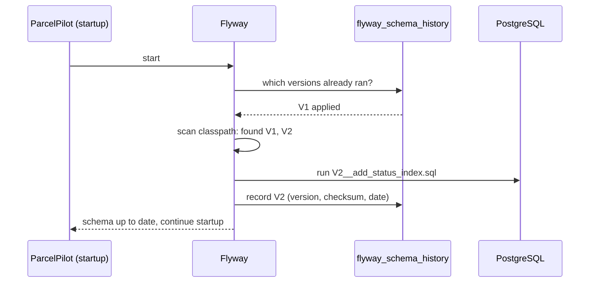

# Flyway migrations explained

Step 10 tells you to put `V1__create_parcels.sql` in `db/migration` and it "just works". This page explains what actually happens, why the naming matters, and the two rules that will save you real pain later.

## The problem (real world)

Without migrations, every developer (and every environment) creates tables by hand: you run one `CREATE TABLE` on your laptop, your teammate runs a slightly different one, and production got a third variant six months ago that nobody wrote down. This is **schema drift**, and it produces the classic bug report: *"works on my DB"*. The schema is part of the application — it must be versioned, reviewed, and applied the same way everywhere, exactly like code.

## Key words

| Word | Beginner meaning |
|---|---|
| **Schema** | The shape of the database: which tables and columns exist. |
| **Schema drift** | Different machines silently having different schemas. |
| **Migration** | A versioned SQL script that changes the schema, applied exactly once. |
| **Flyway** | The library that finds, orders, runs, and records migrations at app startup. |
| **`flyway_schema_history`** | The table Flyway creates to record which migrations already ran. |
| **Checksum** | A fingerprint of a migration file, used to detect that an applied file was edited. |
| **Compensating migration** | A *new* migration that undoes or corrects an earlier one, instead of editing history. |

## What is a migration?

A migration is a plain SQL file with a version number in its name. Flyway runs each one **exactly once per database** and records that fact in its own bookkeeping table, `flyway_schema_history`. So "creating the schema" stops being a manual step someone must remember, and becomes something the app does for itself on startup:



Start the app on a **fresh** database and Flyway runs everything from V1. Start it on an existing database and Flyway runs only what's new. Either way, every machine ends up with the identical schema — that's the whole point.

## The naming convention (the double underscore!)

```text
src/main/resources/db/migration/V1__create_parcels.sql
                                │├┘└──────┬──────────┘
                                ││        └ description (for humans)
                                │└ DOUBLE underscore separates version from description
                                └ V + version number
```

The separator is `__` — **two** underscores. With only one (`V1_create_parcels.sql`), Flyway doesn't recognize the file and silently skips it, which is a genuinely confusing failure: the app starts, then JPA complains that the `parcels` table doesn't exist. Later migrations count upward: `V2__add_status_index.sql`, `V3__create_notifications.sql`, and so on.

## How Flyway decides what to run

At startup Flyway compares two lists:

1. the migration files on the classpath (sorted by version number), and
2. the rows in `flyway_schema_history` (what already ran, with each file's **checksum**).

Anything on list 1 that isn't on list 2 gets executed, in version order, and recorded. Anything on both lists gets **verified**: Flyway recomputes the file's checksum and compares it to the recorded one. You can inspect the history yourself:

```bash
docker exec -it parcelpilot-db psql -U parcelpilot -d parcelpilot \
  -c 'SELECT version, description, checksum, success FROM flyway_schema_history;'
```

## Rule 1: NEVER edit an applied migration

Suppose V1 already ran, and you notice `recipient` should have been `VARCHAR(500)`. Editing `V1__create_parcels.sql` feels natural — and breaks the very next startup:

```text
org.flywaydb.core.api.exception.FlywayValidateException:
Validate failed: Migrations have failed validation
Migration checksum mismatch for migration version 1
-> Applied to database : 1996767037
-> Resolved locally    : -1093730151
Either revert the changes to the migration, or run repair to update the schema history.
```

Flyway is telling you: "the file on disk no longer matches what I actually ran, so I can no longer promise every database looks the same." And note what editing *wouldn't* have done anyway: V1 already ran, so your edit would never re-execute on this database — but it **would** run in its edited form on a teammate's fresh database. Now two machines have different schemas: drift, the exact disease migrations cure.

**The fix:** revert your edit to V1, and express the change as a *new* migration:

```sql
-- V2__widen_recipient.sql
ALTER TABLE parcels ALTER COLUMN recipient TYPE VARCHAR(500);
```

Applied migrations are history. History is append-only.

## Rollback reality

"Can I roll back a migration?" In Flyway's free (community) edition: **no** — undo scripts are a paid feature, and honestly, teams rarely rely on them anyway (a `DROP COLUMN` can't give the data back). The practical model is **forward-only**: if V2 was a mistake, you write V3, a **compensating migration** that reverses or corrects it:

```sql
-- V3__remove_priority_column.sql  (compensates V2, which added it)
ALTER TABLE parcels DROP COLUMN priority;
```

The history stays honest: the schema went wrong and was fixed, and every database that applies V1..V3 lands in the same correct state.

## Dev-loop tips

- **Resetting your local database:** while experimenting you'll sometimes want a clean slate. The simplest safe reset is to throw away the Docker volume — the data and the schema history vanish together, and the next startup replays all migrations from V1:

```bash
docker rm -f parcelpilot-db
docker volume rm parcelpilot-postgres
# then re-run the docker run command from the step 10 README
```

- **`flyway.clean` danger:** Flyway has a `clean` command that drops *every object in the schema*. Pointed at the wrong database, it is a catastrophe with no undo. Spring Boot disables it by default (`spring.flyway.clean-disabled=true`) — leave it that way and use the volume trick locally instead.
- Keep each migration **small and single-purpose** (one table or one change). Small migrations are easy to review and easy to compensate.

## Migrations vs `ddl-auto=update`

Hibernate can generate schema changes itself: set `spring.jpa.hibernate.ddl-auto=update` and it alters tables to match your entities at startup. Why doesn't the course use that?

| | Flyway migrations | `ddl-auto=update` |
|---|---|---|
| Who writes the SQL | you, explicitly, reviewed in git | Hibernate guesses from entity changes |
| Reproducible across machines | yes — same scripts, same order, recorded | mostly, but no record of *what* it did |
| Renames a column | you write `ALTER TABLE … RENAME` | sees "old column gone, new column appeared": adds the new, **keeps the old with its data stranded** |
| Deletes / narrows anything | only if you write it | never drops columns — the schema accretes junk |
| Fails loudly on drift | yes (checksum validation) | no — it "helpfully" patches over differences |
| Effort | write a small SQL file per change | zero |

**The honest summary:** `ddl-auto=update` is genuinely fine for toys, prototypes, and throwaway experiments — zero ceremony, instant iteration. It's dangerous for real data because it applies unreviewed, unrecorded schema changes directly to a database you care about, and its guesses (especially around renames) silently lose or strand data. ParcelPilot uses the production-grade setting from the start: `ddl-auto=validate` (Hibernate only *checks* that entities match the schema) plus Flyway (the only thing allowed to *change* the schema).

## Back to the step

Return to [Step 10](README.md) and create `V1__create_parcels.sql`. When you later add an index in [Indexes: why queries get fast](indexes-intro.md), that will be your first `V2`.
