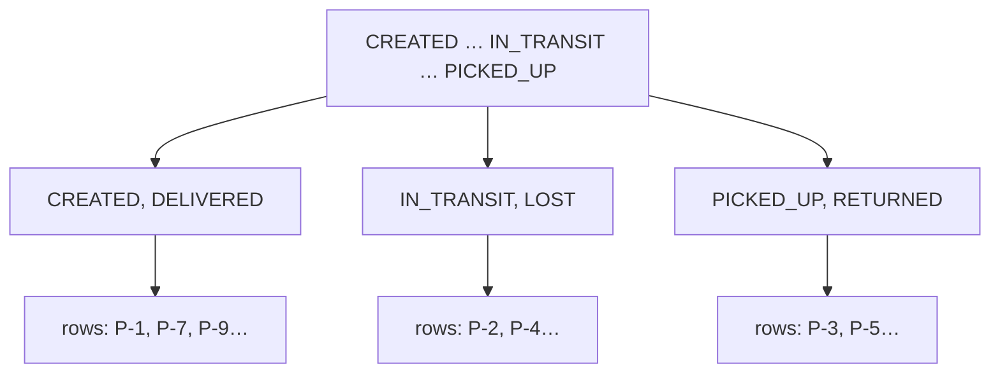

# Indexes: why queries get fast

## The problem (real world)

ParcelPilot's repository has `findByStatus(Status status)`. To answer it, PostgreSQL's only default option is to read **every row** in `parcels` and check each one's `status`. That's called a **sequential scan** (seq scan). With 50 parcels, who cares. With 5 million parcels and a query on every dashboard refresh, the database spends its life re-reading rows that can't possibly match. The same goes for finding parcels by recipient: no shortcut exists unless you build one.

An **index** is that shortcut.

## Key words

| Word | Beginner meaning |
|---|---|
| **Index** | A sorted lookup structure the database maintains next to a table to find rows fast. |
| **Sequential scan (seq scan)** | Reading the whole table row by row to answer a query. |
| **Index scan** | Jumping through the index to only the matching rows. |
| **B-tree** | The tree shape most indexes use: sorted, shallow, fast to search. |
| **Selectivity** | How well a column narrows things down (an ID: very; a boolean: barely). |
| **`EXPLAIN`** | SQL command that shows the plan the database *would* use for a query. |
| **`EXPLAIN ANALYZE`** | Runs the query and shows the plan *plus* real timings. |

## What is an index?

Think of a phone book. To find "Novak" you don't read every page from A — the book is **sorted by name**, so you jump straight to N. But that same phone book is useless for "find everyone whose phone number ends in 42": for that question you'd need a *second* book sorted by number.

An index is exactly that second book: a sorted copy of one column (plus pointers back to the full rows), kept up to date by the database automatically. Most databases store it as a **B-tree** — a wide, shallow tree where each step down eliminates most of the remaining rows:



(Real B-trees hold thousands of entries per node; the idea is what matters: a few hops instead of a million row reads.)

Creating one is a single SQL statement — in ParcelPilot it belongs in a Flyway migration (see [Flyway migrations explained](flyway-migrations-explained.md)):

```sql
-- V2__add_status_index.sql
CREATE INDEX idx_parcels_status ON parcels (status);
```

One important freebie: **primary keys are indexed automatically**. `findById("P-1")` was always fast — the `PRIMARY KEY` on `id` created an index behind your back. You only add indexes for the *other* columns you search by.

## Seeing the difference with EXPLAIN

Don't take the theory on faith — ask PostgreSQL for its plan. Open `psql` inside the database container from step 10:

```bash
docker exec -it parcelpilot-db psql -U parcelpilot -d parcelpilot
```

Before the index (or on a tiny table), asking for the plan shows a seq scan:

```sql
EXPLAIN SELECT * FROM parcels WHERE status = 'CREATED';
```

```text
                       QUERY PLAN
---------------------------------------------------------
 Seq Scan on parcels  (cost=0.00..25.88 rows=6 width=98)
   Filter: ((status)::text = 'CREATED'::text)
```

To make the effect visible, give the table enough rows to matter, then create the index:

```sql
-- generate 100k throwaway parcels
INSERT INTO parcels (id, recipient, status, version)
SELECT 'GEN-' || n, 'Recipient ' || n,
       (ARRAY['CREATED','PICKED_UP','DELIVERED'])[1 + n % 3], 0
FROM generate_series(1, 100000) AS n;

CREATE INDEX idx_parcels_status ON parcels (status);

EXPLAIN ANALYZE SELECT * FROM parcels WHERE status = 'CREATED';
```

```text
                       QUERY PLAN
---------------------------------------------------------
 Bitmap Heap Scan on parcels  (...)
   ->  Bitmap Index Scan on idx_parcels_status  (...)
         Index Cond: ((status)::text = 'CREATED'::text)
 Execution Time: 8.912 ms
```

The plan now goes through `idx_parcels_status` instead of reading everything (a "Bitmap Index Scan" is PostgreSQL's way of using an index for a match with many rows; for rarer matches you'll see a plain `Index Scan`). `EXPLAIN ANALYZE` also prints real execution time, so you can compare before/after. Clean up the generated rows afterwards: `DELETE FROM parcels WHERE id LIKE 'GEN-%';`

**Don't be surprised if a tiny table still says Seq Scan after you add an index.** For a handful of rows, reading the whole table is genuinely cheaper than bouncing through an index, and the query planner knows it. That is correct behavior, not a broken index.

## When an index helps, and when it doesn't

An index earns its keep when queries actually use that column and it narrows results well:

- columns in **`WHERE`** clauses you run often (`status`, `recipient`)
- columns you **`JOIN`** on
- columns you **`ORDER BY`** for large result sets
- **high selectivity**: the column splits the table into many small groups (an email column: great; a `is_active` boolean where 99% are true: nearly useless)

It does *not* help — and actively costs you — when:

- the table is **tiny** (planner ignores it, rightly)
- the column has **low selectivity** (few distinct values, evenly spread)
- the table is **write-heavy**: every `INSERT` and `UPDATE` must also update **every index** on the table. Indexes are a tax on writes that you pay to speed up reads. Ten indexes "just in case" means ten extra structures maintained on every single write.

## Pros and cons

| Pros | Cons |
|---|---|
| Reads that used to scan millions of rows become near-instant | Every index slows down every `INSERT`/`UPDATE`/`DELETE` a bit |
| `WHERE`, `JOIN`, `ORDER BY` on the indexed column get cheap | Takes disk space (it's a second sorted copy of the column) |
| Primary keys and unique constraints get one for free | Wrong or unused indexes are pure overhead |
| `EXPLAIN` makes the benefit measurable, not vibes | Query planner may ignore it (small table, low selectivity) — surprising at first |

## Call-out: the N+1 queries problem

> An index makes *one* query fast. A related trap makes you run *too many* queries: load a list of 100 parcels (1 query), then touch a lazy-loaded relation on each one — JPA quietly fires 100 more queries, one per parcel. That's **N+1**: one query for the list plus N for the details, and no index can save you from death by a thousand round trips. It's JPA's lazy-loading default doing exactly what you asked, just not what you meant.
>
> ParcelPilot has no entity relations yet, so you can't hit it today — but when relations arrive, you catch N+1 by watching the SQL. Set `spring.jpa.show-sql=true` locally and skim the log: one user action printing a waterfall of near-identical `SELECT`s is the tell. The fix (fetch joins or dedicated queries) can wait until you actually have the problem.

## Back to the step

Return to [Step 10](README.md). If you want the index to be a permanent part of ParcelPilot, add it as your next Flyway migration — the naming rules are in [Flyway migrations explained](flyway-migrations-explained.md).
