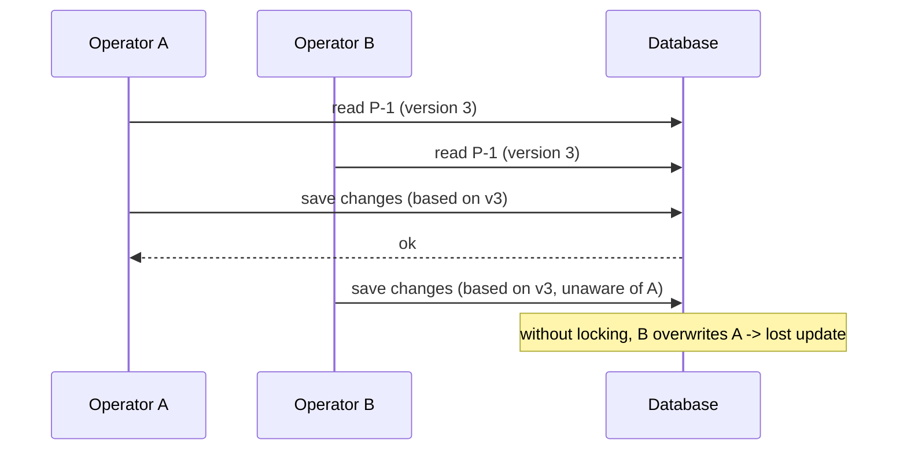
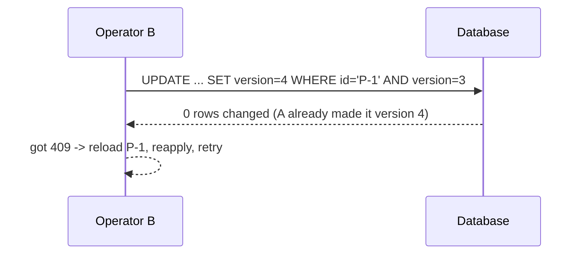

# Locking explained (optimistic vs pessimistic)

When more than one request changes the same data at the same time, you can get **lost updates**. Locking prevents that.

## The problem (real world)

Two operators open parcel `P-1` at the same moment (both see version 3). Operator A sets it to `PICKED_UP`. Operator B, still looking at the old copy, sets a note and saves. Without protection, B's save overwrites A's change, and A's update is silently **lost**.



## Two solutions

### Optimistic locking (our default)

Assume conflicts are **rare**. Add a `version` number to each row. On update, the database only writes if the version still matches, then it bumps the version. If someone else already changed the row, your update matches zero rows → the app returns `409 Conflict`, and the caller reloads and retries.



In JPA this is **automatic** once you add `@Version`:

```java
@Entity
public class ParcelEntity {
    @Id private String id;
    @Version private long version;   // JPA checks + increments this on every update
    // ...
}
```

If a conflict happens, JPA throws `OptimisticLockException`. Map that to HTTP `409` in your controller.

### Pessimistic locking

Assume conflicts are **likely**. Lock the row in the database while you work, so others must wait. Stronger, but reduces concurrency and can cause waits/deadlocks.

```java
// conceptual: lock the row for the duration of the transaction
@Lock(LockModeType.PESSIMISTIC_WRITE)
Optional<ParcelEntity> findById(String id);
```

## Optimistic vs pessimistic: the full comparison

| | Optimistic | Pessimistic |
|---|---|---|
| How it works | no lock; write checks the `version` still matches, else the update matches 0 rows | the row is locked in the database while the transaction works; others must wait |
| Throughput under **low** contention | high: readers and writers never wait on each other | lower: even non-clashing work pays for taking and holding locks |
| Behavior under **high** contention | many failed writes → a storm of `409`s and retries, wasted work | writers queue up in order; each waits but usually succeeds on its turn |
| Deadlock risk | none from the locking itself (no locks held) | real: two transactions each holding a row the other wants → the DB kills one |
| Failure mode the client sees | a fast, clean `409 Conflict` → reload and retry (client-visible, recoverable) | a **blocked wait**: the request just hangs until the lock frees or times out |
| When to choose | conflicts are rare and retrying is cheap: typical REST updates (ParcelPilot) | conflicts are common on a hot row and waiting beats retry storms: seat/stock counters, short critical sections |

**We use optimistic locking** because parcel updates rarely collide, and it keeps the API fast and simple. You just handle the occasional `409`.

You will *provoke* an optimistic-lock conflict on purpose and script the retry in step 15's [optimistic locking lab](../15-performance-and-safety/optimistic-locking-lab.md).

## Locking vs transactions (don't confuse them)

- A **transaction** groups changes so they all succeed or all fail (atomicity).
- **Locking** decides what happens when two transactions touch the same row.

You'll use both: a transaction wraps a change, and the `@Version` lock protects against concurrent writers.

## Real-world analogy

Optimistic = editing a shared doc and getting "someone else changed this, please refresh" when you save. Pessimistic = checking out a library book so nobody else can take it until you return it.

## Proof (do this in the step)

Create `P-1`, then send two updates both based on version 3. One succeeds, and the other must return `409`.

## Back to the step

Return to [Step 10](README.md).
