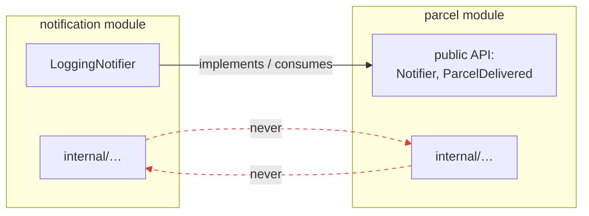

# Module boundaries lab: draw lines you can enforce

## Problem

"We have modules" is easy to claim and easy to fake. If any class may import any other class, then `parcel` and `notification` are just folder names: notification code can read `ParcelEntity` fields directly, reach into parcel persistence, and quietly weld the two features together. Six months later "everything imports everything", and the modular monolith is a regular tangled monolith with prettier folders.

A boundary only exists if there is a rule that can be **broken and detected**. This lab draws that rule inside one codebase — no new tools, just packages and discipline you can check with `grep`.

## Key words

| Word | Beginner meaning |
|---|---|
| **Public API (of a module)** | The few classes/interfaces a module deliberately offers to others. |
| **Internal** | Everything else in the module: free to change, forbidden to outsiders. |
| **Boundary violation** | Code in one module importing another module's internals. |
| **Dependency direction** | The one allowed arrow between modules (here: notification → parcel's API, never the reverse). |
| **DTO / event** | A small carrier object passed across the boundary instead of exposing internals. |

## Solution

Give each module two zones: a small **public API** at the module root, and an `internal` package for everything else. Cross-module code may only touch the other module's root — never its `internal`.

```text
com/parcelpilot/
├── parcel/
│   ├── Notifier.java             # PUBLIC: the port parcel needs others to implement
│   ├── ParcelDelivered.java      # PUBLIC: event/DTO handed across the boundary
│   └── internal/
│       ├── Parcel.java           # domain rules
│       ├── ParcelService.java    # use cases
│       ├── ParcelController.java # HTTP adapter
│       ├── ParcelEntity.java     # JPA entity — NOBODY outside sees this
│       └── ParcelRepository.java
└── notification/
    ├── LoggingNotifier.java      # PUBLIC-ish: implements parcel's Notifier port
    └── internal/
        └── NotificationService.java
```

And exactly **one** allowed dependency direction between the modules:



Notification may know parcel's public API (the `Notifier` interface it implements and the `ParcelDelivered` event it receives). Parcel knows nothing about notification, and *neither* module touches the other's `internal`. That single arrow is what makes step 13's split possible: a boundary you enforced for months is a service seam you can trust.

## Example: a boundary violation, found and fixed

Here's the violation you'll plant and then fix. Notification code reaching straight into parcel's internals:

```java
// notification/internal/NotificationService.java — THE VIOLATION
import com.parcelpilot.parcel.internal.ParcelEntity;      // forbidden import!
import com.parcelpilot.parcel.internal.ParcelRepository;  // forbidden import!

public class NotificationService {
    void notifyDelivered(String parcelId) {
        ParcelEntity p = parcelRepository.findById(parcelId).orElseThrow();
        send("Parcel for " + p.getRecipient() + " was delivered");
    }
}
```

Why is this bad, concretely? Notification now depends on parcel's *storage shape*. Rename a column, switch entities, refactor the repository — notification breaks, even though nothing about notifications changed. And parcel can never be extracted to its own service, because a stranger holds its entity.

**The fix:** parcel hands over what happened as a small immutable carrier — an event — and notification consumes only that:

```java
// parcel/ParcelDelivered.java — PUBLIC, tiny, stable
package com.parcelpilot.parcel;

import java.time.Instant;

public record ParcelDelivered(String parcelId, String recipient, Instant occurredAt) {}
```

```java
// parcel/internal/ParcelService.java — parcel PUSHES the fact out through its port
notifier.parcelDelivered(new ParcelDelivered(parcel.id(), parcel.recipient(), clock.now()));
```

```java
// notification/internal/NotificationService.java — AFTER: no parcel internals anywhere
import com.parcelpilot.parcel.ParcelDelivered;   // public API only

public class NotificationService {
    void onParcelDelivered(ParcelDelivered event) {
        send("Parcel for " + event.recipient() + " was delivered");
    }
}
```

The event carries exactly the data the consumer needs, nothing more. Parcel's internals are free to change again.

## The lab, step by step

1. In `applications/parcelpilot`, restructure both modules into the root + `internal` layout above (this extends what step 11's README already had you build).
2. **Plant the violation:** make notification import `ParcelEntity`/`ParcelRepository` directly, as in the "before" sketch. Compile and run — note that *nothing complains*. That silence is the danger.
3. **Fix it:** introduce the `ParcelDelivered` record in parcel's public API, pass it through the `Notifier` port, and delete the forbidden imports.
4. Run the proof below.

## Proof

Behavior must be identical, and the boundary must be grep-clean:

```bash
cd applications/parcelpilot

# 1. still compiles, tests still green
mvn test

# 2. endpoints unchanged
mvn spring-boot:run &
curl -i -X POST http://localhost:8080/parcels \
  -H 'Content-Type: application/json' -d '{"id":"P-1","recipient":"Ava"}'
curl -i -X PATCH http://localhost:8080/parcels/P-1/status \
  -H 'Content-Type: application/json' -d '{"status":"DELIVERED"}'

# 3. NO forbidden imports across the boundary — both greps must print 0
grep -r "import com.parcelpilot.parcel.internal" src/main/java/com/parcelpilot/notification | wc -l
grep -r "import com.parcelpilot.notification.internal" src/main/java/com/parcelpilot/parcel | wc -l
```

That grep is a real technique: teams run exactly this kind of check in CI (with tools like ArchUnit doing the grepping properly) so a boundary violation fails the build instead of waiting for a code review to catch it.

## Pros and cons

| Pros | Cons |
|---|---|
| Clear seams: each module changeable, testable, understandable alone | Ceremony: more packages, an event/DTO where a direct call "would have worked" |
| Violations are mechanically detectable (grep/CI), not a matter of taste | Public API needs thought: too wide and the boundary is fake, too narrow and you fight it |
| The future service split (step 13) becomes moving a folder, not surgery | In a small app, the payoff arrives later than the cost |
| The `ParcelDelivered` event is *exactly* what goes on the queue in step 12 | Java packages can't fully forbid the import — discipline + checks must |

## Next

- [Step 12](../12-queues/README.md) takes the `ParcelDelivered` event you just created and moves it onto a real queue between these very modules.
- [Step 13](../13-split-services/README.md) cashes in the boundary: parcel and notification become separate services along this exact line.
- Why the interface belongs to the parcel module: [Ports and adapters](ports-and-adapters.md).
