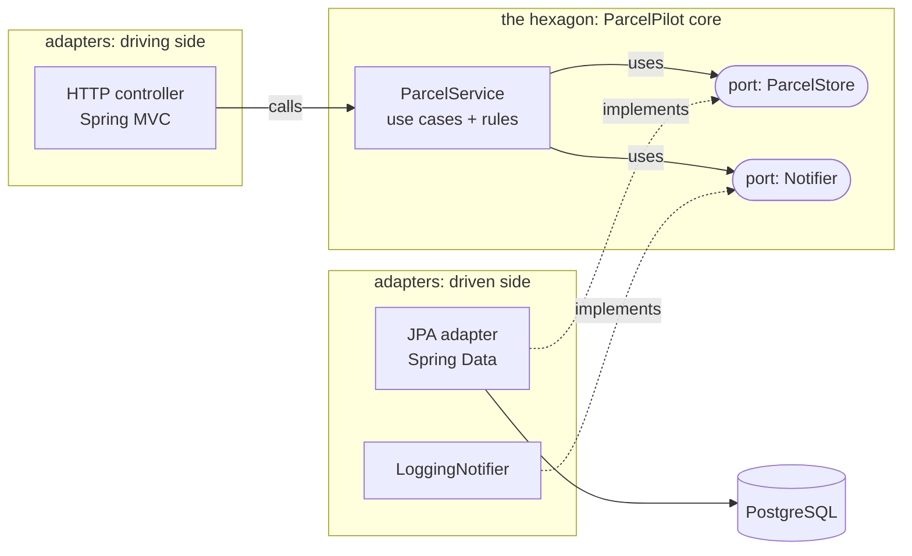

# Ports and adapters (hexagonal architecture)

Step 11's `Notifier` interface is a taste of a bigger idea with a fancy name: **hexagonal architecture**, also called **ports and adapters**. This page gives you the whole idea at intro level, so the pattern has a name the next time you meet it.

## The problem

Look honestly at where ParcelPilot was before this step: the class holding the "when may a parcel become DELIVERED?" rule also knew about `@PathVariable`, JSON shapes, and `JpaRepository`. Domain logic was tangled with HTTP details and database details. Two painful consequences:

1. **You can't test the rules alone.** Checking "a delivered parcel can't go back to CREATED" required booting Spring, a web server, and a database, for a rule that is pure Java logic.
2. **Every edge change hits the core.** Swap REST for messaging, or JPA for something else, and you're editing the same file that holds your business rules, with all the risk that brings.

## Key words

| Word | Beginner meaning |
|---|---|
| **Core / domain** | Your business rules and use cases, pure Java, no framework imports. |
| **Port** | An interface **owned by the core** describing something it needs (storage, notifying) or offers. |
| **Adapter** | An edge class that implements a port (JPA storage) or calls into the core (HTTP controller). |
| **Hexagonal architecture** | The picture: core in the middle, ports on its edges, adapters plugged in from outside. |
| **Dependency direction** | Who imports whom. Here: adapters import the core, never the reverse. |

## The idea

Put the domain in the middle. Everything the outside world wants (HTTP requests in) or the domain needs (a database, a notifier out) goes through an **interface that the core owns** — a *port*. The messy, framework-specific code that satisfies each interface lives at the edge — an *adapter*. The hexagon shape is just a drawing convention (nothing is special about six sides); what matters is the rule it encodes:

> **All dependencies point inward.** The core imports no Spring, no JPA, no HTTP. Adapters depend on the core; the core doesn't know they exist.



The controller *drives* the core (calls in). The JPA adapter and notifier are *driven* by the core (called out through ports). Both kinds of adapter are replaceable without touching the middle.

## Before / after in code

**Before** — the service depends directly on the JPA repository, so it drags in the whole persistence world and can't exist without it:

```java
import org.springframework.data.jpa.repository.JpaRepository; // persistence leaks into the core

@Service
public class ParcelService {
    private final ParcelRepository repository;   // a JpaRepository — JPA all the way down

    public void markDelivered(String id) {
        ParcelEntity parcel = repository.findById(id).orElseThrow();
        // domain rule mixed with entity/persistence types
    }
}
```

**After** — the core defines the *shape* of storage it needs as a port, and only depends on that:

```java
// PORT: owned by the core. Note: no Spring, no JPA imports anywhere.
package com.parcelpilot.parcel;

import java.util.Optional;

public interface ParcelStore {
    Optional<Parcel> findById(String id);
    void save(Parcel parcel);
}
```

```java
// CORE: pure use case. Testable with a ten-line fake ParcelStore.
package com.parcelpilot.parcel;

public class ParcelService {
    private final ParcelStore store;
    private final Notifier notifier;

    public ParcelService(ParcelStore store, Notifier notifier) {
        this.store = store;
        this.notifier = notifier;
    }

    public void markDelivered(String id) {
        Parcel parcel = store.findById(id).orElseThrow(ParcelNotFound::new);
        parcel.deliver();                 // the rule lives in the domain object
        store.save(parcel);
        notifier.parcelDelivered(id);
    }
}
```

```java
// ADAPTER: at the edge, implements the port using JPA. Spring lives HERE.
package com.parcelpilot.parcel.persistence;

@Component
class JpaParcelStore implements ParcelStore {
    private final ParcelJpaRepository jpa;   // the actual JpaRepository
    // ... map ParcelEntity <-> Parcel, delegate to jpa ...
}
```

Now a unit test constructs `ParcelService` with an in-memory fake `ParcelStore` and checks every rule in milliseconds — no Spring context, no database, no HTTP.

## This is step 02, scaled up

You already know this move. In [step 02](../02-oop-and-composition/README.md) you gave `ParcelTracker` a `Clock` **interface** and injected a `SystemClock`, precisely so tests could inject a fake clock. Ports and adapters is *the same trick* — depend on an interface, inject the implementation (composition) — applied to whole subsystems instead of one class: the database becomes "a `ParcelStore` someone injects", notifications become "a `Notifier` someone injects". Step 11's `Notifier` already **is** a port; this page just generalizes the idea.

## Pros and cons

| Pros | Cons |
|---|---|
| Core rules testable in plain unit tests, no Spring boot-up | More indirection: an interface + an adapter per edge |
| Edges are swappable (JPA today, something else tomorrow; REST and a queue consumer can drive the same core) | More files and mapping code (entity ↔ domain object) |
| The dependency rule is checkable: "no Spring/JPA imports in the core" | Overkill for tiny CRUD apps — the ceremony can exceed the app |
| Makes step 13's service split mechanical: ports become the seams | Beginners can over-abstract: a port per class instead of per *need* |

## When NOT to use it (honestly)

A small CRUD app — a controller, a repository, barely any rules — does not need the full pattern; wrapping `JpaRepository` in a hand-written port there is pure ceremony. And you don't have to go all-in to benefit: the cheapest 80% is adopting just the rule **"domain code doesn't import Spring or JPA"** and letting the rest follow when it hurts. ParcelPilot's step 11 does exactly that light version: feature modules, a `Notifier` port between them, and no dogma.

## Relation to layered architecture

Layers (controller → service → repository) also separate concerns, but classic layering lets the service depend on the repository's *technology*. Ports and adapters keeps the separation and flips that one dependency: the core owns the interface, persistence implements it. How this interacts with package layout — and why the course packages by feature rather than by layer — is in [Layered vs feature packages](layered-vs-feature-packages.md) and the full journey in [Code organization](../../references/code-organization.md).

## Back to the step

Return to [Step 11](README.md). The [module boundaries lab](module-boundaries-lab.md) turns the dependency rule into something you can enforce with a grep.
