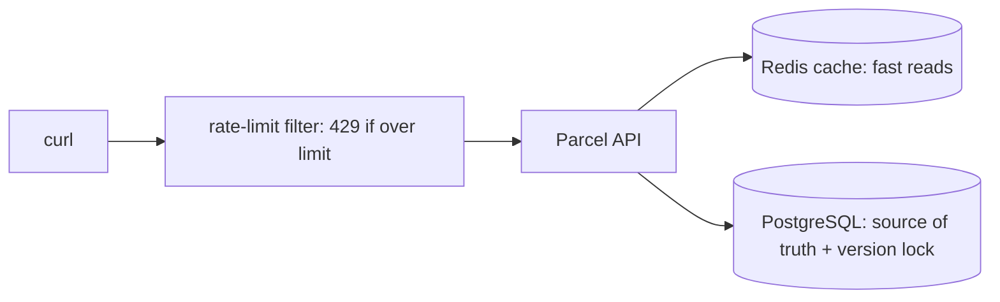

# Step 11: Caching, locking, and rate limiting

> In this step: keep the API fast and safe under load with a cache, a lock, and a rate limit. ~90 minutes. See the [rate-limiting lab](rate-limiting.md).

## The problem right now

The full system works, so realistic pressure appears: the same parcel is read over and over (hitting the DB every time), two operators update the same parcel at once, and a buggy or abusive client floods an endpoint. These are **three different problems** with three different fixes.

## Key words

| Word | Beginner meaning |
|---|---|
| **Cache** | A fast, temporary copy of data to avoid repeating slow work. |
| **Redis** | A very fast in-memory data store often used as a cache. |
| **Cache-aside** | Pattern: check cache first, and on a miss read the DB and fill the cache. |
| **TTL** | Time To Live: how long a cached value stays before expiring. |
| **Cache invalidation** | Removing/updating stale cache entries after data changes. |
| **Hashing** | Turning input into a fixed-size, one-way fingerprint (used for keys, integrity, passwords). |
| **Locking** | Preventing conflicting simultaneous changes to the same data. |
| **Rate limiting** | Capping how many requests a client may make in a time window. |
| **`429 Too Many Requests`** | The HTTP status for "you've hit the rate limit". |
| **Proxy (pattern)** | A stand-in object that adds behavior (like caching) around another. |

## The three tools, in plain language

- **Cache** = a sticky note with the answer. Reading `GET /parcels/P-1` a thousand times shouldn't hit the database a thousand times. Store the answer in Redis with a **TTL**, and **invalidate** it when the parcel changes. The database stays the source of truth.
- **Locking** = "who edits wins, safely." Use the `version` from step 06 (optimistic locking) so a clashing update returns `409` instead of silently overwriting.
- **Rate limiting** = "a bouncer at the door." If a client sends too many requests, reject extras with `429` and a `Retry-After` hint, protecting capacity for everyone.



## Where hashing fits

**Hashing** is one-way: you can't reverse it. It's used for cache/keys, data-integrity checks, and, crucially, **password storage** in the next step. Note the difference: **encryption** is reversible with a key, **hashing** is not, and **encoding** (Base64) is neither and provides no security.

## Why do it? Pros and cons

| Tool | Pros | Cons / cautions |
|---|---|---|
| Cache | big speed-up, less DB load | stale data risk, invalidation is tricky, extra dependency |
| Locking | prevents lost updates | conflicts need retry handling, pessimistic locks reduce concurrency |
| Rate limiting | protects availability, stops abuse | wrong limits block real users, needs shared counter across replicas |

**Real-world example:** a product page caches the item details (fast reads), uses row versioning so two admins don't overwrite each other, and rate-limits login attempts to slow attackers.

## Build it in ParcelPilot

In `applications/parcelpilot-services/` (add Redis to `compose.yaml`):

1. **Cache-aside**: cache `GET /parcels/{id}` in Redis with a short TTL, then **invalidate** the key when the parcel is updated.
2. **Optimistic locking**: ensure updates use the parcel `version` and return `409` on conflict.
3. **Rate limiting**: limit an expensive endpoint per client/IP, and return `429` + `Retry-After`. Use a tiny limit locally so it's easy to trigger. Follow the [rate-limiting lab](rate-limiting.md).

Spring makes cache-aside almost declarative. Add `spring-boot-starter-data-redis` + `spring-boot-starter-cache`, enable caching, then annotate the read and the update:

```java
@Cacheable(value = "parcels", key = "#id")   // check cache first; on miss, run method and store result
public ParcelResponse getParcel(String id) {
    return toResponse(repository.findById(id).orElseThrow());
}

@CacheEvict(value = "parcels", key = "#id")  // remove stale cache entry after a change
public void updateStatus(String id, Status newStatus) {
    // ... load, apply rule, save (optimistic lock handles conflicts) ...
}
```

The cache is a **proxy** in front of the database read. The rate limiter can pick its algorithm via a **strategy** (see [design patterns](../../references/design-patterns.md)).

## Test it

```bash
# cache: same read twice; logs show miss then hit
curl -s http://localhost:8080/parcels/P-1 >/dev/null
curl -s http://localhost:8080/parcels/P-1 >/dev/null

# locking: two updates on the same version -> one 409

# rate limit: exceed the small limit -> 429
for i in $(seq 1 10); do curl -s -o /dev/null -w "%{http_code}\n" \
  http://localhost:8080/parcels/P-1; done
```

## Acceptance criteria

- [ ] A repeated `GET /parcels/{id}` is served from cache (observable miss → hit in logs/metrics).
- [ ] Updating a parcel invalidates its cache so the next read is fresh.
- [ ] Two updates on the same version: one succeeds, the other returns `409`.
- [ ] Exceeding the limit returns `429` with `Retry-After`. After waiting, requests succeed again.
- [ ] You can explain the difference between hashing, encryption, and encoding.

## Say it like a developer

- "Repeated reads are served from the **cache** (Redis) instead of hitting the DB every time."
- "I use **cache-aside**: check the cache, and on a **miss** read the DB and fill it, with a **TTL**."
- "When a parcel changes I **invalidate** its cache entry so the next read is fresh."
- "Clashing writes are caught by **optimistic locking**: the loser gets a `409`."
- "An abusive client gets **rate limited**: extra requests return `429` with `Retry-After`."
- "**Hashing** is one-way. **Encryption** is reversible with a key. **Encoding** (Base64) is neither and gives no security."

## Quiz: check yourself

Answer out loud before opening each toggle.

1. Describe the **cache-aside** pattern in order.

<details><summary>Show answer</summary>

Check the cache first. On a **hit**, return the cached value. On a **miss**, read the database, store the result in the cache (with a TTL), then return it.

</details>

2. What is **cache invalidation**, and why is it necessary?

<details><summary>Show answer</summary>

Removing or updating a stale cache entry after the underlying data changes. Without it, readers would keep getting the old cached value even though the database changed. The database stays the source of truth.

</details>

3. Which of the three tools solves which problem: repeated identical reads / two people editing the same parcel / a client flooding an endpoint?

<details><summary>Show answer</summary>

Repeated reads → **cache**. Two people editing the same parcel → **optimistic locking** (`409`). Flooding → **rate limiting** (`429`).

</details>

4. What status codes go with a lost-update conflict and with hitting the rate limit?

<details><summary>Show answer</summary>

`409 Conflict` for the clashing update. `429 Too Many Requests` (usually with a `Retry-After` header) for the rate limit.

</details>

5. What's the difference between **hashing**, **encryption**, and **encoding**?

<details><summary>Show answer</summary>

Hashing is one-way (can't be reversed), used for passwords, integrity, and keys. Encryption is reversible with a key, used to protect data you need to read back. Encoding (like Base64) just reshapes data and provides **no** security.

</details>

## Reflect (stretch)

Everything so far is open to anyone who can reach the port. Real operations must be restricted to authenticated operators. That's the final step, and it uses the hashing idea you just met.

## Next

[Step 12](../12-jwt-authentication/README.md): add password login and JWT-protected actions.
