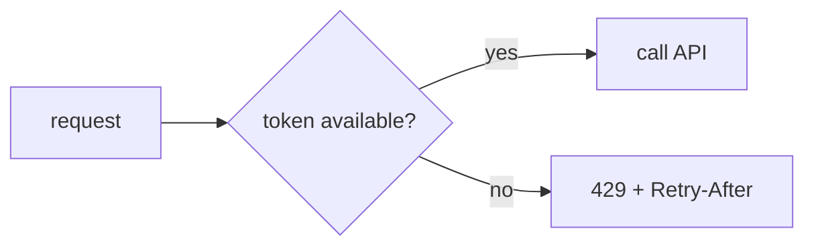

# Rate limiting lab

## Real-world problem

A broken scanner repeatedly calls an endpoint, or a public caller floods an API. Even correct application code can become unavailable when requests exceed its capacity.

## Algorithms

**Fixed window** counts requests in a period, such as 10 per minute. It is simple but callers can burst at the window boundary.

**Token bucket** refills tokens steadily and lets a caller spend a short burst. It is a good general-purpose API choice.

**Leaky bucket** processes requests at a steady rate, smoothing output but potentially adding delay.



## Implementation boundary

Rate limiting belongs before expensive work: a Spring filter, gateway, or reverse proxy. A single in-memory counter is acceptable for understanding the algorithm but fails when replicas scale. Redis permits shared counters across local service instances.

## API contract

Return `429 Too Many Requests`, explain when to retry with `Retry-After`, and never use rate limiting as the only authentication or authorization control.

```bash
for i in {1..6}; do
  curl -i http://localhost:8080/parcels/P-1
done
```

Use a tiny limit locally to make the behavior visible. A production limit needs monitoring, client identity rules, burst policy, and an exception path for trusted internal callers.
