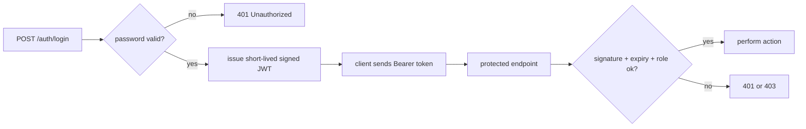

# Step 12 — Password login & JWT protection

> In this step: add a small, safe login and protect an operator action with a token. ~90 minutes. Required reading: [Password authentication and JWT](../../references/authentication.md).

## The problem right now

Every endpoint is public. Anyone who can reach the port can change parcels. Sensitive actions must be limited to a **logged-in operator**. Authentication is deliberately last: it's security-sensitive and easier once you understand the whole system.

## Key words

| Word | Beginner meaning |
|---|---|
| **Authentication (authn)** | Proving *who* you are (login). |
| **Authorization (authz)** | Deciding *what* you're allowed to do (roles/permissions). |
| **Credential** | A secret used to log in (here: username + password). |
| **Password hashing** | Storing a one-way, salted fingerprint of a password, never the password itself. |
| **Salt** | Random data added before hashing so identical passwords get different hashes. |
| **`PasswordEncoder`** | Spring Security's tool to hash and verify passwords (Argon2/bcrypt). |
| **JWT** | JSON Web Token: a signed token carrying claims (who you are, your role). |
| **Claim** | A fact inside a JWT, e.g. `sub` (subject) or `role`. |
| **Bearer token** | A token sent in the `Authorization: Bearer <token>` header. |
| **Signature** | Proof the token wasn't tampered with (verified with a secret/key). |
| **`401` / `403`** | `401` = not authenticated; `403` = authenticated but not allowed. |

## What is JWT-based auth (the flow)?

1. The operator sends username + password to `POST /auth/login` (over HTTPS in real life).
2. The server verifies the password against the stored **hash** (never plaintext).
3. On success, the server returns a **short-lived, signed JWT**.
4. The client sends that JWT as a **Bearer token** on protected requests.
5. The server checks the signature, expiry, and role before allowing the action.



## Why do it? Pros and cons

**What it brings us:** only known operators can perform sensitive actions, and each request proves identity without re-sending the password.

**Pros of JWT:** stateless (server needn't store sessions); carries role info; works well across services.
**Cons / cautions:** JWT contents are usually **readable** (don't put secrets in them); **revoking** a token before it expires is hard (needs short expiry + refresh strategy); getting crypto wrong is dangerous — **use the library, never invent your own**.

**Real-world example:** most APIs issue a short-lived access token at login and require it on every protected call; a separate refresh token gets new access tokens.

## Build it in ParcelPilot

Scope: a **teaching** implementation, not a full identity system. Work in `parcel-service`.

1. Add `spring-boot-starter-security` (+ a JWT library).
2. Store one seeded operator: username, role, and a **hashed** password in PostgreSQL.
3. Implement `POST /auth/login` that verifies the password with `PasswordEncoder` and returns a short-lived signed JWT (claims: subject + role).
4. Require `Authorization: Bearer <token>` for `PATCH /parcels/{id}/status`.
5. Decide deliberately whether `GET` parcel endpoints stay public.
6. **Never** log, store, or return plaintext passwords or put secrets in JWT claims.

## Test it

```bash
TOKEN=$(curl -s -X POST http://localhost:8080/auth/login \
  -H 'Content-Type: application/json' \
  -d '{"username":"operator","password":"local-password"}' | jq -r .accessToken)

# with token -> allowed
curl -i -X PATCH http://localhost:8080/parcels/P-1/status \
  -H "Authorization: Bearer $TOKEN" \
  -H 'Content-Type: application/json' -d '{"status":"PICKED_UP"}'

# without token -> 401
curl -i -X PATCH http://localhost:8080/parcels/P-1/status \
  -H 'Content-Type: application/json' -d '{"status":"PICKED_UP"}'
```

## Acceptance criteria

- [ ] Passwords are stored only as salted hashes (verify the DB has no plaintext).
- [ ] `POST /auth/login` with correct credentials returns a JWT; wrong credentials return `401`.
- [ ] The protected endpoint works **with** a valid Bearer token and returns `401` **without** one.
- [ ] A valid token lacking the required role returns `403`.
- [ ] You can explain authentication vs authorization, and why hashing (not encryption) is used for passwords.

## Say it like a developer

- "**Authentication** proves *who* you are (login); **authorization** decides *what* you may do (role)."
- "Passwords are stored as **salted hashes** via `PasswordEncoder` — never plaintext."
- "On successful login the server issues a short-lived, signed **JWT**."
- "The client sends it as a **Bearer token** in the `Authorization` header."
- "The server checks the **signature**, expiry, and role before allowing the action."
- "No token → `401`; valid token but wrong role → `403`."

## Quiz — check yourself

Answer out loud before opening each toggle.

1. What's the difference between **authentication** and **authorization**?

<details><summary>Show answer</summary>

Authentication (authn) proves *who* you are — logging in. Authorization (authz) decides *what* you're allowed to do — your roles/permissions.

</details>

2. Why store a **salted hash** of a password instead of encrypting it?

<details><summary>Show answer</summary>

Hashing is one-way, so even if the database leaks, attackers can't reverse it to the original password. A salt makes identical passwords produce different hashes, defeating precomputed (rainbow-table) attacks. Encryption is reversible with a key, which is the wrong property for stored passwords.

</details>

3. What is a **JWT**, and what does the server check when it receives one?

<details><summary>Show answer</summary>

A JSON Web Token: a signed token carrying claims (like subject and role). The server verifies the **signature** (not tampered), the **expiry** (still valid), and the **role** (allowed) before permitting the action.

</details>

4. When do you return `401` vs `403`?

<details><summary>Show answer</summary>

`401 Unauthorized` = not authenticated (no/invalid token). `403 Forbidden` = authenticated but not allowed (valid token, missing the required role).

</details>

5. Name two cautions about JWTs.

<details><summary>Show answer</summary>

Any two of: their contents are usually **readable**, so never put secrets inside; **revoking** one before expiry is hard, so use short expiry + a refresh strategy; and never invent your own crypto — use a vetted library.

</details>

6. Why is authentication the **last** step in this course?

<details><summary>Show answer</summary>

It's security-sensitive and easiest to get right once you understand the whole system. Adding it last means you protect a working, well-understood app rather than guessing early.

</details>

## Reflect (stretch)

You implemented only short-lived access tokens. Real systems also need HTTPS, refresh tokens + revocation, brute-force protection, secret rotation, and audit logs. You now know enough to read those topics safely — see [Password authentication and JWT](../../references/authentication.md).

## You finished the roadmap

ParcelPilot grew from one Java file into an observable, secured, multi-service system — one problem at a time. Revisit [Production thinking](../../references/production-thinking.md) for what to explore next.
