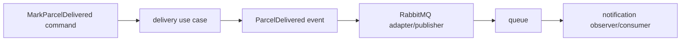

# Event-driven lab: observer, command, adapter, and idempotency

## Problem

The delivery HTTP request should not wait for a notification provider. The code also needs a way to react to an event without the parcel feature depending on every reaction.

## Solution

Treat “parcel delivered” as an immutable event. The delivery use case is a command. Event listeners act as observers. The RabbitMQ publisher is an adapter around broker-specific code.



## Example event

```java
public record ParcelDelivered(
    UUID eventId, String parcelId, Instant occurredAt) {}
```

An event describes a fact in the past. Name it in past tense. A command asks for work. Name it as an action.

## Consumer rule

Store or otherwise recognize the `eventId` before the external side effect. If the broker redelivers the same event, acknowledge it without sending another notification.

## Scenario: duplicate delivery (see it happen)

Redelivery is not a rare edge case you must take on faith. Provoke it once and it stops being abstract.

The window to hit is "after processing, before ack". Give yourself time by making the consumer slow for a moment — add a temporary sleep at the **end** of the listener, after the notification log line:

```java
@RabbitListener(queues = "parcel-delivered")
public void handle(ParcelDelivered event) throws InterruptedException {
    log.info("notification sent for {}", event.parcelId());
    Thread.sleep(10_000);   // TEMPORARY: hold the message unacked for 10s
}
```

Then kill the worker inside that window:

```bash
# 1. rebuild and start the app, watching its logs
docker build -t parcelpilot-api:12 . && docker run --name parcelpilot-api \
  --network parcelpilot-net -e DB_HOST=parcelpilot-db -p 8080:8080 -d parcelpilot-api:12
docker logs -f parcelpilot-api &

# 2. trigger the event
curl -i -X PATCH http://localhost:8080/parcels/P-1/status \
  -H 'Content-Type: application/json' -d '{"status":"DELIVERED"}'

# 3. the moment "notification sent for P-1" appears: kill the worker DURING the sleep
docker rm -f parcelpilot-api

# 4. check the queue: Unacked went back to Ready (management UI, or:)
#    the message survived — the work happened, but the broker never heard the ack

# 5. start the worker again and watch the SAME event arrive a second time
docker run --name parcelpilot-api --network parcelpilot-net \
  -e DB_HOST=parcelpilot-db -p 8080:8080 -d parcelpilot-api:12
docker logs -f parcelpilot-api
```

The log prints `notification sent for P-1` **again**: the notification really was sent twice for one delivery. Nothing malfunctioned — the broker could not distinguish "crashed before the work" from "crashed after the work, before the ack", so it redelivered. That is **at-least-once delivery**, and it is the default reality of every serious queue system, not a RabbitMQ quirk.

The fix is making duplicates harmless on the consumer side: the [idempotency lab](idempotency-lab.md). (Remove the `Thread.sleep` once you've seen the redelivery.)

## Trade-off

Events reduce direct coupling, but make state eventually consistent: the parcel can show `DELIVERED` briefly before the notification record exists. Log event IDs in producer and consumer so one flow remains traceable.

| Event-driven decoupling: pros | Cons |
|---|---|
| Fast responses: the request never waits for slow side work | Eventual consistency: parts of the system briefly disagree |
| Resilience: a down notification provider no longer fails parcel updates | Duplicates and ordering become your problem (idempotency, above) |
| Producers and consumers evolve, deploy, and scale independently | Harder tracing: one action spans two processes and a broker — step 14's [correlation IDs](../14-compose-and-observe/correlation-ids.md) restore the thread |
