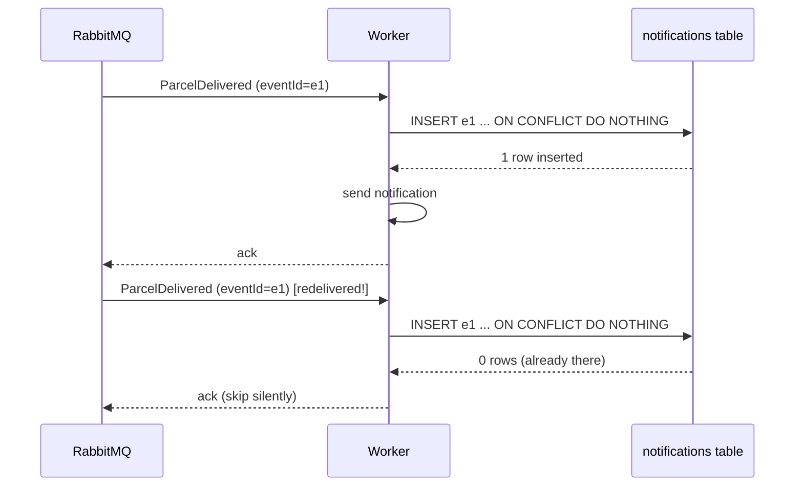

# Idempotency lab: surviving duplicate messages

## Problem

Your notification worker receives `ParcelDelivered`, sends the notification… and crashes *before* acknowledging the message. From RabbitMQ's point of view the message was never handled — an unacked message from a dead consumer goes back on the queue. The worker restarts, receives the **same event again**, and sends a **second notification** for the same delivery. Ava gets two "your parcel arrived!" texts; with a payment instead of a text, this bug has a dollar amount.

The broker isn't broken. Redelivery-on-doubt is the deal you signed: RabbitMQ promises **at-least-once** delivery, and "at least" means duplicates are your job to survive.

## Key words

| Word | Beginner meaning |
|---|---|
| **Idempotent** | Doing the operation twice has the same result as doing it once. |
| **At-most-once** | Deliver once or never: no duplicates possible, but a message can be **lost** (ack before processing). |
| **At-least-once** | Deliver until acknowledged: nothing is lost, but **duplicates happen** (ack after processing). The default deal, and what step 12 uses. |
| **Exactly-once** | The dream: every message processed once, no loss, no duplicates. Across a real distributed system (broker + your DB + an email provider) it is effectively **a lie in practice** — you build at-least-once + idempotency and get the same *effect*. |
| **Dedup(lication)** | Detecting "I've already handled this one" and skipping the repeat. |

Why can't the broker just… not duplicate? Because it can't tell the difference between "worker crashed before doing the work" and "worker did the work, then crashed before telling me." When in doubt it must redeliver (or messages get lost — at-most-once). The only component that *can* tell the difference is your consumer, because it can keep a record.

## Solution: consumer-side idempotency

Give the consumer a memory of what it already processed, keyed by the event's identity. Step 12's event already carries one — `eventId` exists precisely for this:

```java
public record ParcelDelivered(UUID eventId, String parcelId, Instant occurredAt) {}
```

For ParcelPilot the memory is a `notifications` table with the event id as **primary key**, and the recipe is *record first, act second*:

```sql
-- V3__create_notifications.sql
CREATE TABLE notifications (
    event_id     UUID PRIMARY KEY,     -- the dedup key: one row per event, ever
    parcel_id    VARCHAR(64) NOT NULL,
    processed_at TIMESTAMP   NOT NULL DEFAULT now()
);
```

The primary key is what makes this safe: inserting the same `event_id` twice is *impossible*, and the database enforces it even if two duplicates arrive at the same instant. INSERT-if-absent, then send only if the insert actually inserted:

```java
@Component
public class ParcelDeliveredConsumer {

    private static final Logger log = LoggerFactory.getLogger(ParcelDeliveredConsumer.class);
    private final JdbcTemplate jdbc;

    public ParcelDeliveredConsumer(JdbcTemplate jdbc) {
        this.jdbc = jdbc;
    }

    @RabbitListener(queues = "parcel-delivered")
    public void handle(ParcelDelivered event) {
        // INSERT-if-absent: ON CONFLICT DO NOTHING inserts 0 rows for a duplicate
        int inserted = jdbc.update("""
            INSERT INTO notifications (event_id, parcel_id)
            VALUES (?, ?) ON CONFLICT DO NOTHING
            """, event.eventId(), event.parcelId());

        if (inserted == 0) {
            log.info("duplicate event {} for parcel {} - already processed, skipping",
                     event.eventId(), event.parcelId());
            return;   // method returns normally -> message is acked and dropped
        }

        log.info("notification sent for {}", event.parcelId());
    }
}
```

Two details worth saying out loud:

- **The duplicate is acknowledged, not rejected.** Skipping *is* successful processing of a duplicate. Returning normally lets Spring ack it, and the queue is rid of it.
- **Record before the side effect.** If you sent first and recorded second, a crash between the two would re-send on redelivery — the original bug, back again. (Record-first has the mirror flaw: crash after insert but before send, and the notification is never sent. For a text message, course policy is "rather skip than spam". The bulletproof version — do both in one transaction — is the outbox pattern hinted at in the step 12 quiz.)



## Proof

Force the same event through twice and watch the logs treat them differently.

**Option A — publish the same payload twice** via the RabbitMQ management UI (`http://localhost:15672`, guest/guest): *Queues → parcel-delivered → Publish message*, paste one JSON payload with a fixed `eventId`, publish it **twice**:

```json
{"eventId": "11111111-1111-1111-1111-111111111111", "parcelId": "P-1", "occurredAt": "2026-01-01T10:00:00Z"}
```

**Option B — provoke a genuine redelivery**: stop the worker after processing but before ack, exactly as walked through in the [duplicate delivery scenario of the event-driven lab](event-driven-lab.md).

Either way, the log must show one send and one skip:

```text
notification sent for P-1
duplicate event 11111111-1111-1111-1111-111111111111 for parcel P-1 - already processed, skipping
```

And the table holds exactly one row:

```bash
docker exec -it parcelpilot-db psql -U parcelpilot -d parcelpilot \
  -c "SELECT event_id, parcel_id FROM notifications;"
```

That's the step 12 acceptance criterion "re-delivering the same event does not produce a second notification", now proven rather than assumed.

## Pros and cons

| Pros | Cons |
|---|---|
| Duplicates become harmless — at-least-once is now safe to build on | A table (or cache) of processed ids to store and eventually clean up |
| The database enforces the guarantee, even under concurrent duplicates | Every event **must** carry a stable unique id — producer discipline forever |
| Skips are visible in logs (you can *see* redeliveries happening) | One more query on every message handled |
| The pattern transfers as-is to payments, emails, webhooks… | Doesn't solve producer-side gaps (dual-write needs the outbox pattern) |

## When you don't need it

If the operation is **naturally idempotent**, replaying it is already harmless and no dedup table is needed. `UPDATE parcels SET status = 'DELIVERED' WHERE id = 'P-1'` lands on the same final state no matter how often it runs. The rule of thumb: *setting* a value is naturally idempotent, *adding/sending/incrementing* is not — "send a text", "append a row", "charge €5" all need the dedup key. When unsure, assume you need it.

## Next

- What happens when a message doesn't just duplicate but *keeps failing*: [Retries and dead letters](retries-and-dead-letters.md).
- Delivery-guarantee vocabulary in one place: [Messaging and queues](../../references/messaging-and-queues.md).
- Back to [Step 12](README.md).
