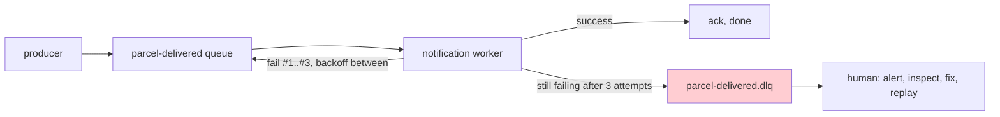

# Retries and dead letters: when a message keeps failing

## Problem

A `ParcelDelivered` event arrives with a malformed payload, or the notification provider is down, and your consumer **throws**. The message is not acked, so RabbitMQ puts it back — and delivers it again. It fails again. And again, hundreds of times per second: a **poison message**, stuck in an infinite redelivery loop, eating the worker alive while every healthy message queues up behind it.

Two questions need answers: *how often and how patiently do we retry?* and *where does a message go when retrying clearly isn't going to help?*

## Key words

| Word | Beginner meaning |
|---|---|
| **Poison message** | A message that fails processing every single time (bad data, permanent bug). |
| **Transient failure** | A failure that fixes itself: provider briefly down, network blip, DB restart. Worth retrying. |
| **Permanent failure** | A failure retries can never fix: unparseable payload, violated business rule. |
| **Backoff** | Waiting longer between attempts (1s, 10s, 60s…) instead of hammering instantly. |
| **Nack / requeue** | The consumer telling the broker "failed" — optionally putting the message back in line. |
| **Dead-letter queue (DLQ)** | A separate queue where messages go after too many failures, instead of looping forever. |

## Retry — but with backoff, and not forever

Retrying is right for **transient** failures: if the SMS provider is down for 30 seconds, the second or third attempt succeeds and nobody notices. But *immediate* re-attempts (the default nack-and-requeue loop) retry a hundred times in the same second the provider is down — all wasted. Retries need **backoff**: wait 1 second, then 10, then 60. And they need a **limit**, because a poison message will fail attempt #1,000,000 too.

Where does retrying actually happen? Two flavors, both fine to keep conceptual for now:

- **In the consumer**: catch the failure and re-attempt in-process with growing pauses. Spring AMQP does this declaratively (see the config sketch below) — simplest, and what ParcelPilot uses.
- **In the broker, via delayed retry queues**: on failure the message is parked in a side queue whose messages only become visible again after a delay, then flow back to the main queue. More moving parts, but the wait doesn't occupy a consumer thread. You'll meet this pattern in bigger systems; recognizing it is enough today.

## The dead-letter queue

A **dead-letter queue** is, plainly: *the queue where messages go when the main queue gives up on them*. After N failed attempts, instead of deleting the message (data loss, silent) or requeueing it forever (the poison loop), the broker moves it aside. The main queue flows again, and the failed message is **kept, inspectable, and replayable**.



### What do you DO with dead letters?

A DLQ is a hospital, not a graveyard — its value is entirely in what happens next:

1. **Alert**: a non-empty DLQ should page or notify someone. (Even step 07's logging is enough to start: log loudly when a message dead-letters.)
2. **Inspect**: open the message in the management UI (`http://localhost:15672`, *Queues → parcel-delivered.dlq → Get messages*). The payload plus the consumer's exception in the logs usually name the bug directly.
3. **Fix, then replay**: deploy the fix, then move the message back to the main queue (*shovel* it in the UI, or republish it). Because your consumer is [idempotent](idempotency-lab.md), replaying is safe even if part of the work already happened.

The failure mode to fear is the **silent DLQ graveyard**: messages quietly pile up for months because nobody watches. A DLQ nobody monitors is just data loss with extra steps.

## ParcelPilot sketch

Two pieces, matching step 12's Spring AMQP setup. First, retries with backoff in the consumer, straight from `application.properties`:

```properties
# retry a failing listener in-process: 3 attempts, pausing 1s then 3s
spring.rabbitmq.listener.simple.retry.enabled=true
spring.rabbitmq.listener.simple.retry.max-attempts=3
spring.rabbitmq.listener.simple.retry.initial-interval=1s
spring.rabbitmq.listener.simple.retry.multiplier=3
# after the last attempt, do NOT put it back on the queue (no poison loop)
spring.rabbitmq.listener.simple.default-requeue-rejected=false
```

Second, where rejected messages *go* — declare the queues so the main one dead-letters into the other, using RabbitMQ's `x-dead-letter-exchange` argument:

```java
@Bean
Queue parcelDeliveredQueue() {
    return QueueBuilder.durable("parcel-delivered")
        .withArgument("x-dead-letter-exchange", "")               // default exchange
        .withArgument("x-dead-letter-routing-key", "parcel-delivered.dlq")
        .build();
}

@Bean
Queue parcelDeliveredDlq() {
    return QueueBuilder.durable("parcel-delivered.dlq").build();
}
```

Flow: exception → retry after 1s → retry after 3s → still failing → message is rejected without requeue → RabbitMQ routes it to `parcel-delivered.dlq`. To watch it happen, throw an exception for one specific parcel id in your consumer, publish that event, and watch the message count on the DLQ go from 0 to 1 in the management UI.

## Pros and cons

| Pros | Cons |
|---|---|
| Transient failures heal themselves — nobody gets paged for a 30-second blip | More infrastructure: retry config, a second queue, alerting on it |
| Poison messages can't take the worker hostage | A DLQ nobody watches is a silent graveyard (= slow data loss) |
| Failed messages are kept and inspectable, not lost | Retries delay *everything* behind the message while it fails (in-consumer flavor) |
| Replay-after-fix turns bugs into recoverable events | Tuning attempts/delays is judgment, not science |

## When NOT to automate retries

Retries only help failures that **time fixes**. A payload that can't be parsed today can't be parsed in 60 seconds either — three doomed retries just delay the inevitable and blur your logs. For failures you *know* are permanent (validation errors, impossible state transitions), **fail fast**: skip or minimize retries, dead-letter (or log-and-drop) immediately, and alert a human — a person with context beats an automated loop that was never going to succeed. The honest rule: retry the *transient*, dead-letter the *permanent*, and make sure a human hears about the latter.

## Next

- Duplicates (the *other* redelivery problem, including why retries cause them): [Idempotency lab](idempotency-lab.md).
- The delivery-guarantee vocabulary behind all of this: [Messaging and queues](../../references/messaging-and-queues.md).
- Back to [Step 12](README.md).
