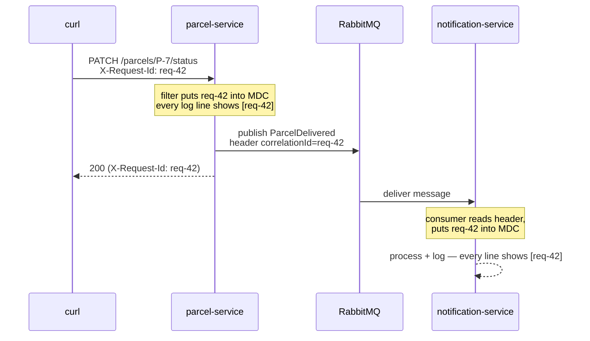

# Correlation IDs: one thread of identity across two services

Companion to [Step 14](README.md). Builds directly on the step-07 stretch goal — the `RequestIdFilter` from the [logging lab](../07-logging-and-observability-basics/logging-lab.md). If you skipped it then, build it now first.

## The problem

One `PATCH /parcels/P-7/status` request now produces log lines in **two** services. Inside parcel-service, your step-07 filter stamps every line with a request ID from the `X-Request-Id` header (or a generated one) via MDC. But that ID lives in the MDC of *one JVM*. The moment the work crosses the broker, the ID stays behind — notification-service's lines carry no trace of which request caused them. Same logical operation, two services, **no shared thread of identity**. Grep-by-parcel-ID ([previous lab](reading-logs-across-services.md)) is a workaround; the real fix is making the ID travel *with the work*.

## Key words

| Word | Beginner meaning |
|---|---|
| **Correlation ID** | One ID for one logical operation, attached everywhere that operation goes. |
| **MDC** | The per-thread "sticky note" (step 07) that Logback prints on every log line. |
| **Message header** | Metadata attached to a message, separate from its payload. |
| **Propagation** | Passing the ID along at every boundary: HTTP → code → message → code. |

## The move: put the ID into the event

The correlation ID must ride inside the thing that crosses the boundary — the message. Two options: a **message header** (metadata, keeps the payload/contract clean — our choice) or a field in the event JSON (visible in the queue UI, but now it's part of the [contract](../13-split-services/service-contracts.md)).



## Producer side: attach the ID when publishing

Wherever parcel-service publishes with `RabbitTemplate`, copy the current MDC value into a message header. A `MessagePostProcessor` lets you set headers without changing the event payload:

```java
import org.slf4j.MDC;
import org.springframework.amqp.rabbit.core.RabbitTemplate;

public void publishDelivered(ParcelDelivered event) {
    String correlationId = MDC.get("requestId");   // set by the step-07 filter
    rabbitTemplate.convertAndSend(exchange, routingKey, event, message -> {
        message.getMessageProperties().setHeader("correlationId", correlationId);
        return message;
    });
    log.info("Published ParcelDelivered for {} (eventId {})", event.parcelId(), event.eventId());
}
```

(Adapt names to your publisher — the two lines that matter are `MDC.get` and `setHeader`.)

## Consumer side: read the header, fill the MDC

In notification-service's listener, pull the header and put it into **this** service's MDC before doing anything — and clean it up after, exactly like the step-07 filter did:

```java
import org.slf4j.MDC;
import org.springframework.amqp.rabbit.annotation.RabbitListener;
import org.springframework.messaging.handler.annotation.Header;

@RabbitListener(queues = "parcel.delivered")
public void onParcelDelivered(ParcelDelivered event,
                              @Header(name = "correlationId", required = false) String correlationId) {
    MDC.put("requestId", correlationId != null ? correlationId : "no-correlation-id");
    try {
        log.info("Received ParcelDelivered for {} (eventId {})", event.parcelId(), event.eventId());
        // ... idempotency check + send notification ...
        log.info("notification sent for {}", event.parcelId());
    } finally {
        MDC.remove("requestId");   // listener threads are reused — always clean up
    }
}
```

Both services also need the step-07 console pattern so the MDC value actually prints:

```properties
logging.pattern.console=%d{HH:mm:ss.SSS} %-5level [%X{requestId}] %logger{36} : %msg%n
```

## Proof: one curl, one grep, the whole story

Rebuild and restart (`docker compose up --build`), then send **one** request with a recognizable ID:

```bash
curl -s -X PATCH http://localhost:8080/parcels/P-7/status \
  -H 'X-Request-Id: req-42' \
  -H 'Content-Type: application/json' -d '{"status":"DELIVERED"}' > /dev/null

docker compose logs | grep req-42
```

Expected — every line of the operation, from both services, in order:

```text
parcel-service        | 18:52:03.114  INFO [req-42] com.parcelpilot.parcel.ParcelController : Parcel P-7 status changed to DELIVERED
parcel-service        | 18:52:03.131  INFO [req-42] com.parcelpilot.parcel.ParcelEventPublisher : Published ParcelDelivered for P-7 (eventId e-57)
notification-service  | 18:52:03.209  INFO [req-42] com.parcelpilot.notification.DeliveredEventConsumer : Received ParcelDelivered for P-7 (eventId e-57)
notification-service  | 18:52:03.215  INFO [req-42] com.parcelpilot.notification.DeliveredEventConsumer : notification sent for P-7
```

That grep works even when ten other requests are interleaving, even for log lines that never mention a parcel ID. One ID, one operation, full story.

## Distributed tracing, in one paragraph

What you built by hand is the seed of **distributed tracing**. Grown-up systems use OpenTelemetry (and backends like Jaeger, Zipkin, or Tempo): every operation gets a **trace ID** (your correlation ID, standardized), each unit of work within it gets a **span** with timing, and libraries propagate the IDs automatically through HTTP headers and message headers — no hand-written filters. The result is a visual timeline per request across every service. Don't implement it here; just recognize that when you meet "traces" later, you already understand the core idea.

## Why do it? Pros and cons

| Pros | Cons |
|---|---|
| One grep reconstructs any operation across all services | Discipline required at **every** boundary — one publish or one consumer that forgets, and the thread of identity snaps |
| Works for lines with no business ID in them (errors, infrastructure) | Header names and MDC keys must match across codebases (an informal contract) |
| Clients can quote the `X-Request-Id` from a failed response in a bug report — instantly findable | MDC cleanup mistakes on reused threads stamp the *wrong* ID on later work |

## Next

- Logs answer "what happened" — for "how many, how fast" go to [metrics-intro.md](metrics-intro.md)
- Back to the step: [Step 14 README](README.md)
