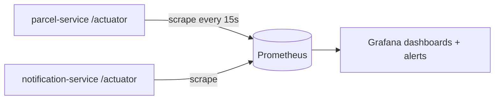

# Metrics intro: from stories to numbers

Companion to [Step 14](README.md). You already added Actuator for `/actuator/health` in this step's Build section — this lab looks at what else it gives you.

## The problem

Logs tell stories about **single requests**: parcel P-7 was created at 18:40, its delivery event was consumed 80 ms later. But some of the most important questions aren't about any single request:

- How many parcels are we creating per minute?
- Is `GET /parcels/{id}` getting slower this week?
- Is memory usage creeping up toward a crash?

You *could* count log lines with grep, but that's slow, fragile, and hopeless for latency questions. These are questions about **aggregates over time**, and the tool for aggregates is **metrics**.

## Logs vs metrics vs traces

| Signal | One line |
|---|---|
| **Logs** | What happened, one event at a time — "parcel P-7 created at 18:40:11". |
| **Metrics** | Numbers aggregated over time — "142 requests/min, p95 latency 38 ms". |
| **Traces** | One request's journey across services, with timing per hop (the grown-up [correlation ID](correlation-ids.md)). |

## Key words

| Word | Beginner meaning |
|---|---|
| **Metric** | A named number the app keeps updated, e.g. a request counter. |
| **Counter** | A metric that only goes up (requests served, parcels created). |
| **Timer** | A metric recording how long things took, plus how often. |
| **Tag (dimension)** | A label on a metric (`uri=/parcels`, `status=200`) so you can slice it. |
| **p95** | The value 95% of requests stay under — a "typical worst case". |
| **Scrape** | A monitoring server pulling current metric values on a schedule. |

## Turn it on

You already have the dependency from the Build section (`spring-boot-starter-actuator`). By default only `health` is exposed over HTTP; expose metrics too in `application.properties`:

```properties
management.endpoints.web.exposure.include=health,metrics
```

Restart, then list what's being measured — Spring Boot instruments HTTP, JVM, and more automatically, with **zero code from you**:

```bash
curl -s http://localhost:8080/actuator/metrics | jq
```

```json
{
  "names": [
    "http.server.requests",
    "jvm.memory.used",
    "jvm.gc.pause",
    "process.cpu.usage",
    "..."
  ]
}
```

## Tour the one metric that matters most

`http.server.requests` records every HTTP request the service handles. Make some traffic first (a few of the curls from this step), then:

```bash
curl -s http://localhost:8080/actuator/metrics/http.server.requests | jq
```

```json
{
  "name": "http.server.requests",
  "measurements": [
    { "statistic": "COUNT", "value": 27.0 },
    { "statistic": "TOTAL_TIME", "value": 0.482 },
    { "statistic": "MAX", "value": 0.061 }
  ],
  "availableTags": [
    { "tag": "uri", "values": ["/parcels", "/parcels/{id}", "/actuator/health"] },
    { "tag": "status", "values": ["200", "201", "404"] },
    { "tag": "method", "values": ["GET", "POST", "PATCH"] }
  ]
}
```

How to read it:

- **COUNT** — 27 requests since startup. Sample it every minute and the *difference* is your requests-per-minute.
- **TOTAL_TIME** — 0.482 s spent handling all of them; `TOTAL_TIME / COUNT` ≈ 18 ms average.
- **MAX** — the slowest single request recently (61 ms).
- **availableTags** — the slicing knobs. Drill into just the parcel-read endpoint:

```bash
curl -s 'http://localhost:8080/actuator/metrics/http.server.requests?tag=uri:/parcels/{id}' | jq
```

Same three statistics, now for that one endpoint only. Add `&tag=status:404` to see just the misses. Notice `uri` is the *template* `/parcels/{id}`, not each concrete ID — that's deliberate, and it matters (see the cardinality warning below).

JVM metrics are free too — worth one look each:

```bash
curl -s http://localhost:8080/actuator/metrics/jvm.memory.used | jq
curl -s http://localhost:8080/actuator/metrics/jvm.gc.pause | jq
```

## Prometheus and Grafana, in one paragraph

Curling an endpoint shows *now*; the questions that matter are about *trends*. The standard real-world setup: **Prometheus** scrapes every service's metrics endpoint on a schedule (say, every 15 s) and stores the time series; **Grafana** draws dashboards from it and fires alerts ("p95 over 200 ms for 5 minutes → page someone"). Spring supports it with one extra dependency (`micrometer-registry-prometheus`). Name it, recognize it, don't build it here.



## Stretch: your first custom metric

HTTP metrics come free, but "how many parcels were created?" is a *business* number nobody instruments for you. Micrometer's `MeterRegistry` is already on the classpath — inject it and count:

```java
import io.micrometer.core.instrument.Counter;
import io.micrometer.core.instrument.MeterRegistry;

@RestController
@RequestMapping("/parcels")
public class ParcelController {

    private final Counter parcelsCreated;

    public ParcelController(MeterRegistry registry /* , ... existing deps */) {
        this.parcelsCreated = registry.counter("parcels.created");
    }

    // in the create endpoint, after the save:
    // parcelsCreated.increment();
}
```

Create two parcels, then prove it:

```bash
curl -s http://localhost:8080/actuator/metrics/parcels.created | jq '.measurements'
# [ { "statistic": "COUNT", "value": 2.0 } ]
```

## Why do it? Pros and cons

| Pros | Cons / cautions |
|---|---|
| Answers aggregate questions logs can't (rates, percentiles, trends) | **Cardinality cost**: a tag with unbounded values (like a raw parcel ID) creates one time series per value and can blow up memory — tag with templates and categories, never raw IDs |
| Cheap: incrementing a counter is nanoseconds, unlike writing a log line | Numbers without context — a spike tells you *that*, never *why* (that's logs) |
| The basis for alerting: "tell me *before* users notice" | A real setup is another system to run, scrape, and keep healthy |

## When not to use metrics

Don't reach for metrics to debug **one request** — "why did *this* PATCH fail?" is a job for logs and correlation IDs. Metrics tell you the error *rate* jumped at 18:40; the log tells you what the errors said. You need both, which is why observability people always list the signals together: logs, metrics, traces.

## Next

- The production mindset behind all of this: [Production thinking](../../references/production-thinking.md)
- Back to the step: [Step 14 README](README.md)
- Next step: [Step 15](../15-performance-and-safety/README.md) — caching, locking, and rate limiting.
