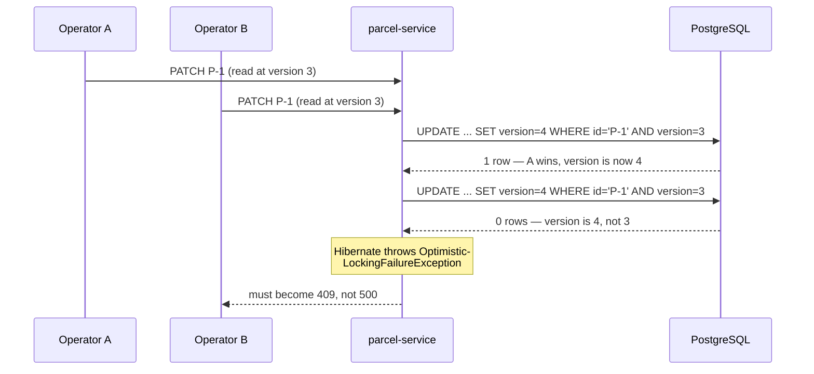

# Optimistic locking lab: when two operators race

Hands-on companion to [Step 15](README.md), Build item 2. Concepts (optimistic vs pessimistic, why we chose optimistic) were covered in [Locking explained](../10-persistence/locking-explained.md) — this lab doesn't re-explain them, it makes you *cause* a conflict and handle it properly.

## The problem

Two operators have parcel P-1 open. Operator A marks it `PICKED_UP`. A second later, operator B — still looking at the old screen — marks it `IN_TRANSIT`. Without protection, B's write lands on top of A's and **silently wins**: no error, no warning, A's update simply never happened. The database is consistent; the *history* is a lie. This is the **lost update**, and the whole point of this lab is turning "silent" into "loud": the loser must get a `409`, not a quiet victory.



## The `@Version` field: check it's still there

You added this in [step 10](../10-persistence/README.md) — verify it survived the step-13 move into parcel-service:

```java
@Entity
@Table(name = "parcels")
public class ParcelEntity {
    @Id
    private String id;
    // ...
    @Version
    private long version;   // Hibernate checks + bumps this on every UPDATE
}
```

What Hibernate does with it: every `UPDATE` it generates gets `AND version = <the version you read>` in the `WHERE` clause, plus `SET version = version + 1`. If another transaction committed in between, the row's version no longer matches, the update touches **0 rows**, and Hibernate — knowing it should have touched exactly 1 — throws. No trigger, no manual check: the version column turns the race into an exception.

## The exception, and mapping it to 409

The exception that reaches your code is Spring's wrapper `ObjectOptimisticLockingFailureException` (wrapping JPA's `OptimisticLockException`). Right now, nothing handles it — so the losing operator gets the step-06 catch-all: a generic `500`. Wrong twice over: it's not a server bug, and the client learns nothing about what to do next.

Add a handler to the `GlobalErrorHandler` from [step 06](../06-error-handling/README.md), same `ErrorResponse` shape as everything else:

```java
import org.springframework.orm.ObjectOptimisticLockingFailureException;

@ExceptionHandler(ObjectOptimisticLockingFailureException.class)
@ResponseStatus(HttpStatus.CONFLICT)
public ErrorResponse concurrentModification(ObjectOptimisticLockingFailureException ex,
                                            HttpServletRequest request) {
    return new ErrorResponse(
            "CONCURRENT_MODIFICATION",
            "The parcel was modified by someone else. Re-read it and retry.",
            Map.of(),
            request.getRequestURI());
}
```

`409 Conflict` is exactly right: the request was valid, but it conflicts with the resource's current state — same reasoning as the illegal-transition `409` you already have.

## Proof: stage the race

A genuine race needs two updates in flight at once. Fire two PATCHes simultaneously with `&` and capture the status codes:

```bash
curl -s -X POST http://localhost:8080/parcels \
  -H 'Content-Type: application/json' -d '{"id":"P-9","recipient":"Cleo"}' > /dev/null

curl -s -o /dev/null -w "first:  %{http_code}\n" -X PATCH http://localhost:8080/parcels/P-9/status \
  -H 'Content-Type: application/json' -d '{"status":"PICKED_UP"}' &
curl -s -o /dev/null -w "second: %{http_code}\n" -X PATCH http://localhost:8080/parcels/P-9/status \
  -H 'Content-Type: application/json' -d '{"status":"PICKED_UP"}' &
wait
```

Expected:

```text
first:  200
second: 409
```

(Order may flip, and both statuses are the point: **one winner, one loud loser**.) Races are timing-dependent — if both return `200`, the requests didn't overlap inside the transaction window; run it again, or make the window easy to hit by adding a temporary `Thread.sleep(500)` between the repository read and the save in the update path (delete it afterwards). If the loser gets a `409` because of the *state rule* instead (PICKED_UP → PICKED_UP is an invalid transition), check the `code` field: this lab is done when you can produce `"code": "CONCURRENT_MODIFICATION"`, not `"INVALID_TRANSITION"`.

Verify the body shape while you're here:

```bash
curl -s -X PATCH ... | jq
{
  "code": "CONCURRENT_MODIFICATION",
  "message": "The parcel was modified by someone else. Re-read it and retry.",
  "details": {},
  "path": "/parcels/P-9/status"
}
```

## The client's job on a 409

A `409` is not a dead end; it's an instruction. The client should: **re-read** the parcel (fresh state, fresh version), **reapply** its intended change if it still makes sense against the new state (maybe someone already did it, or the transition is no longer legal), and **retry** the request. Human-facing UIs usually surface it instead: "This parcel changed while you were editing — here's the latest state."

## Optimistic vs pessimistic under load

The full comparison lives in [Locking explained](../10-persistence/locking-explained.md); the one thing this lab adds is the *load* perspective. Optimistic locking costs nothing until a conflict actually happens — perfect while conflicts are rare, as parcel updates are. But if a single hot row were updated hundreds of times a second, most requests would lose the race, and the retry storm (read → 409 → re-read → 409 …) would burn more work than pessimistic waiting ever would. High contention is the one regime where "lock the row and make everyone queue" wins. ParcelPilot is nowhere near that; if it ever is, you'll see it in the metrics from [step 14](../14-compose-and-observe/metrics-intro.md) first.

## Next

- The third tool of this step: [rate-limiting.md](rate-limiting.md)
- Back to the step: [Step 15 README](README.md)
- Concepts: [Locking explained](../10-persistence/locking-explained.md) · [Databases, caching, and locking](../../references/databases-caching-and-locking.md)
