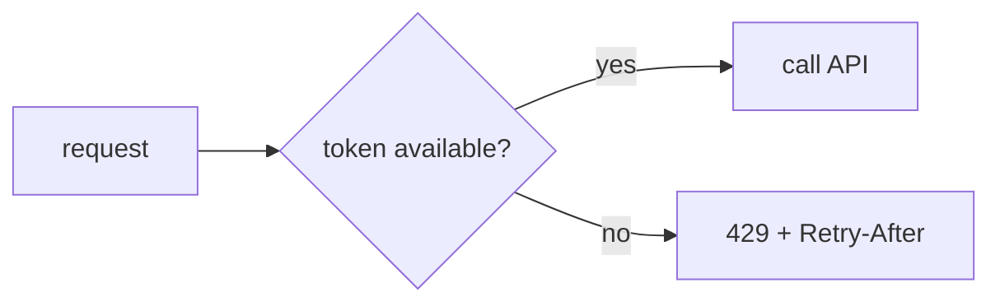

# Rate limiting lab

## Real-world problem

A broken scanner repeatedly calls an endpoint, or a public caller floods an API. Even correct application code can become unavailable when requests exceed its capacity.

## Algorithms

**Fixed window** counts requests in a period, such as 10 per minute. It is simple but callers can burst at the window boundary.

**Token bucket** refills tokens steadily and lets a caller spend a short burst. It is a good general-purpose API choice.

**Leaky bucket** processes requests at a steady rate, smoothing output but potentially adding delay.



### Fixed window vs token bucket at a glance

| | Fixed window | Token bucket |
|---|---|---|
| Burst behavior | Allows a double burst at the window edge: 10 requests at 0:59 + 10 more at 1:00 all pass | Smooth: a burst spends saved-up tokens, then the steady refill rate caps everything |
| Implementation | Trivial — one counter and a reset time per client | Slightly more — token count + last-refill timestamp per client, refill math on each request |
| Memory per client | One integer + one timestamp | One number + one timestamp (about the same) |
| Behavior under sustained load | Hard cutoffs, then a fresh full window | Steady drip at the refill rate |
| Good default for | Understanding the idea, internal tools | Public APIs (most real limiters are token-bucket-shaped) |

## Implementation boundary

Rate limiting belongs before expensive work: a Spring filter, gateway, or reverse proxy. A single in-memory counter is acceptable for understanding the algorithm but fails when replicas scale. Redis permits shared counters across local service instances.

## API contract

Return `429 Too Many Requests`, explain when to retry with `Retry-After`, and never use rate limiting as the only authentication or authorization control.

Use a tiny limit locally to make the behavior visible. A production limit needs monitoring, client identity rules, burst policy, and an exception path for trusted internal callers.

## See it with curl

With your limiter in place (Build item 3 of the [step README](README.md)) and a small local limit — say 20 requests per minute — hammer the endpoint and print only the status codes:

```bash
for i in $(seq 1 25); do
  curl -s -o /dev/null -w "%{http_code}\n" http://localhost:8080/parcels/P-1
done
```

Expected: the first 20 pass, then the limiter slams the door on the rest.

```text
200
200
...   (18 more 200s)
429
429
429
429
429
```

Now look at *what* a rejected request gets, not just the status. If your filter sets `Retry-After` (it should — that's the API contract above):

```bash
curl -si http://localhost:8080/parcels/P-1 | head -5
```

```text
HTTP/1.1 429
Retry-After: 42
Content-Type: application/json
```

`Retry-After: 42` means "try again in 42 seconds" — a well-behaved client sleeps that long instead of hammering harder. If your implementation doesn't set the header yet, add it in the filter where you return the `429`; a limiter that says "no" without saying "when" forces clients to guess.

Finally, prove that waiting works:

```bash
sleep 60   # or whatever Retry-After said
curl -s -o /dev/null -w "%{http_code}\n" http://localhost:8080/parcels/P-1
# 200
```

`200` again — the window rolled over (or tokens refilled), and the same client is welcome once more. That full arc — 200s, 429s with a `Retry-After`, then 200 after waiting — is the acceptance criterion in the step README.

## Next

- Back to the step: [Step 15 README](README.md)
- The other two tools of this step: [cache-invalidation-lab.md](cache-invalidation-lab.md) · [optimistic-locking-lab.md](optimistic-locking-lab.md)
