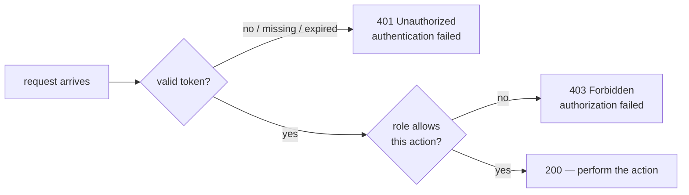

# Authn vs authz lab: who you are vs what you may do

Hands-on companion to [Step 16](README.md). Do it once login works and `PATCH` requires a token — this lab adds the *second* half of security.

## The problem

ParcelPilot can now say **who** you are: no token, no `PATCH`. But look closely at what you built — *any* logged-in user can perform *any* protected action. If you seeded a second user tomorrow (a customer who should only *read* their parcels), they could mark parcels delivered all day. Knowing who someone is says nothing about what they may do. Those are two different questions, and the second one is still unanswered.

## The two questions (hammer this in)

**Authentication (authn)** — *who are you?* Answered at login by verifying credentials. When the answer is "I can't tell": **`401 Unauthorized`**.

**Authorization (authz)** — *what may you do?* Answered on every request by checking the authenticated identity's roles against the endpoint's rule. When the answer is "you specifically may not": **`403 Forbidden`**.

This pair confuses everyone (not helped by `401`'s misleading official name "Unauthorized", which really means *unauthenticated*). Burn it in with the decision table:

| The server thinks… | Status | Example |
|---|---|---|
| "No idea who this is" (no token) | `401` | curl without an `Authorization` header |
| "Someone claims to be operator, but I can't verify it" (bad/expired token) | `401` | token signed with a different secret, or expired |
| "This is definitely user *ava* — and ava may not do this" | `403` | valid token, missing the required role |
| "This is operator, and operators may do this" | `200` | valid token with the right role |



Rule of thumb: **401 = fix your token. 403 = fix your permissions.**

## Key words

| Word | Beginner meaning |
|---|---|
| **Role** | A named bundle of permissions (`OPERATOR`, `CUSTOMER`) assigned to a user. |
| **Authority** | Spring Security's word for a single granted permission string. A role is an authority with a `ROLE_` prefix. |
| **Claim** | A fact inside the JWT — here, the role travels as a claim. |
| **`hasRole` / `hasAuthority`** | Spring's checks: `hasRole("OPERATOR")` matches authority `ROLE_OPERATOR`; `hasAuthority("ROLE_OPERATOR")` matches it literally. |

## Build it

### 1. Put the role into the token at login

Your login code already sets the subject claim; the README seeded the operator **with a role** — now make the token carry it. Wherever you build the JWT:

```java
String token = Jwts.builder()
        .subject(user.username())
        .claim("role", user.role())        // e.g. "OPERATOR" — from the seeded user
        .issuedAt(now)
        .expiration(expiry)
        .signWith(key)
        .compact();
```

(Adapt to your JWT library's builder — the point is one `role` claim sourced from the stored user, never from the login request.)

### 2. Turn the claim into an authority when verifying

Where your filter/converter validates the token and builds the `Authentication`, map the claim to a Spring authority **with the `ROLE_` prefix**:

```java
String role = claims.get("role", String.class);
var authorities = List.of(new SimpleGrantedAuthority("ROLE_" + role));
var authentication = new UsernamePasswordAuthenticationToken(claims.getSubject(), null, authorities);
```

### 3. Protect the operator action with a role check

In the `SecurityFilterChain`, tighten the `PATCH` rule from "any authenticated user" to "operators only":

```java
http.authorizeHttpRequests(auth -> auth
        .requestMatchers("/auth/login").permitAll()
        .requestMatchers(HttpMethod.GET, "/parcels/**").permitAll()   // your step-16 decision
        .requestMatchers(HttpMethod.PATCH, "/parcels/*/status").hasRole("OPERATOR")
        .anyRequest().authenticated());
```

`hasRole("OPERATOR")` checks for the authority `ROLE_OPERATOR` — which is exactly what step 2 produced. To *see* a `403`, seed a second user without the role (e.g. username `ava`, role `CUSTOMER`) — one extra row in your seed data.

## Proof: the three-status ladder

```bash
# 1. No token -> 401 (authentication fails: who are you?)
curl -s -o /dev/null -w "%{http_code}\n" -X PATCH http://localhost:8080/parcels/P-1/status \
  -H 'Content-Type: application/json' -d '{"status":"PICKED_UP"}'
# 401

# 2. Valid token, wrong role -> 403 (authenticated as ava; customers may not do this)
CUSTOMER_TOKEN=$(curl -s -X POST http://localhost:8080/auth/login \
  -H 'Content-Type: application/json' \
  -d '{"username":"ava","password":"local-password"}' | jq -r .accessToken)

curl -s -o /dev/null -w "%{http_code}\n" -X PATCH http://localhost:8080/parcels/P-1/status \
  -H "Authorization: Bearer $CUSTOMER_TOKEN" \
  -H 'Content-Type: application/json' -d '{"status":"PICKED_UP"}'
# 403

# 3. Valid token WITH the role -> 200
OPERATOR_TOKEN=$(curl -s -X POST http://localhost:8080/auth/login \
  -H 'Content-Type: application/json' \
  -d '{"username":"operator","password":"local-password"}' | jq -r .accessToken)

curl -s -o /dev/null -w "%{http_code}\n" -X PATCH http://localhost:8080/parcels/P-1/status \
  -H "Authorization: Bearer $OPERATOR_TOKEN" \
  -H 'Content-Type: application/json' -d '{"status":"PICKED_UP"}'
# 200
```

Same endpoint, same request body — three outcomes, decided entirely by *who* is asking and *what they may do*.

**One honest note on the response bodies:** these `401`/`403`s are produced by Spring Security's filters, which run *before* your controllers — so the step-06 `GlobalErrorHandler` never sees them, and the bodies are Spring's defaults (often empty), **not** your `ErrorResponse` shape. Wiring security failures into the shared error contract is possible (custom `AuthenticationEntryPoint` and `AccessDeniedHandler`) but is beyond this step; for now, know that the *status code* is the reliable part of the contract here.

## Common mistakes

- **The `ROLE_` prefix, both directions.** `hasRole("OPERATOR")` secretly means authority `ROLE_OPERATOR`. Two classic bugs: granting the authority without the prefix (`SimpleGrantedAuthority("OPERATOR")` — never matches `hasRole`), and writing `hasRole("ROLE_OPERATOR")` (Spring prepends the prefix again → `ROLE_ROLE_OPERATOR`). Pick a rule: claims store the bare name, the converter adds `ROLE_`, config uses `hasRole("OPERATOR")`.
- **Checking the role in controller code** (`if (!user.role().equals("OPERATOR")) return 403;`). It works — once. But the rule is now invisible to anyone reading the security config, duplicated in every method that needs it, and one forgotten `if` away from a hole. Authorization rules belong in one place: the filter chain (or method-level annotations like `@PreAuthorize`, same idea).
- **Reading the role from the request instead of the token.** The role must come from the *verified* JWT claim. Anything the client sends outside the signature (a header, a body field) is the client grading their own homework.

## Pros and cons: roles inside the JWT

| Pros | Cons |
|---|---|
| Self-contained: every request carries its permissions; no DB lookup to authorize | **Stale until expiry**: revoke someone's operator role and their existing token keeps working until `exp` — the flip side of statelessness |
| Works across services: any service holding the secret can authorize locally | Role changes require re-login (or short expiry + refresh tokens) |
| Simple to reason about: decode the token, see exactly what it grants | Fat permission lists bloat a token that rides on *every* request |

The staleness trade-off is the JWT revocation problem from the README's cons, wearing authorization clothes. Short expiry keeps the window small — exactly why ParcelPilot's tokens are short-lived.

## Next

- When any of this returns a status you didn't expect: [security-troubleshooting.md](security-troubleshooting.md)
- Concepts: [Password authentication and JWT](../../references/authentication.md)
- Back to the step: [Step 16 README](README.md)
