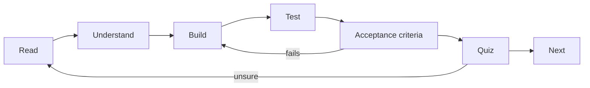

# How to use a topic

Each numbered folder is **one step** on the [roadmap](../GUIDE.md) and one change to the same ParcelPilot product. Walk them in order. Do not read all references first.

## The rhythm for every step

1. **Read** the step `README.md`.
2. **Understand** the topic using its "What is …?" section and linked lab/reference. Aim to explain it in one sentence.
3. **Build** it in `applications/` following "Build it in ParcelPilot".
4. **Test** it with the exact check under "Test it".
5. **Check acceptance criteria**: every box must be tickable. If not, return to Build.
6. Only then go to the **Next** step.

## What each section means

| Section | What it gives you |
|---|---|
| **The problem right now** | The concrete limitation in the current project that this step fixes. |
| **Key words** | Beginner definitions of every new term, so nothing is assumed. |
| **What is …?** | The concept explained in plain language, with a diagram. |
| **Why do it? Pros and cons** | What it buys you and what it costs. |
| **Real-world example** | Where the same idea appears outside ParcelPilot. |
| **Build it in ParcelPilot** | The exact, minimal changes to make this step. |
| **Test it** | The exact check that shows the change working. |
| **Acceptance criteria** | A checklist that defines "done" for the step. |
| **Say it like a developer** | Example sentences using the new terms correctly, so you learn to *talk* about the concept, not just recognize it. |
| **Quiz: check yourself** | A few questions with hidden answers. Answer each out loud in a full sentence **before** revealing it. |
| **Reflect / Next** | The limitation that motivates the next step. |

## How to use the quiz

Every step ends with a short quiz. Treat it as the real gate for "did I understand this?":

- Answer **out loud or in writing**, in full sentences, *before* opening the answer toggle.
- If your answer is fuzzy or wrong, re-read the linked section and try again. Don't move on.
- Being able to say the answer in your own words matters more than remembering exact wording.

## Two rules

- Add **only** what the step asks for. Do not pull in next-step abstractions early.
- If a keyword or pattern doesn't solve the step's stated problem, it waits. The full pattern catalog is in [../references/design-patterns.md](../references/design-patterns.md).
